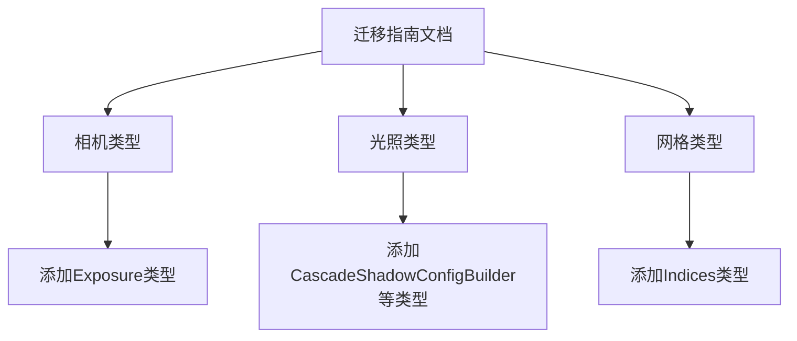

+++
title = "#21098 improve render reorg guide"
date = "2025-09-17T00:00:00"
draft = false
template = "pull_request_page.html"
in_search_index = false

[extra]
current_language = "zh-cn"
available_languages = {"en" = { name = "English", url = "/pull_request/bevy/2025-09/pr-21098-en-20250917" }, "zh-cn" = { name = "中文", url = "/pull_request/bevy/2025-09/pr-21098-zh-cn-20250917" }}
+++

# 改进渲染重组指南

## 基本信息
- **标题**: improve render reorg guide
- **PR链接**: https://github.com/bevyengine/bevy/pull/21098
- **作者**: atlv24
- **状态**: 已合并
- **标签**: A-Rendering, S-Ready-For-Final-Review
- **创建时间**: 2025-09-16T23:00:10Z
- **合并时间**: 2025-09-16T23:43:19Z
- **合并者**: alice-i-cecile

## 描述翻译
### 目标
- 修复 #21025

### 解决方案
- 添加缺失的类型

### 测试
- 

## 本次PR的故事

这个PR解决了一个相对简单但重要的问题：在Bevy引擎的渲染模块重组迁移指南中，有多个关键类型被遗漏了。当开发者按照迁移指南进行版本升级时，这些缺失的信息会导致困惑和导入错误。

问题的核心在于#21025报告的场景：开发者在迁移过程中发现某些类型无法正确导入，因为文档没有完整列出所有已移动到新crate的类型。这是一个典型的文档完整性issue，虽然不涉及代码逻辑变更，但对开发者体验影响很大。

PR作者atlv24采取了最直接的解决方案：仔细检查迁移指南，补充所有遗漏的类型。具体来说，在三个主要类别中添加了缺失的条目：

1. **相机类型**中添加了`Exposure`类型
2. **光照类型**中添加了`CascadeShadowConfigBuilder`、`NotShadowCaster`和`NotShadowReceiver`类型  
3. **网格类型**中添加了`Indices`类型

这些添加确保了迁移指南的完整性，使开发者能够准确知道哪些类型需要从新的crate导入，而不是继续尝试从旧的`bevy_render`模块导入。

从工程角度看，这类文档维护工作虽然看似简单，但对开源项目的健康度至关重要。完整的迁移指南能显著降低用户的升级成本，减少社区中的重复问题咨询。这次修改体现了Bevy项目对开发者体验的重视。

## 可视化表示



## 关键文件更改

### `release-content/migration-guides/bevy_render_reorganization.md` (+3/-3)

这个文件是Bevy渲染模块重组的迁移指南，主要更新了三个类型列表，添加了之前遗漏的类型：

```markdown
# 修改前：
Camera types such as `Camera`, `Camera3d`, `Camera2d`, `ClearColor`, `ClearColorConfig`, `Projection`, `PerspectiveProjection`, and `OrthographicProjection` have been moved to a new crate, `bevy_camera`.

# 修改后：
Camera types such as `Camera`, `Camera3d`, `Camera2d`, `ClearColor`, `ClearColorConfig`, `Exposure`, `Projection`, `PerspectiveProjection`, and `OrthographicProjection` have been moved to a new crate, `bevy_camera`.
```

```markdown
# 修改前：
Light types such `AmbientLight`, `PointLight`, `SpotLight`, `DirectionalLight`, `EnvironmentMapLight`, `GeneratedEnvironmentMapLight`, `LightProbe`, `IrradianceVolume`, `VolumetricFog`, `FogVolume`, and `light_consts` have been moved to a new crate, `bevy_light`.

# 修改后：
Light types such `AmbientLight`, `PointLight`, `SpotLight`, `DirectionalLight`, `EnvironmentMapLight`, `GeneratedEnvironmentMapLight`, `LightProbe`, `IrradianceVolume`, `VolumetricFog`, `FogVolume`, `CascadeShadowConfigBuilder`, `NotShadowCaster`, `NotShadowReceiver` and `light_consts` have been moved to a new crate, `bevy_light`.
```

```markdown
# 修改前：
Mesh types such as `Mesh`, `Mesh3d`, `Mesh2d`, `MorphWeights`, `MeshBuilder`, and `Meshable` have been moved to a new crate, `bevy_mesh`.

# 修改后：
Mesh types such as `Mesh`, `Mesh3d`, `Mesh2d`, `MorphWeights`, `MeshBuilder`, `Indices`, and `Meshable` have been moved to a new crate, `bevy_mesh`.
```

这些修改确保了迁移指南的完整性，帮助开发者准确了解所有需要从新crate导入的类型。

## 扩展阅读

- [Bevy引擎官方文档](https://bevyengine.org/learn/)
- [Rust模块系统与crate管理](https://doc.rust-lang.org/book/ch07-00-managing-growing-projects-with-packages-crates-and-modules.html)
- [语义化版本与迁移指南最佳实践](https://semver.org/)

## 完整代码差异

```diff
diff --git a/release-content/migration-guides/bevy_render_reorganization.md b/release-content/migration-guides/bevy_render_reorganization.md
index 1cfa7604d4caf..8e0fc89b6d41b 100644
--- a/release-content/migration-guides/bevy_render_reorganization.md
+++ b/release-content/migration-guides/bevy_render_reorganization.md
@@ -6,7 +6,7 @@ pull_requests: [20485, 20330, 18703, 20587, 20502, 19997, 19991, 20000, 19949, 1
 You must now import `bevy_render::NormalizedRenderTargetExt` to use methods on `NormalizedRenderTarget`
 `ManualTextureViews` is now in `bevy_render::texture`
 
-Camera types such as `Camera`, `Camera3d`, `Camera2d`, `ClearColor`, `ClearColorConfig`, `Projection`, `PerspectiveProjection`, and `OrthographicProjection` have been moved to a new crate, `bevy_camera`.
+Camera types such as `Camera`, `Camera3d`, `Camera2d`, `ClearColor`, `ClearColorConfig`, `Exposure`, `Projection`, `PerspectiveProjection`, and `OrthographicProjection` have been moved to a new crate, `bevy_camera`.
 Visibility types such as `Visibility`, `InheritedVisibility`, `ViewVisibility`, `VisibleEntities`, and `RenderLayers` have been moved to `bevy_camera::visibility`.
 Culling primitives such as `Frustum`, `HalfSpace`, `Aabb`, and `Sphere` have been moved to `bevy_camera::primitives`.
 Import them directly or from `bevy::camera` now.
@@ -14,10 +14,10 @@ Import them directly or from `bevy::camera` now.
 Shader types such as `Shader`, `ShaderRef`, `ShaderDef`, `ShaderCache`, and `PipelineCompilationError` have been moved to a new crate, `bevy_shader`.
 Import them directly or from `bevy::shader` now.
 
-Light types such `AmbientLight`, `PointLight`, `SpotLight`, `DirectionalLight`, `EnvironmentMapLight`, `GeneratedEnvironmentMapLight`, `LightProbe`, `IrradianceVolume`, `VolumetricFog`, `FogVolume`, and `light_consts` have been moved to a new crate, `bevy_light`.
+Light types such `AmbientLight`, `PointLight`, `SpotLight`, `DirectionalLight`, `EnvironmentMapLight`, `GeneratedEnvironmentMapLight`, `LightProbe`, `IrradianceVolume`, `VolumetricFog`, `FogVolume`, `CascadeShadowConfigBuilder`, `NotShadowCaster`, `NotShadowReceiver` and `light_consts` have been moved to a new crate, `bevy_light`.
 Import them directly or from `bevy::light` now.
 
-Mesh types such as `Mesh`, `Mesh3d`, `Mesh2d`, `MorphWeights`, `MeshBuilder`, and `Meshable` have been moved to a new crate, `bevy_mesh`.
+Mesh types such as `Mesh`, `Mesh3d`, `Mesh2d`, `MorphWeights`, `MeshBuilder`, `Indices`, and `Meshable` have been moved to a new crate, `bevy_mesh`.
 Import them directly or from `bevy::mesh` now. This crate is actually present in the previous release, but its `bevy_render` re-exports have now been removed.
 
 Image types such as `Image`, `ImagePlugin`, `ImageFormat`, `ImageSampler`, `ImageAddressMode`, `ImageSamplerDescriptor`, `ImageCompareFunction`, and `ImageSamplerBorderColor` have been moved to a new crate, `bevy_image`. This crate is actually present in the previous release, but its `bevy_render` re-exports have now been removed.
```