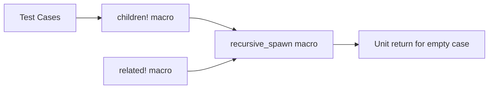

+++
title = "#21099 Fix empty children regression"
date = "2025-09-17T00:00:00"
draft = false
template = "pull_request_page.html"
in_search_index = true

[taxonomies]
list_display = ["show"]

[extra]
current_language = "en"
available_languages = {"en" = { name = "English", url = "/pull_request/bevy/2025-09/pr-21099-en-20250917" }, "zh-cn" = { name = "中文", url = "/pull_request/bevy/2025-09/pr-21099-zh-cn-20250917" }}
labels = ["C-Bug", "A-ECS", "P-Regression"]
+++

# Fix empty children regression

## Basic Information
- **Title**: Fix empty children regression
- **PR Link**: https://github.com/bevyengine/bevy/pull/21099
- **Author**: CorvusPrudens
- **Status**: MERGED
- **Labels**: C-Bug, A-ECS, S-Ready-For-Final-Review, P-Regression
- **Created**: 2025-09-17T01:18:24Z
- **Merged**: 2025-09-17T17:04:21Z
- **Merged By**: alice-i-cecile

## Description Translation
# Objective

#18865 introduced a regression for an empty invocation of `children!` and `related!`. The `recursive_spawn` macro has no case for zero inputs, so the compiler rejects `children![]`. Whether this is particularly meaningful isn't important; there are a number of situations in which you might want your code to compile even with an empty set of children.

## Solution

A case has been added to `recursive_spawn` for no inputs, returning a unit. This matches the previous behavior for `children!` and `related!` exactly.

## The Story of This Pull Request

This PR addresses a regression introduced by PR #18865 that broke empty invocations of the `children!` and `related!` macros. The issue stemmed from the `recursive_spawn` macro lacking a case for handling zero inputs, causing the compiler to reject empty macro calls like `children![]`.

The problem occurred because macro expansion patterns need to explicitly handle all possible input cases. When #18865 modified the `recursive_spawn` macro, it didn't account for the empty input scenario, which previously worked. This created a breaking change for code that legitimately needed to express empty child collections, even if the functionality appeared trivial.

The solution was straightforward: add a zero-input case to the `recursive_spawn` macro that returns a unit type `()`. This matches the previous behavior exactly and maintains API consistency. The fix ensures that empty macro invocations compile successfully while preserving all existing functionality.

To validate the fix, a test case was added that specifically verifies an empty `children![]` invocation compiles and works correctly. This regression test ensures this edge case won't break again in future modifications.

The changes are minimal and surgical, affecting only the macro definition and adding a test case. This approach demonstrates good defensive programming practices by explicitly handling edge cases in macro patterns and adding tests to prevent regression.

## Visual Representation



## Key Files Changed

### `crates/bevy_ecs/src/spawn.rs`
Added a zero-input case to the `recursive_spawn` macro:

```rust
// Before:
macro_rules! recursive_spawn {
    ($a:expr) => {
        $crate::spawn::Spawn($a)
    };
    ($a:expr, $($rest:expr),*) => {
        ($crate::spawn::Spawn($a), $crate::spawn::recursive_spawn!($($rest),*))
    };
}

// After:
macro_rules! recursive_spawn {
    () => { () };
    ($a:expr) => {
        $crate::spawn::Spawn($a)
    };
    ($a:expr, $($rest:expr),*) => {
        ($crate::spawn::Spawn($a), $crate::spawn::recursive_spawn!($($rest),*))
    };
}
```

### `crates/bevy_ecs/src/hierarchy.rs`
Added a test case to verify empty children macro works:

```rust
// Added test case:
#[test]
fn spawn_many_children() {
    let mut world = World::new();

    // ensure an empty set can be mentioned
    world.spawn(children![]);

    // 12 children should result in a flat tuple
    let id = world
        .spawn(children![(), (), (), (), (), (), (), (), (), (), (), ()])
        .id();
    
    // ... rest of test
}
```

## Further Reading

- [Rust Macros: The Complete Guide](https://danielkeep.github.io/tlborm/book/index.html) - Comprehensive resource on Rust macro development
- [Bevy ECS Documentation](https://bevyengine.org/learn/ecs/) - Official Bevy Entity Component System documentation
- [Macro Patterns in Rust](https://doc.rust-lang.org/book/ch19-06-macros.html) - Official Rust book chapter on macros