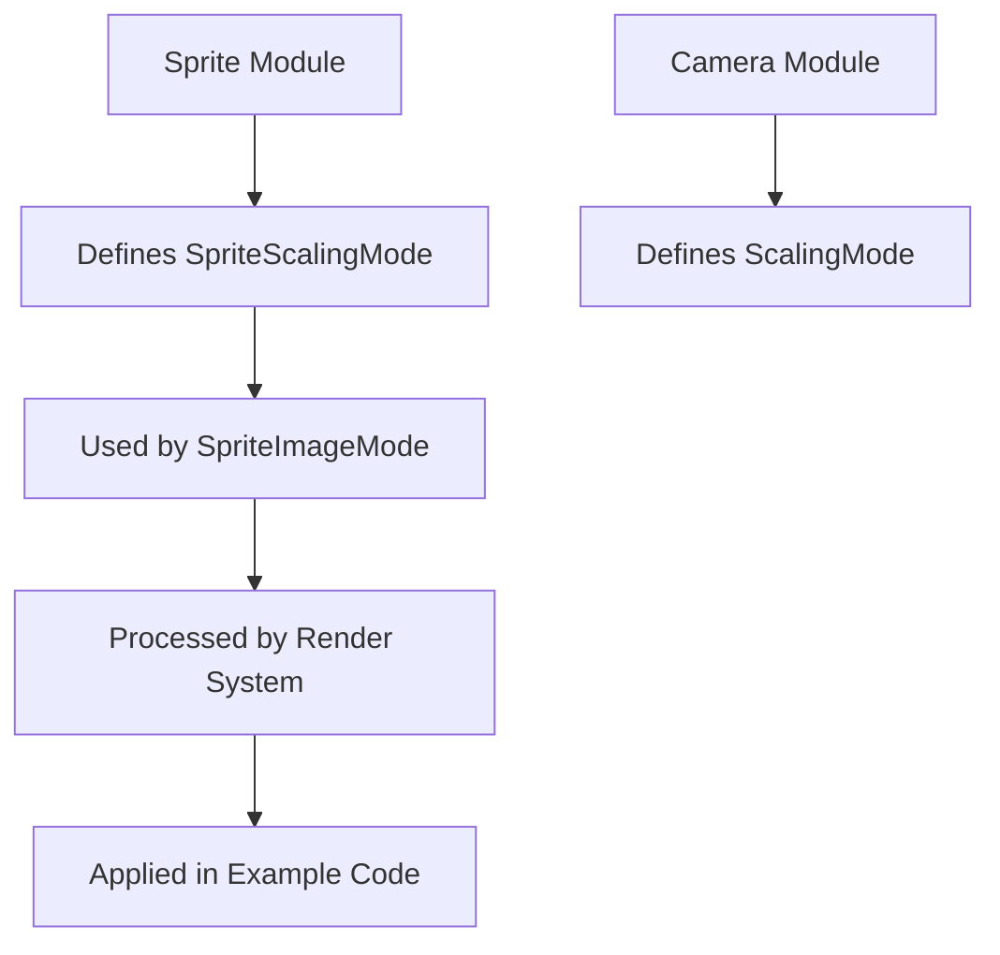

+++
title = "#21100 Rename `bevy_sprite::sprite::ScalingMode` to `SpriteScalingMode`"
date = "2025-09-17T00:00:00"
draft = false
template = "pull_request_page.html"
in_search_index = true

[taxonomies]
list_display = ["show"]

[extra]
current_language = "en"
available_languages = {"en" = { name = "English", url = "/pull_request/bevy/2025-09/pr-21100-en-20250917" }, "zh-cn" = { name = "中文", url = "/pull_request/bevy/2025-09/pr-21100-zh-cn-20250917" }}
labels = ["D-Trivial", "A-Rendering", "C-Code-Quality"]
+++

# Rename `bevy_sprite::sprite::ScalingMode` to `SpriteScalingMode`

## Basic Information
- **Title**: Rename `bevy_sprite::sprite::ScalingMode` to `SpriteScalingMode`
- **PR Link**: https://github.com/bevyengine/bevy/pull/21100
- **Author**: ickshonpe
- **Status**: MERGED
- **Labels**: D-Trivial, A-Rendering, C-Code-Quality, S-Ready-For-Final-Review, M-Needs-Migration-Guide
- **Created**: 2025-09-17T08:37:28Z
- **Merged**: 2025-09-17T21:42:11Z
- **Merged By**: alice-i-cecile

## Description Translation
# Objective

There are two enums both called `ScalingMode`, `bevy_sprite::sprite::ScalingMode` and `bevy_camera::projection::ScalingMode`, in violition of the one namespace rule.

Part of #19285

## Solution

Rename `bevy_sprite::sprite::ScalingMode` to  `bevy_sprite::sprite::SpriteScalingMode`.

Chose to rename the sprite enum as `bevy_camera::projection::ScalingMode` is much older and  `OrthographicProjectionScalingMode` is a bit long.


## The Story of This Pull Request

This PR addresses a namespace collision between two distinct `ScalingMode` enums in the Bevy engine. The conflict occurred between `bevy_sprite::sprite::ScalingMode` and `bevy_camera::projection::ScalingMode`, violating the project's one namespace rule which aims to prevent naming ambiguities.

The problem manifested when developers needed to use both sprite scaling and camera projection scaling in the same codebase. Without explicit module paths, the compiler couldn't distinguish between the two enums, forcing developers to use verbose qualified paths or aliases.

The solution implemented renames the sprite module's `ScalingMode` to `SpriteScalingMode`. This approach was chosen because:
1. The camera projection's `ScalingMode` is older and more established in the codebase
2. The alternative camera enum name `OrthographicProjectionScalingMode` would be excessively long
3. The sprite enum is used less frequently than the camera enum in typical game development scenarios

The implementation required systematic updates across multiple components:
- Core enum definition and its usage in the sprite module
- Rendering system that processes sprite scaling
- Example code demonstrating sprite scaling functionality
- Public API exports in the module prelude
- Migration guide for existing users

The changes maintain full backward compatibility through a clear migration path while resolving the namespace conflict permanently. All existing functionality remains identical - only the type names have changed.

## Visual Representation



## Key Files Changed

### `crates/bevy_sprite/src/sprite.rs`
Core enum definition and related type updates:
```rust
// Before:
pub enum ScalingMode {
    FillCenter,
    // ... other variants
}

// After:  
pub enum SpriteScalingMode {
    FillCenter,
    // ... other variants
}
```

### `crates/bevy_sprite_render/src/render/mod.rs`
Rendering system updates:
```rust
// Before:
fn apply_scaling(scaling_mode: ScalingMode, ...) { ... }

// After:
fn apply_scaling(scaling_mode: SpriteScalingMode, ...) { ... }
```

### `examples/2d/sprite_scale.rs`
Example code updates:
```rust
// Before:
image_mode: SpriteImageMode::Scale(ScalingMode::FillCenter)

// After:
image_mode: SpriteImageMode::Scale(SpriteScalingMode::FillCenter)
```

### `crates/bevy_sprite/src/lib.rs`
Prelude export updates:
```rust
// Before:
pub use crate::ScalingMode;

// After:
pub use crate::SpriteScalingMode;
```

### `release-content/migration-guides/rename_bevy_sprite_ScalingMode_to_SpriteScalingMode.md`
New migration guide:
```markdown
In the previous release, both `bevy_sprite::sprite` and `bevy_camera::projection` defined an enum named `ScalingMode`, in violation of our one-namespace rule.

To resolve this, the `ScalingMode` enum from `bevy::sprite` has been renamed to `SpriteScalingMode`.
```

## Further Reading

- [Rust Module System](https://doc.rust-lang.org/book/ch07-02-defining-modules-to-control-scope-and-privacy.html)
- [Bevy Engine Documentation](https://bevyengine.org/learn/)
- [Namespace Management in Large Codebases](https://en.wikipedia.org/wiki/Namespace)

# Full Code Diff
[Full code diff provided in the original request]