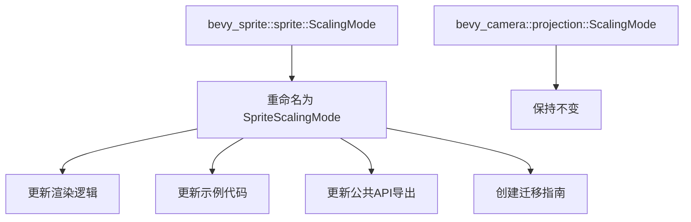

+++
title = "#21100 Rename `bevy_sprite::sprite::ScalingMode` to `SpriteScalingMode"
date = "2025-09-17T00:00:00"
draft = false
template = "pull_request_page.html"
in_search_index = false

[extra]
current_language = "zh-cn"
available_languages = {"en" = { name = "English", url = "/pull_request/bevy/2025-09/pr-21100-en-20250917" }, "zh-cn" = { name = "中文", url = "/pull_request/bevy/2025-09/pr-21100-zh-cn-20250917" }}
+++

# 重命名 `bevy_sprite::sprite::ScalingMode` 为 `SpriteScalingMode`

## 基本信息
- **标题**: Rename `bevy_sprite::sprite::ScalingMode` to `SpriteScalingMode`
- **PR链接**: https://github.com/bevyengine/bevy/pull/21100
- **作者**: ickshonpe
- **状态**: 已合并
- **标签**: D-Trivial, A-Rendering, C-Code-Quality, S-Ready-For-Final-Review, M-Needs-Migration-Guide
- **创建时间**: 2025-09-17T08:37:28Z
- **合并时间**: 2025-09-17T21:42:11Z
- **合并者**: alice-i-cecile

## 描述翻译

# 目标

存在两个同名为 `ScalingMode` 的枚举类型，分别位于 `bevy_sprite::sprite::ScalingMode` 和 `bevy_camera::projection::ScalingMode`，这违反了单一命名空间规则。

作为 #19285 的一部分

## 解决方案

将 `bevy_sprite::sprite::ScalingMode` 重命名为 `bevy_sprite::sprite::SpriteScalingMode`。

选择重命名精灵(sprite)枚举是因为 `bevy_camera::projection::ScalingMode` 存在时间更久，且 `OrthographicProjectionScalingMode` 名称较长。

## 这个PR的故事

这个PR解决了一个在Bevy代码库中存在的命名冲突问题。在大型代码库中，保持清晰的命名空间是维护代码可读性和避免混淆的关键。当两个不同的模块定义了相同名称的类型时，开发者在使用时需要额外注意导入路径，这增加了认知负担和出错的可能性。

问题的核心在于 `bevy_sprite` 和 `bevy_camera` 模块都定义了一个名为 `ScalingMode` 的枚举类型。虽然它们的功能不同——一个用于控制精灵的缩放行为，另一个用于控制相机投影的缩放——但相同的名称导致了命名空间污染。

开发者选择了重命名 `bevy_sprite` 中的枚举而不是 `bevy_camera` 中的，这是基于合理的工程决策：
1. `bevy_camera::projection::ScalingMode` 存在时间更久，更改它会影响更多现有代码
2. 相机模块的完整名称 `OrthographicProjectionScalingMode` 较长，不太适合作为日常使用的主要名称
3. 精灵模块的缩放模式使用频率可能较高，给予更简洁的名称更合理

这个更改虽然看似简单，但涉及到了代码库中的多个层面。从核心的枚举定义，到使用该枚举的渲染逻辑，再到示例代码和公共API的导出，都需要进行相应的更新。这种系统性的更改确保了整个代码库的一致性。

值得注意的是，PR作者还创建了迁移指南，这是处理破坏性变更的最佳实践。迁移指南帮助现有用户平滑过渡到新版本，减少了升级时的摩擦。

从技术实现角度看，这个PR展示了如何正确处理类型重命名：
1. 更改类型定义本身的名称
2. 更新所有使用该类型的地方
3. 调整模块的公共API导出
4. 更新示例代码以反映更改
5. 提供迁移文档帮助用户适应变化

这种系统性的方法确保了更改的完整性和一致性，避免了遗漏任何使用该类型的地方。

## 可视化表示



## 关键文件更改

以下是本次PR中最重要的文件更改：

### `crates/bevy_sprite/src/sprite.rs`
这个文件包含了核心的枚举类型定义更改：
```rust
// 之前:
pub enum ScalingMode {
    FillCenter,
    // ... 其他变体
}

// 之后:
pub enum SpriteScalingMode {
    FillCenter,
    // ... 其他变体
}
```
同时还更新了相关的方法签名以使用新类型名称。

### `crates/bevy_sprite_render/src/render/mod.rs`
渲染逻辑需要更新以使用新的类型名称：
```rust
// 之前:
fn apply_scaling(
    scaling_mode: ScalingMode,
    // ... 其他参数
)

// 之后:
fn apply_scaling(
    scaling_mode: SpriteScalingMode,
    // ... 其他参数
)
```
匹配语句中的所有模式也都更新为了新的枚举变体名称。

### `examples/2d/sprite_scale.rs`
示例代码中的所有使用处都更新为了新名称：
```rust
// 之前:
image_mode: SpriteImageMode::Scale(ScalingMode::FillCenter),

// 之后:
image_mode: SpriteImageMode::Scale(SpriteScalingMode::FillCenter),
```

### `crates/bevy_sprite/src/lib.rs`
更新了模块的公共API导出：
```rust
// 之前:
pub use crate::{
    ScalingMode,
    // ... 其他导出
};

// 之后:
pub use crate::{
    SpriteScalingMode,
    // ... 其他导出
};
```

### `release-content/migration-guides/rename_bevy_sprite_ScalingMode_to_SpriteScalingMode.md`
新增了迁移指南文档：
```markdown
---
title: Rename `ScalingMode` to `SpriteScalingMode`
pull_requests: [21100]
---

In the previous release, both `bevy_sprite::sprite` and `bevy_camera::projection` defined an enum named `ScalingMode`, in violation of our one-namespace rule.

To resolve this, the `ScalingMode` enum from `bevy::sprite` has been renamed to `SpriteScalingMode`.
```

## 进一步阅读

- [Rust命名约定](https://doc.rust-lang.org/1.0.0/style/style/naming/README.html)
- [Bevy引擎官方文档](https://bevyengine.org/learn/)
- [Semantic Versioning规范](https://semver.org/)
- [破坏性变更和迁移指南最佳实践](https://doc.rust-lang.org/cargo/reference/semver.html)