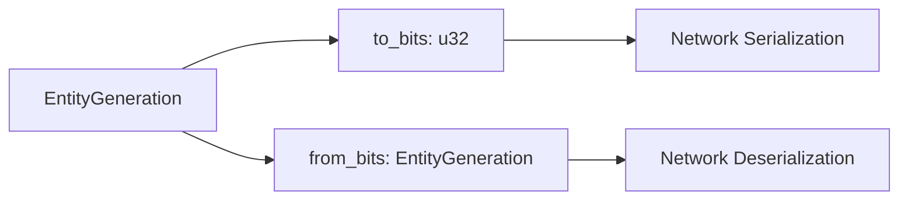

+++
title = "#21101 Expose getter/setter for EntityGeneration"
date = "2025-09-17T00:00:00"
draft = false
template = "pull_request_page.html"
in_search_index = true

[taxonomies]
list_display = ["show"]

[extra]
current_language = "en"
available_languages = {"en" = { name = "English", url = "/pull_request/bevy/2025-09/pr-21101-en-20250917" }, "zh-cn" = { name = "中文", url = "/pull_request/bevy/2025-09/pr-21101-zh-cn-20250917" }}
labels = ["D-Trivial", "A-ECS", "C-Usability", "A-Networking"]
+++

# Expose getter/setter for EntityGeneration

## Basic Information
- **Title**: Expose getter/setter for EntityGeneration
- **PR Link**: https://github.com/bevyengine/bevy/pull/21101
- **Author**: cBournhonesque
- **Status**: MERGED
- **Labels**: D-Trivial, A-ECS, C-Usability, S-Ready-For-Final-Review, A-Networking
- **Created**: 2025-09-17T12:14:54Z
- **Merged**: 2025-09-17T16:32:29Z
- **Merged By**: alice-i-cecile

## Description Translation
While the EntityGeneration has an opaque underlying structure; it can still be useful to be able to access the actual value (for instance for networking)

Do I need to add a Migration Guide?

## The Story of This Pull Request

The EntityGeneration struct in Bevy's ECS serves as an opaque wrapper around a u32 value that tracks entity generations. While the internal representation is intentionally hidden to maintain abstraction boundaries, there are legitimate use cases where direct access to the underlying bits is necessary - particularly for networking scenarios where serialization and deserialization of entity data is required.

The problem was straightforward: developers needed to serialize EntityGeneration values for network transmission and reconstruct them on the receiving end, but the existing API didn't provide public methods to access the raw data. This forced workarounds or unsafe code to bypass the abstraction.

The solution implemented in this PR is minimal and focused: expose the existing `to_bits` and `from_bits` methods as public APIs. These methods already provided the necessary functionality internally, so the change simply removes the access restrictions. The `to_bits` method returns the underlying u32 representation, while `from_bits` reconstructs an EntityGeneration from a u32 value.

This approach maintains the opaque nature of EntityGeneration for most use cases while providing escape hatches for legitimate low-level operations. The implementation is safe because it doesn't change any behavior - it only changes visibility. The const nature of both methods is preserved, ensuring they can be used in compile-time contexts.

From a technical perspective, this change follows the principle of providing controlled access to internal representations when necessary for interoperability. The methods are appropriately documented with warnings about the opaque nature of the bits, guiding developers to use them only when absolutely necessary.

The impact is significant for networking code while being minimal for the rest of the codebase. Networking implementations can now properly serialize and deserialize entity generations without resorting to unsafe patterns or maintaining parallel data structures.

## Visual Representation



## Key Files Changed

**File: `crates/bevy_ecs/src/entity/mod.rs`**

Changes made to the EntityGeneration implementation to expose the conversion methods publicly:

```rust
// Before:
#[inline(always)]
const fn to_bits(self) -> u32 {
    self.0
}

#[inline]
const fn from_bits(bits: u32) -> Self {
    Self(bits)
}

// After:
#[inline(always)]
pub const fn to_bits(self) -> u32 {
    self.0
}

#[inline]
pub const fn from_bits(bits: u32) -> Self {
    Self(bits)
}
```

These changes make the conversion methods public while maintaining their const nature and inline optimizations. The `to_bits` method provides getter functionality, while `from_bits` serves as the setter/constructor equivalent.

## Further Reading

- [Bevy ECS Documentation](https://bevyengine.org/learn/book/ecs/)
- [Entity Component System Pattern](https://en.wikipedia.org/wiki/Entity_component_system)
- [Rust Visibility and Privacy](https://doc.rust-lang.org/book/ch07-02-defining-modules-to-control-scope-and-privacy.html)
- [Network Serialization in Game Engines](https://gafferongames.com/post/serialization_strategies/)