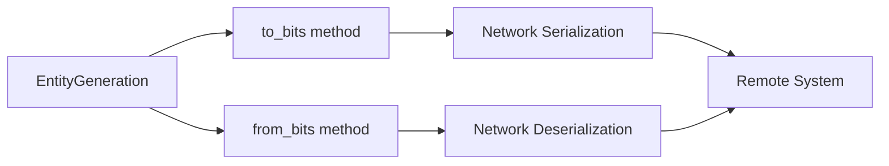

+++
title = "#21101 Expose getter/setter for EntityGeneration"
date = "2025-09-17T00:00:00"
draft = false
template = "pull_request_page.html"
in_search_index = false

[extra]
current_language = "zh-cn"
available_languages = {"en" = { name = "English", url = "/pull_request/bevy/2025-09/pr-21101-en-20250917" }, "zh-cn" = { name = "中文", url = "/pull_request/bevy/2025-09/pr-21101-zh-cn-20250917" }}
+++

# Expose getter/setter for EntityGeneration

## 基本信息
- **标题**: Expose getter/setter for EntityGeneration
- **PR链接**: https://github.com/bevyengine/bevy/pull/21101
- **作者**: cBournhonesque
- **状态**: 已合并
- **标签**: D-Trivial, A-ECS, C-Usability, S-Ready-For-Final-Review, A-Networking
- **创建时间**: 2025-09-17T12:14:54Z
- **合并时间**: 2025-09-17T16:32:29Z
- **合并者**: alice-i-cecile

## 描述翻译
虽然EntityGeneration具有不透明的底层结构；但在某些场景下（例如网络传输）仍然需要能够访问实际值

需要添加迁移指南吗？

## 这个Pull Request的故事

这个PR解决了一个简单但实用的需求：为EntityGeneration结构体提供公开的getter和setter方法。EntityGeneration是Bevy ECS中Entity标识符的重要组成部分，它管理着实体代的计数，用于处理实体重用时的代际追踪。

**问题与背景**
在Bevy的ECS架构中，Entity由标识符(index)和代(generation)组成。EntityGeneration封装了代的内部表示，原本其to_bits()和from_bits()方法是私有的。这意味着虽然内部有这些转换方法，但外部代码无法使用它们。这在网络传输等场景中造成了不便，因为需要将EntityGeneration序列化和反序列化。

**解决方案**
开发者采取了最直接有效的解决方案：将这两个方法的可见性从私有(const)改为公有(pub const)。这样既保持了原有的功能不变，又提供了外部访问的能力。

**实现细节**
变更非常简单但实用。在`crates/bevy_ecs/src/entity/mod.rs`文件中，只是将两个方法的可见性修饰符从`const`改为`pub const`：

```rust
// 修改前：
const fn to_bits(self) -> u32
const fn from_bits(bits: u32) -> Self

// 修改后：
pub const fn to_bits(self) -> u32
pub const fn from_bits(bits: u32) -> Self
```

这种修改保持了方法的常量属性，同时允许外部代码调用它们。to_bits()方法将EntityGeneration转换为32位无符号整数，from_bits()则执行反向操作，从整数位重建EntityGeneration。

**技术考量**
这种设计遵循了信息隐藏原则的同时提供了必要的灵活性。EntityGeneration的内部结构仍然是不透明的（通过私有字段实现），但提供了受控的序列化接口。这对于网络同步等场景特别重要，因为需要将实体标识符在不同系统间传输和重建。

**影响**
这个小小的改动为网络功能开发提供了重要支持。现在开发者可以在网络协议中传输EntityGeneration的位表示，然后在接收端准确重建。这对于多玩家游戏或分布式仿真系统至关重要。

## 可视化表示



## 关键文件变更

- `crates/bevy_ecs/src/entity/mod.rs` (+2/-2)

这个文件包含了EntityGeneration结构体的定义。变更非常简单，只是修改了两个方法的可见性：

```rust
// 变更前：
#[inline(always)]
const fn to_bits(self) -> u32 {
    self.0
}

#[inline]
const fn from_bits(bits: u32) -> Self {
    Self(bits)
}

// 变更后：
#[inline(always)]
pub const fn to_bits(self) -> u32 {
    self.0
}

#[inline]
pub const fn from_bits(bits: u32) -> Self {
    Self(bits)
}
```

这些变更使得外部代码能够将EntityGeneration转换为原始位表示并进行反向转换，这对于网络序列化等用例非常重要。

## 扩展阅读

- [Bevy ECS Entity Documentation](https://docs.rs/bevy_ecs/latest/bevy_ecs/entity/struct.Entity.html)
- [Rust Visibility and Privacy](https://doc.rust-lang.org/book/ch07-02-defining-modules-to-control-scope-and-privacy.html)
- [Networked Entity Synchronization Patterns](https://gafferongames.com/post/networked_physics/)

## 完整代码差异

```diff
diff --git a/crates/bevy_ecs/src/entity/mod.rs b/crates/bevy_ecs/src/entity/mod.rs
index f16319318f8d2..f8e6b3ce7b934 100644
--- a/crates/bevy_ecs/src/entity/mod.rs
+++ b/crates/bevy_ecs/src/entity/mod.rs
@@ -218,7 +218,7 @@ impl EntityGeneration {
     /// Gets some bits that represent this value.
     /// The bits are opaque and should not be regarded as meaningful.
     #[inline(always)]
-    const fn to_bits(self) -> u32 {
+    pub const fn to_bits(self) -> u32 {
         self.0
     }
 
@@ -226,7 +226,7 @@ impl EntityGeneration {
     ///
     /// Only useful when applied to results from `to_bits` in the same instance of an application.
     #[inline]
-    const fn from_bits(bits: u32) -> Self {
+    pub const fn from_bits(bits: u32) -> Self {
         Self(bits)
     }
 
```