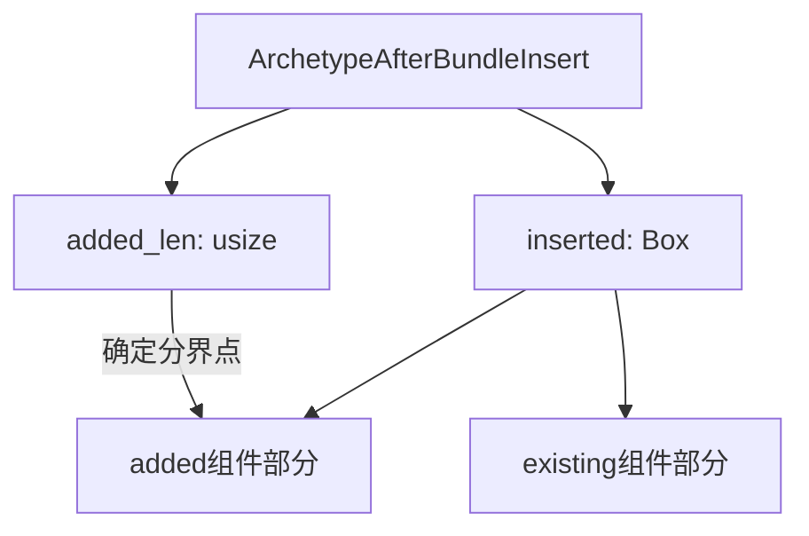

+++
title = "#21102 Combine added and existing `ComponentId`s in a single allocation"
date = "2025-09-18T00:00:00"
draft = false
template = "pull_request_page.html"
in_search_index = false

[extra]
current_language = "zh-cn"
available_languages = {"en" = { name = "English", url = "/pull_request/bevy/2025-09/pr-21102-en-20250918" }, "zh-cn" = { name = "中文", url = "/pull_request/bevy/2025-09/pr-21102-zh-cn-20250918" }}
+++

# Combine added and existing `ComponentId`s in a single allocation

## 基本信息
- **标题**: Combine added and existing `ComponentId`s in a single allocation
- **PR链接**: https://github.com/bevyengine/bevy/pull/21102
- **作者**: chescock
- **状态**: 已合并
- **标签**: A-ECS, C-Performance, S-Ready-For-Final-Review
- **创建时间**: 2025-09-17T14:48:50Z
- **合并时间**: 2025-09-18T04:27:30Z
- **合并者**: alice-i-cecile

## 描述翻译
### 目标

在 #20626 的基础上进一步缩小 `ArchetypeAfterBundleInsert` 的大小。

移除触发 `Insert` 观察器时对 `collect()` 的需求。

### 解决方案

将 `added` 和 `existing` 组件ID列表合并为一个装箱的切片（boxed slice）。我们需要存储一个额外的长度来恢复切片，但这意味着我们存储**一个**指针和两个长度，而不是**两个**指针和两个长度，从而将 `ArchetypeAfterBundleInsert` 的大小缩小一个指针。

这也意味着我们有一个完整的 `inserted` 组件列表切片可用，无需将它们复制到新的 `Vec` 中。

## 本次PR的故事

这个PR是在#20626基础上的进一步性能优化，主要针对ECS（Entity Component System）中的bundle插入操作。问题核心在于内存布局和访问效率的优化。

### 问题背景

在Bevy的ECS架构中，当插入一个bundle时，系统需要跟踪哪些组件是新添加的（added），哪些是已存在的（existing）。原来的实现使用了两个独立的`Box<[ComponentId]>`来分别存储这两类组件ID：

```rust
pub(crate) added: Box<[ComponentId]>,
pub(crate) existing: Box<[ComponentId]>,
```

这种设计存在两个问题：
1. 内存开销：每个`Box`都需要一个指针，总共两个指针的开销
2. 性能开销：当需要访问所有插入的组件（包括新增和已存在的）时，需要执行`.chain()`操作，并且在某些情况下还需要`.collect()`到新的Vec中

### 解决方案

PR作者采用了内存优化的常见模式：将逻辑上相关的数据存储在连续的内存区域中，通过额外的元数据来区分不同部分。具体来说：

1. 将`added`和`existing`数组合并为一个`inserted`数组
2. 添加`added_len`字段来记录added组件的数量
3. 通过切片操作来访问added和existing部分

### 具体实现

在`archetype.rs`中，关键的数据结构变更：

```rust
// 之前：
pub(crate) added: Box<[ComponentId]>,
pub(crate) existing: Box<[ComponentId]>,

// 之后：
inserted: Box<[ComponentId]>,
added_len: usize,
```

相应的访问方法也进行了重构：

```rust
pub(crate) fn inserted(&self) -> &[ComponentId] {
    &self.inserted
}

pub(crate) fn added(&self) -> &[ComponentId] {
    // SAFETY: `added_len` is always in range `0..=inserted.len()`
    unsafe { self.inserted.get(..self.added_len).debug_checked_unwrap() }
}

pub(crate) fn existing(&self) -> &[ComponentId] {
    // SAFETY: `added_len` is always in range `0..=inserted.len()`
    unsafe { self.inserted.get(self.added_len..).debug_checked_unwrap() }
}
```

在`insert.rs`中的构建逻辑也相应调整：

```rust
// 之前使用两个独立的Box
let added: Box<[ComponentId]> = ...;
let existing: Box<[ComponentId]> = ...;

// 现在合并为一个
let added_len = added.len();
added.reserve_exact(existing.len());
added.extend(existing);
let inserted = added.into();
```

### 技术细节与考量

1. **内存布局优化**：从两个指针减少到一个指针，在64位系统上节省了8字节内存
2. **访问性能**：现在可以直接获取完整的inserted组件切片，无需链式迭代器或collect操作
3. **安全性**：使用`debug_checked_unwrap`来确保切片访问的安全性，在debug构建中提供额外检查
4. **内存分配**：通过`reserve_exact`确保不会分配多余内存，避免后续转换为Box时的重复分配

### 影响与收益

这个优化带来了多重好处：

1. **内存使用减少**：每个ArchetypeAfterBundleInsert实例节省一个指针的大小
2. **性能提升**：消除了触发Insert观察器时的collect操作
3. **代码简化**：提供了更直接的API来访问不同类别的组件
4. **缓存友好**：相关数据现在存储在连续内存中，提高了缓存局部性

对于大规模实体系统，这些优化可以累积产生显著的性能提升，特别是在频繁进行bundle插入操作的场景中。

## 可视化表示



## 关键文件变更

### `crates/bevy_ecs/src/archetype.rs` (+23/-15)

这个文件包含了主要的架构变更，重新定义了`ArchetypeAfterBundleInsert`结构体的内存布局。

**关键变更：**
```rust
// 之前：
pub(crate) added: Box<[ComponentId]>,
pub(crate) existing: Box<[ComponentId]>,

// 之后：
inserted: Box<[ComponentId]>,
added_len: usize,
```

同时添加了新的访问方法：
```rust
pub(crate) fn inserted(&self) -> &[ComponentId] {
    &self.inserted
}

pub(crate) fn added(&self) -> &[ComponentId] {
    unsafe { self.inserted.get(..self.added_len).debug_checked_unwrap() }
}

pub(crate) fn existing(&self) -> &[ComponentId] {
    unsafe { self.inserted.get(self.added_len..).debug_checked_unwrap() }
}
```

### `crates/bevy_ecs/src/bundle/insert.rs` (+8/-12)

这个文件更新了bundle插入逻辑以适应新的数据结构。

**关键变更：**
```rust
// 构建逻辑变更：
let added_len = added.len();
added.reserve_exact(existing.len());
added.extend(existing);

// 使用新的访问方法：
components: archetype_after_insert.added(),
components: archetype_after_insert.existing(),
components: archetype_after_insert.inserted(),
```

移除了不必要的collect操作：
```rust
// 之前需要collect：
components: &archetype_after_insert.iter_inserted().collect::<Vec<_>>(),

// 现在直接访问：
components: archetype_after_insert.inserted(),
```

## 扩展阅读

1. [Bevy ECS官方文档](https://bevyengine.org/learn/ecs/) - 了解Bevy的ECS架构
2. [Rust切片操作指南](https://doc.rust-lang.org/book/ch04-03-slices.html) - 掌握Rust切片的高效使用
3. [内存布局优化技巧](https://rust-lang.github.io/rust-clippy/master/index.html#/) - Rust性能优化实践
4. [PR #20626](https://github.com/bevyengine/bevy/pull/20626) - 本次优化所基于的前序工作

## 完整代码差异

```diff
diff --git a/crates/bevy_ecs/src/archetype.rs b/crates/bevy_ecs/src/archetype.rs
index c6fa3dc81dd53..e7eddb06e7e89 100644
--- a/crates/bevy_ecs/src/archetype.rs
+++ b/crates/bevy_ecs/src/archetype.rs
@@ -25,6 +25,7 @@ use crate::{
     entity::{Entity, EntityLocation},
     event::Event,
     observer::Observers,
+    query::DebugCheckedUnwrap,
     storage::{ImmutableSparseSet, SparseArray, SparseSet, TableId, TableRow},
 };
 use alloc::{boxed::Box, vec::Vec};
@@ -142,24 +143,27 @@ pub(crate) struct ArchetypeAfterBundleInsert {
     ///
     /// The initial values are determined based on the provided constructor, falling back to the `Default` trait if none is given.
     pub required_components: Box<[RequiredComponentConstructor]>,
-    /// The components added by this bundle. This includes any Required Components that are inserted when adding this bundle.
-    pub(crate) added: Box<[ComponentId]>,
-    /// The components that were explicitly contributed by this bundle, but already existed in the archetype. This _does not_ include any
-    /// Required Components.
-    pub(crate) existing: Box<[ComponentId]>,
+    /// The components inserted by this bundle, with added components before existing ones.
+    /// Added components includes any Required Components that are inserted when adding this bundle,
+    /// but existing components only includes ones explicitly contributed by this bundle.
+    inserted: Box<[ComponentId]>,
+    /// The number of components added by this bundle, including Required Components.
+    added_len: usize,
 }
 
 impl ArchetypeAfterBundleInsert {
-    pub(crate) fn iter_inserted(&self) -> impl Iterator<Item = ComponentId> + Clone + '_ {
-        self.added.iter().chain(self.existing.iter()).copied()
+    pub(crate) fn inserted(&self) -> &[ComponentId] {
+        &self.inserted
     }
 
-    pub(crate) fn iter_added(&self) -> impl Iterator<Item = ComponentId> + Clone + '_ {
-        self.added.iter().copied()
+    pub(crate) fn added(&self) -> &[ComponentId] {
+        // SAFETY: `added_len` is always in range `0..=inserted.len()`
+        unsafe { self.inserted.get(..self.added_len).debug_checked_unwrap() }
     }
 
-    pub(crate) fn iter_existing(&self) -> impl Iterator<Item = ComponentId> + Clone + '_ {
-        self.existing.iter().copied()
+    pub(crate) fn existing(&self) -> &[ComponentId] {
+        // SAFETY: `added_len` is always in range `0..=inserted.len()`
+        unsafe { self.inserted.get(self.added_len..).debug_checked_unwrap() }
     }
 }
 
@@ -244,17 +248,21 @@ impl Edges {
         archetype_id: ArchetypeId,
         bundle_status: impl Into<Box<[ComponentStatus]>>,
         required_components: impl Into<Box<[RequiredComponentConstructor]>>,
-        added: impl Into<Box<[ComponentId]>>,
-        existing: impl Into<Box<[ComponentId]>>,
+        mut added: Vec<ComponentId>,
+        existing: Vec<ComponentId>,
     ) {
+        let added_len = added.len();
+        // Make sure `extend` doesn't over-reserve, since the conversion to `Box<[_]>` would reallocate to shrink.
+        added.reserve_exact(existing.len());
+        added.extend(existing);
         self.insert_bundle.insert(
             bundle_id,
             ArchetypeAfterBundleInsert {
                 archetype_id,
                 bundle_status: bundle_status.into(),
                 required_components: required_components.into(),
-                added: added.into(),
-                existing: existing.into(),
+                added_len,
+                inserted: added.into(),
             },
         );
     }
diff --git a/crates/bevy_ecs/src/bundle/insert.rs b/crates/bevy_ecs/src/bundle/insert.rs
index 86a356291ce55..d305de386bf1d 100644
--- a/crates/bevy_ecs/src/bundle/insert.rs
+++ b/crates/bevy_ecs/src/bundle/insert.rs
@@ -167,7 +167,7 @@ impl<'w> BundleInserter<'w> {
                         REPLACE,
                         &mut Replace { entity },
                         &mut EntityComponentsTrigger {
-                            components: &archetype_after_insert.existing,
+                            components: archetype_after_insert.existing(),
                         },
                         caller,
                     );
@@ -175,7 +175,7 @@ impl<'w> BundleInserter<'w> {
                 deferred_world.trigger_on_replace(
                     archetype,
                     entity,
-                    archetype_after_insert.iter_existing(),
+                    archetype_after_insert.existing().iter().copied(),
                     caller,
                     relationship_hook_mode,
                 );
@@ -346,7 +346,7 @@ impl<'w> BundleInserter<'w> {
             deferred_world.trigger_on_add(
                 new_archetype,
                 entity,
-                archetype_after_insert.iter_added(),
+                archetype_after_insert.added().iter().copied(),
                 caller,
             );
             if new_archetype.has_add_observer() {
@@ -355,7 +355,7 @@ impl<'w> BundleInserter<'w> {
                     ADD,
                     &mut Add { entity },
                     &mut EntityComponentsTrigger {
-                        components: &archetype_after_insert.added,
+                        components: archetype_after_insert.added(),
                     },
                     caller,
                 );
@@ -366,7 +366,7 @@ impl<'w> BundleInserter<'w> {
                     deferred_world.trigger_on_insert(
                         new_archetype,
                         entity,
-                        archetype_after_insert.iter_inserted(),
+                        archetype_after_insert.inserted().iter().copied(),
                         caller,
                         relationship_hook_mode,
                     );
@@ -375,12 +375,8 @@ impl<'w> BundleInserter<'w> {
                         deferred_world.trigger_raw(
                             INSERT,
                             &mut Insert { entity },
-                            // PERF: this is not a regression from what we were doing before, but ideally we don't
-                            // need to collect here
                             &mut EntityComponentsTrigger {
-                                components: &archetype_after_insert
-                                    .iter_inserted()
-                                    .collect::<Vec<_>>(),
+                                components: archetype_after_insert.inserted(),
                             },
                             caller,
                         );
@@ -392,7 +388,7 @@ impl<'w> BundleInserter<'w> {
                     deferred_world.trigger_on_insert(
                         new_archetype,
                         entity,
-                        archetype_after_insert.iter_added(),
+                        archetype_after_insert.added().iter().copied(),
                         caller,
                         relationship_hook_mode,
                     );
@@ -402,7 +398,7 @@ impl<'w> BundleInserter<'w> {
                             INSERT,
                             &mut Insert { entity },
                             &mut EntityComponentsTrigger {
-                                components: &archetype_after_insert.added,
+                                components: archetype_after_insert.added(),
                             },
                             caller,
                         );
```