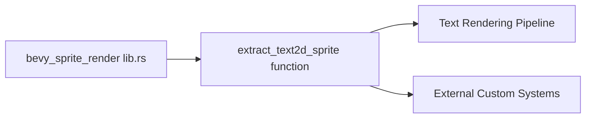

+++
title = "#21104 Make `extract_text2d_sprite` public"
date = "2025-09-17T00:00:00"
draft = false
template = "pull_request_page.html"
in_search_index = true

[taxonomies]
list_display = ["show"]

[extra]
current_language = "en"
available_languages = {"en" = { name = "English", url = "/pull_request/bevy/2025-09/pr-21104-en-20250917" }, "zh-cn" = { name = "中文", url = "/pull_request/bevy/2025-09/pr-21104-zh-cn-20250917" }}
labels = ["D-Trivial", "A-UI", "C-Usability", "P-Regression"]
+++

# Make `extract_text2d_sprite` public

## Basic Information
- **Title**: Make `extract_text2d_sprite` public
- **PR Link**: https://github.com/bevyengine/bevy/pull/21104
- **Author**: ickshonpe
- **Status**: MERGED
- **Labels**: D-Trivial, A-UI, C-Usability, S-Ready-For-Final-Review, P-Regression
- **Created**: 2025-09-17T20:21:42Z
- **Merged**: 2025-09-17T21:12:20Z
- **Merged By**: alice-i-cecile

## Description
Make `extract_text2d_sprite` `pub` again.

This was made private during the `bevy_sprite_render` migration. Doesn't look like this was done intentionally, there's no mention of it in the migration guides.

## The Story of This Pull Request

This PR addresses a regression in the Bevy engine's public API surface area. During the migration to the `bevy_sprite_render` module, the `extract_text2d_sprite` function was inadvertently changed from public to private visibility. This change wasn't documented in any migration guides, suggesting it was unintentional.

The function serves a critical role in Bevy's text rendering pipeline. It handles the extraction of 2D sprite components from text entities, converting them into renderable data. When this function became private, it broke any external code that depended on this functionality, particularly custom rendering pipelines or text processing systems that needed to hook into Bevy's text extraction process.

The solution is straightforward: change the visibility modifier from private to public. This is achieved by modifying the `use` statement in the module's root from a standard import to a public re-export. The change restores the previous public API without affecting any implementation details or requiring modifications to the function's signature or behavior.

This fix demonstrates the importance of maintaining consistent API visibility during large-scale code migrations. While the mechanical change is simple (adding the `pub` keyword), the impact is significant for downstream consumers who rely on these public interfaces for extending Bevy's functionality.

The implementation maintains all existing functionality while restoring the public access point. No performance implications are expected since this is purely a visibility change that doesn't affect the underlying implementation.

## Visual Representation



## Key Files Changed

- `crates/bevy_sprite_render/src/lib.rs` (+1/-1)

This file contains the module declaration and public exports for the sprite renderer. The change modifies the visibility of the `extract_text2d_sprite` import to make it publicly available again.

```rust
// File: crates/bevy_sprite_render/src/lib.rs
// Before:
#[cfg(feature = "bevy_text")]
use crate::text2d::extract_text2d_sprite;

// After:
#[cfg(feature = "bevy_text")]
pub use crate::text2d::extract_text2d_sprite;
```

The change is minimal but significant: adding the `pub` keyword to the use statement makes the `extract_text2d_sprite` function publicly accessible from the `bevy_sprite_render` module, restoring the API that was available before the migration.

## Further Reading

- [Bevy Engine Documentation](https://docs.rs/bevy/latest/bevy/)
- [Rust Module System and Visibility](https://doc.rust-lang.org/book/ch07-02-defining-modules-to-control-scope-and-privacy.html)
- [Bevy Migration Guides](https://bevyengine.org/learn/migration-guides/)

# Full Code Diff
```diff
diff --git a/crates/bevy_sprite_render/src/lib.rs b/crates/bevy_sprite_render/src/lib.rs
index e902f13dee004..fe7ca6951669c 100644
--- a/crates/bevy_sprite_render/src/lib.rs
+++ b/crates/bevy_sprite_render/src/lib.rs
@@ -45,7 +45,7 @@ use bevy_render::{
 use bevy_sprite::Sprite;
 
 #[cfg(feature = "bevy_text")]
-use crate::text2d::extract_text2d_sprite;
+pub use crate::text2d::extract_text2d_sprite;
 
 /// Adds support for 2D sprite rendering.
 #[derive(Default)]
```