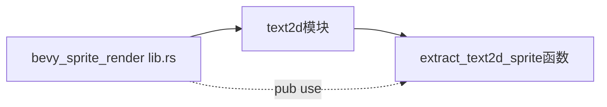

+++
title = "#21104 Make `extract_text2d_sprite` public"
date = "2025-09-17T00:00:00"
draft = false
template = "pull_request_page.html"
in_search_index = false

[extra]
current_language = "zh-cn"
available_languages = {"en" = { name = "English", url = "/pull_request/bevy/2025-09/pr-21104-en-20250917" }, "zh-cn" = { name = "中文", url = "/pull_request/bevy/2025-09/pr-21104-zh-cn-20250917" }}
+++

# Make `extract_text2d_sprite` public

## 基本信息
- **标题**: Make `extract_text2d_sprite` public
- **PR链接**: https://github.com/bevyengine/bevy/pull/21104
- **作者**: ickshonpe
- **状态**: 已合并
- **标签**: D-Trivial, A-UI, C-Usability, S-Ready-For-Final-Review, P-Regression
- **创建时间**: 2025-09-17T20:21:42Z
- **合并时间**: 2025-09-17T21:12:20Z
- **合并者**: alice-i-cecile

## 描述翻译
# 目标

将 `extract_text2d_sprite` 重新设为 `pub`。

这个函数在 `bevy_sprite_render` 迁移过程中被改为私有。看起来这不是有意为之，迁移指南中也没有提到这一点。

## PR 故事

这个 PR 解决了一个简单的回归问题：`extract_text2d_sprite` 函数在 `bevy_sprite_render` 模块迁移过程中意外地从公有变为私有。这是一个典型的"意外破坏API"案例，开发者发现这个变更在迁移文档中没有任何说明，确认这是一个无意的变更。

问题的核心在于，当函数从公有变为私有后，依赖于这个API的外部代码就无法编译了。在Bevy这样的游戏引擎中，保持API稳定性至关重要，特别是对于被设计为公开使用的函数。

解决方案非常直接：在lib.rs文件中使用 `pub use` 重新导出这个函数，恢复其公有可见性。这种修复方式符合Rust的最佳实践，通过显式的重新导出来控制模块的公共API表面。

从技术角度来看，这个变更展示了Rust的可见性控制系统如何工作。`pub use` 语句允许模块将内部项重新导出为公共API的一部分，这是组织大型代码库时的常用模式。

这个修改的影响是立即且积极的：恢复了之前依赖此函数的代码的兼容性，同时保持了代码库的模块化结构。对于Bevy用户来说，这意味着他们可以继续使用这个提取函数而不需要寻找替代方案或等待更长的修复周期。

## 可视化表示



## 关键文件变更

**crates/bevy_sprite_render/src/lib.rs** (+1/-1)
这个文件是bevy_sprite_render模块的主要入口点。变更内容是将对extract_text2d_sprite的导入从私有改为公有重新导出。

```rust
// 变更前:
use crate::text2d::extract_text2d_sprite;

// 变更后:
pub use crate::text2d::extract_text2d_sprite;
```

这个简单的修改恢复了`extract_text2d_sprite`函数的公共可访问性，使其再次成为bevy_sprite_render模块公共API的一部分。

## 延伸阅读

- [Rust模块系统和可见性规则](https://doc.rust-lang.org/book/ch07-02-defining-modules-to-control-scope-and-privacy.html)
- [Bevy引擎架构概述](https://bevyengine.org/learn/book/introduction/)
- [使用pub use控制API暴露](https://doc.rust-lang.org/rust-by-example/mod/use_decl.html)