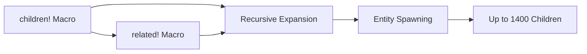

+++
title = "#21107 Add release note for infiinite children"
date = "2025-09-18T00:00:00"
draft = false
template = "pull_request_page.html"
in_search_index = true

[taxonomies]
list_display = ["show"]

[extra]
current_language = "en"
available_languages = {"en" = { name = "English", url = "/pull_request/bevy/2025-09/pr-21107-en-20250918" }, "zh-cn" = { name = "中文", url = "/pull_request/bevy/2025-09/pr-21107-zh-cn-20250918" }}
labels = ["D-Trivial", "A-ECS", "X-Contentious"]
+++

# Add release note for infiinite children

## Basic Information
- **Title**: Add release note for infiinite children
- **PR Link**: https://github.com/bevyengine/bevy/pull/21107
- **Author**: alice-i-cecile
- **Status**: MERGED
- **Labels**: D-Trivial, A-ECS, S-Ready-For-Final-Review, X-Contentious
- **Created**: 2025-09-17T22:59:05Z
- **Merged**: 2025-09-18T00:35:31Z
- **Merged By**: alice-i-cecile

## Description Translation
Fixes #21052.

The changes I thought needed to happen to `related!` were actually already made, so we're good to go.

## The Story of This Pull Request

This PR addresses a documentation gap for a previously implemented feature that significantly improves Bevy's entity spawning capabilities. The core issue was that the `children!` macro, introduced in Bevy 0.16, had an arbitrary limitation of only supporting 12 children due to Rust's lack of variadic generics. This constraint proved problematic for users working with complex UI hierarchies or other entity structures requiring more children.

The technical solution involved rewriting the macro implementation to use recursive expansion patterns instead of relying on fixed-length tuples. This approach leverages Rust's macro system to generate code recursively, effectively pushing the limit to approximately 1400 children - the practical boundary defined by Rust's recursion limit rather than an arbitrary constraint.

While the actual implementation work was completed in PR #18865, this PR serves as the necessary documentation component, adding release notes to inform users about the enhanced capability. The same improvements were also applied to the `related!` macro, enabling users to spawn large numbers of related entities in a single call.

The engineering trade-off here is clear: while variadic generics would provide a more elegant solution, the recursive macro approach delivers practical functionality within Rust's current language constraints. The implementation demonstrates effective use of Rust's macro system to work around language limitations while maintaining API consistency.

From a performance perspective, spawning hundreds of entities via macro expansion remains efficient as the heavy lifting occurs at compile time rather than runtime. The macro generates the equivalent code that would be written manually, ensuring no runtime overhead compared to alternative approaches.

This change significantly improves developer experience by eliminating the need for workarounds when working with large entity hierarchies. Users can now leverage the convenience macros for most practical use cases without hitting artificial limits.

## Visual Representation



## Key Files Changed

**File**: `release-content/release-notes/infinite-children.md`

This file was created to document the removal of the 12-child limit from the `children!` and `related!` macros. The release note explains the previous limitation, the new capability, and provides context about the technical constraints.

```markdown
---
title: Infinite Children
authors: ["@CorvusPrudens"]
pull_requests: [18865]
---

The `children!` macro is a convenient way to spawn children alongside their parents in Bevy code.
When it was introduced in **Bevy 0.16** this was limited to 12 children, due to arbitrary limitations (Rust: please [support variadic generics!](https://blog.rust-lang.org/inside-rust/2025/09/11/program-management-update-2025-08/#variadic-generics)), and not implementing the requisite workarounds.
When working with large UI hierarchies, this could be a real nuisance, forcing users to resort to ugly workarounds.

We've rewritten the macro and lifted this unjust restriction. You are now only limited by Rust's recursion limit: around 1400 children at once.
Rejoice!
If you are manually spawning more than 1400 children in a single macro call, you should reconsider your strategy (such as using `SpawnIter` or `SpawnWith`).

We've made the same change to the `related!` macro, allowing you to spawn huge numbers of related entities in a single call.
```

## Further Reading

- [Rust Macros: The Complete Guide](https://danielkeep.github.io/tlborm/book/) - Comprehensive resource on Rust macro system
- [Bevy ECS Guide: Entity Relationships](https://bevyengine.org/learn/advanced-topics/entity-relationships/) - Official documentation on entity relationships in Bevy
- [Variadic Generics RFC Discussion](https://github.com/rust-lang/rfcs/issues/376) - Ongoing discussion about variadic generics in Rust
- [PR #18865](https://github.com/bevyengine/bevy/pull/18865) - The original implementation that removed the child limit