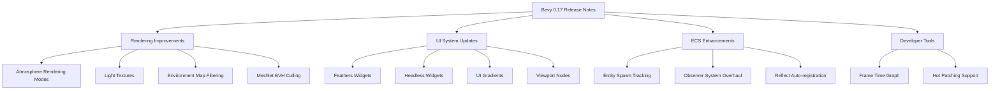

+++
title = "#21108 Bevy 0.17 release notes editorial pass"
date = "2025-09-21T00:00:00"
draft = false
template = "pull_request_page.html"
in_search_index = true

[taxonomies]
list_display = ["show"]

[extra]
current_language = "en"
available_languages = {"en" = { name = "English", url = "/pull_request/bevy/2025-09/pr-21108-en-20250921" }, "zh-cn" = { name = "中文", url = "/pull_request/bevy/2025-09/pr-21108-zh-cn-20250921" }}
labels = ["C-Docs", "A-Cross-Cutting"]
+++

# Bevy 0.17 release notes editorial pass

## Basic Information
- **Title**: Bevy 0.17 release notes editorial pass
- **PR Link**: https://github.com/bevyengine/bevy/pull/21108
- **Author**: cart
- **Status**: MERGED
- **Labels**: C-Docs, S-Ready-For-Final-Review, A-Cross-Cutting
- **Created**: 2025-09-17T23:25:39Z
- **Merged**: 2025-09-21T12:04:15Z
- **Merged By**: cart

## Description Translation
My standard "add clarity, reword / rework, tweak language, trim cruft / protect attention" pass.

## The Story of This Pull Request

This PR represents a comprehensive editorial pass over the Bevy 0.17 release notes. The goal was to improve clarity, precision, and readability while maintaining technical accuracy. The changes focus on making complex concepts more accessible, removing redundant information, and ensuring consistent terminology across all release note sections.

The editorial work addresses several key areas across the 22 modified files:

1. **Technical Precision**: Many sections were rewritten to use more precise terminology and avoid ambiguous language. For example, in `entity-spawn-ticks.md`, the description of `SpawnDetails` and `Spawned` was restructured to clearly explain their purpose and performance characteristics.

2. **Conciseness**: Redundant explanations and unnecessary verbiage were removed. The `render_startup.md` file was significantly condensed while preserving all essential information about the new `RenderStartup` schedule.

3. **Code Examples**: Several files received improved code examples that better illustrate the concepts. In `constructor_functions_for_val_variants.md`, a practical comparison was added showing both the direct `Val::Px` usage and the new helper function approach.

4. **Feature Context**: Descriptions were updated to provide better context about feature maturity and limitations. The `feathers.md` file now clearly distinguishes Feathers as a developer tools widget set and explicitly notes its experimental status and future plans.

5. **Consistent Terminology**: Terms like "Bevy 0.17" were standardized throughout, and technical terms were made consistent across different sections.

The changes maintain a professional, engineering-focused tone while making the content more accessible to Bevy users of all experience levels. The editorial pass ensures that developers can quickly understand what's new in Bevy 0.17 and how to use the features effectively.

## Visual Representation



## Key Files Changed

### `release-content/release-notes/entity-spawn-ticks.md` (+25/-45)
**What changed**: Complete restructuring of the explanation for entity spawn tracking. The new version provides clearer code examples and better explains performance characteristics of the `Spawned` filter.

**Code snippets**:
```rust
// Before:
Keeping track which entities have been spawned since the last time a system ran could only be done indirectly by inserting marker components...

// After:
In previous versions of Bevy, keeping track of which entities have been spawned since the last time a system ran could only be done indirectly by writing your own logic.
```

### `release-content/release-notes/render_startup.md` (+13/-56)
**What changed**: Significant condensation of the explanation about the `RenderStartup` schedule. The technical details were preserved while making the explanation more concise and focused.

**Code snippets**:
```rust
// Before:
Previous rendering code looked quite different from other Bevy code. In general, resources were initialized with the `FromWorld` trait...

// After:
In previous versions of Bevy, render `Plugin` code had to look different than other `Plugin` code, due to how the renderer was initialized.
```

### `release-content/release-notes/raymarched-atmosphere-space-views.md` (+21/-40)
**What changed**: Restructured the atmosphere rendering explanation to clearly present the two rendering modes (`LookupTexture` and `Raymarched`) with their respective use cases.

**Code snippets**:
```rust
// Before:
Bevy's atmosphere now supports a raymarched rendering path that unlocks accurate views from above the atmosphere...

// After:
Bevy's atmosphere now supports a raymarched rendering path that unlocks accurate views from above the atmosphere. This means Bevy 0.17 now has two atmosphere rendering modes to choose from:
```

### `release-content/release-notes/feathers.md` (+25/-24)
**What changed**: Complete rewrite of the Feathers introduction to clearly position it as a developer tools widget set and explicitly note its experimental status and future plans.

**Code snippets**:
```rust
// Before:
To make it easier for Bevy engine developers and third-party tool creators to make comfortable, visually cohesive tooling...

// After:
To make it easier for Bevy engine developers and third-party tool creators to make comfortable, visually cohesive tooling, we're pleased to introduce "Feathers" - a comprehensive Bevy UI widget set.
```

### `release-content/release-notes/reflect_auto_registration.md` (+18/-27)
**What changed**: Restructured the reflect auto-registration explanation with better code examples and clearer description of platform limitations.

**Code snippets**:
```rust
// Before:
Deriving `Reflect` on types opts into Bevy's runtime reflection infrastructure...

// After:
Deriving `Reflect` on types opts into Bevy's runtime reflection infrastructure, which is used to power systems like runtime component inspection and serialization:
```

## Further Reading

- [Bevy Official Documentation](https://bevyengine.org/learn/)
- [Bevy GitHub Repository](https://github.com/bevyengine/bevy)
- [Bevy Cheatbook](https://bevy-cheatbook.github.io/)
- [Bevy Discord Community](https://discord.gg/bevy)

For specific features mentioned in these release notes, refer to the corresponding examples in the Bevy repository and the linked pull requests for technical implementation details.