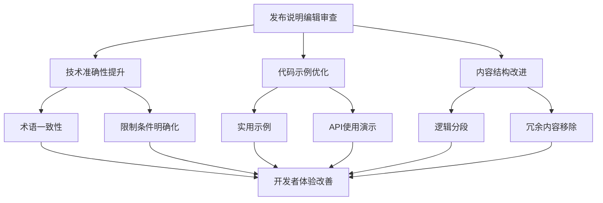

+++
title = "#21108 Bevy 0.17 release notes editorial pass"
date = "2025-09-21T00:00:00"
draft = false
template = "pull_request_page.html"
in_search_index = false

[extra]
current_language = "zh-cn"
available_languages = {"en" = { name = "English", url = "/pull_request/bevy/2025-09/pr-21108-en-20250921" }, "zh-cn" = { name = "中文", url = "/pull_request/bevy/2025-09/pr-21108-zh-cn-20250921" }}
+++

# Bevy 0.17 发布说明编辑审查

## 基本信息
- **标题**: Bevy 0.17 release notes editorial pass
- **PR 链接**: https://github.com/bevyengine/bevy/pull/21108
- **作者**: cart
- **状态**: 已合并
- **标签**: C-Docs, S-Ready-For-Final-Review, A-Cross-Cutting
- **创建时间**: 2025-09-17T23:25:39Z
- **合并时间**: 2025-09-21T12:04:15Z
- **合并者**: cart

## 描述翻译
对发布说明进行标准的"增加清晰度、重新措辞/重构、调整语言、精简冗余内容/保护注意力"的编辑审查。

## 本次 PR 的故事

这个 PR 是对 Bevy 0.17 发布说明的全面编辑审查，主要目标是提升技术文档的质量和可读性。作为一次编辑性质的修改，它不涉及功能代码的变更，而是专注于让发布说明更加清晰、准确和实用。

### 问题和背景

Bevy 0.17 是一个重要的版本更新，包含了许多新特性和改进。原始的发布说明虽然内容完整，但在表达清晰度、代码示例质量和技术准确性方面还有提升空间。存在的问题包括：

- 部分技术描述过于冗长或模糊
- 代码示例不够直观或完整
- 某些功能的适用场景和限制说明不够明确
- 术语使用不够一致

### 解决方案方法

cart 采用了系统性的编辑方法，对每个发布说明文件进行逐项审查：
1. 精简冗余内容，突出关键信息
2. 重写模糊或不准确的描述
3. 改进代码示例，使其更实用和易懂
4. 确保技术术语的一致性
5. 明确功能的使用场景和限制

### 具体实现

编辑工作涉及 22 个文件，主要集中在技术描述的优化和代码示例的改进。以下是一些典型的修改模式：

**实体生成追踪说明的优化**：重写了整个章节的结构，使其更加清晰。原来的长篇解释被拆分为更易理解的段落，并提供了更实用的代码示例：

```rust
// 修改前：
fn system1(query: Query<Entity, Spawned>) {
    for entity in &query { /* entity spawned */ }
}

// 修改后：
fn system(query: Query<Entity, Spawned>) {
    for entity in &query { /* entity spawned */ }
}
```

**渲染启动计划的说明重构**：将原来冗长的技术背景说明精简为更直接的解释，突出了变更的核心价值：

```rust
// 修改前需要复杂的 FromWorld 实现
impl FromWorld for MyRenderResource {
    fn from_world(world: &mut World) -> Self {
        let render_device = world.resource::<RenderDevice>();
        MyRenderResource(/* ... */)
    }
}

// 修改后使用简单的系统初始化
fn init_my_resource(mut commands: Commands, render_device: Res<RenderDevice>) {
    commands.insert_resource(MyRenderResource(/* ... */));
}
```

**Feathers UI 组件集的说明更新**：明确了 Feathers 的定位和使用场景，避免了之前的模糊描述：

```rust
// 更清晰地说明了 Feathers 的用途和限制
commands.spawn((
    Node { width: px(20), height: px(20) },
    BackgroundGradient::from(LinearGradient {
        angle: 4.,
        stops: vec![
            ColorStop::new(Color::WHITE, percent(15)),
            ColorStop::new(Color::BLACK, percent(85)),
        ],
        ..default()
    })
))
```

### 技术见解

这次编辑审查体现了高质量技术文档的几个关键原则：

1. **精确性**：每个技术描述都经过仔细核对，确保与代码实现一致
2. **实用性**：代码示例都是真实可用的，而不是简化的伪代码
3. **一致性**：术语使用在整个文档中保持统一
4. **可读性**：复杂的概念被分解为易于理解的段落

### 影响

这些编辑改进虽然不改变代码功能，但对 Bevy 生态有重要价值：
- 降低了新用户的学习曲线
- 减少了开发者误解API用法的可能性
- 为第三方开发者提供了更清晰的扩展指南
- 提升了 Bevy 作为专业游戏引擎的文档质量

## 可视化表示



## 关键文件变更

### `release-content/release-notes/entity-spawn-ticks.md` (+25/-45)
**变更描述**：重构了实体生成追踪功能的说明，使其更加清晰和实用。

**关键修改**：
```markdown
<!-- 修改前： -->
Keeping track which entities have been spawned since the last time a system ran could only be done indirectly...

<!-- 修改后： -->
In previous versions of Bevy, keeping track of which entities have been spawned since the last time a system ran could only be done indirectly by writing your own logic.
```

### `release-content/release-notes/render_startup.md` (+13/-56)
**变更描述**：简化了 RenderStartup 计划的说明，突出了其核心价值。

**关键修改**：
```markdown
<!-- 修改前： -->
Previous rendering code looked quite different from other Bevy code...

<!-- 修改后： -->
In previous versions of Bevy, render `Plugin` code had to look different than other `Plugin` code, due to how the renderer was initialized.
```

### `release-content/release-notes/raymarched-atmosphere-space-views.md` (+21/-40)
**变更描述**：优化了光线步进大气渲染的说明，更清晰地描述了两种模式的适用场景。

**关键修改**：
```markdown
<!-- 修改前： -->
Bevy's atmosphere now supports a raymarched rendering path that unlocks accurate views from above the atmosphere...

<!-- 修改后： -->
Bevy's atmosphere now supports a raymarched rendering path that unlocks accurate views from above the atmosphere. This means **Bevy 0.17** now has two atmosphere rendering modes to choose from:
```

### `release-content/release-notes/feathers.md` (+25/-24)
**变更描述**：明确了 Feathers UI 组件集的定位和当前状态。

**关键修改**：
```markdown
<!-- 修改前： -->
To make it easier for Bevy engine developers and third-party tool creators to make comfortable, visually cohesive tooling...

<!-- 修改后： -->
we're pleased to introduce "Feathers" - a comprehensive Bevy UI widget set. Feathers is meant to be Bevy's "developer tools" widget set, and it will be used to build the upcoming [Bevy Editor](https://bevy.org/news/bevys-fifth-birthday/#bevy-editor-design).
```

### `release-content/release-notes/reflect_auto_registration.md` (+18/-27)
**变更描述**：改进了反射自动注册功能的说明，提供了更清晰的代码示例。

**关键修改**：
```markdown
<!-- 修改前： -->
## Automatic [`Reflect`] registration

Deriving [`Reflect`] on types opts into **Bevy's** runtime reflection infrastructure...

<!-- 修改后： -->
Deriving [`Reflect`] on types opts into **Bevy's** runtime reflection infrastructure, which is used to power systems like runtime component inspection and serialization:
```

## 扩展阅读

- [Bevy 官方文档](https://bevyengine.org/learn/)
- [Bevy 示例代码](https://github.com/bevyengine/bevy/tree/main/examples)
- [Bevy 社区资源](https://bevyengine.org/community/)
- [技术文档写作最佳实践](https://documentation.divio.com/)

# 完整代码差异

由于 PR 包含 22 个文件的修改，差异内容较长，以下是部分关键变更的摘要：

```diff
diff --git a/release-content/release-notes/entity-spawn-ticks.md b/release-content/release-notes/entity-spawn-ticks.md
index aa319cb2a1158..cc1503df81521 100644
--- a/release-content/release-notes/entity-spawn-ticks.md
+++ b/release-content/release-notes/entity-spawn-ticks.md
@@ -4,50 +4,49 @@ authors: ["@urben1680", "@specificprotagonist"]
 pull_requests: [19047, 19350]
 ---
 
-Keeping track which entities have been spawned since the last time a system ran could only be done indirectly by inserting marker components and do your logic on entities that match an `Added<MyMarker>` filter or in `MyMarker`'s `on_add` hook.
-
-This has the issue however: add events react to component insertions on existing entities too. Sometimes you cannot even add your marker because the spawn call is hidden in some non-public API.
+In previous versions of Bevy, keeping track of which entities have been spawned since the last time a system ran could only be done indirectly by writing your own logic.
 
 The new `SpawnDetails` query data and `Spawned` query filter enable you to find recently spawned entities without any marker components.
 
 ## `SpawnDetails`
 
-Use this in your query when you want to get information about the entity's spawn. You might want to do that for debug purposes, using the struct's `Debug` implementation.
-
-You can also get specific information via methods. The following example prints the entity id (prefixed with "new" if it showed up for the first time), the `Tick` it spawned at and, if the `track_location` feature is activated, the source code location where it was spawned. Said feature is not enabled by default because it comes with a runtime cost.
+Use this in your query when you want to get information about the entity's spawn:
 
 ```rs
 fn print_spawn_details(query: Query<(Entity, SpawnDetails)>) {
     for (entity, spawn_details) in &query {
         if spawn_details.is_spawned() {
-            print!("new ");
+            print!(
+                "new entity {entity:?} spawned at {:?}",
+                spawn_details.spawn_tick()
+            );
+            // if the `track_location` cargo feature is activated, this contains the source
+            // code location where this entity was spawned. This has a runtime cost, so only
+            // use it for debugging!
+            match spawn_details.spawned_by().into_option() {
+                Some(location) => println!(" by {location:?}"),
+                None => println!()
+            }    
         }
-        print!(
-            "entity {entity:?} spawned at {:?}",
-            spawn_details.spawned_at()
-        );
-        match spawn_details.spawned_by().into_option() {
-            Some(location) => println!(" by {location:?}"),
-            None => println!()
-        }    
     }
 }
 ```
 
 ## `Spawned`
 
-Use this filter in your query if you are only interested in entities that were spawned after the last time your system ran.
-
-Note that this, like `Added<T>` and `Changed<T>`, is a non-archetypal filter. This means that your query could still go through millions of entities without yielding any recently spawned ones. Unlike filters like `With<T>` which can easily skip all entities that do not have `T` without checking them one-by-one.
-
-Because of this, these systems have roughly the same performance:
+Use this filter in your query if you are only interested in entities that were spawned after the last time your system ran:
 
-```rs
-fn system1(query: Query<Entity, Spawned>) {
+```rust
+fn system(query: Query<Entity, Spawned>) {
     for entity in &query { /* entity spawned */ }
 }
+```
+
+Note that, much like `Added` and `Changed` filters, this is a "non archetypal filter", meaning it requires scanning every entity matching the query, including those that weren't spawned since the last run.
+Because of this, the system above performs roughly the same as this one:
 
-fn system2(query: Query<(Entity, SpawnDetails)>) {
+```rust
+fn system(query: Query<(Entity, SpawnDetails)>) {
     for (entity, spawned) in &query {
         if spawned.is_spawned() { /* entity spawned */ }
     }
@@ -56,27 +55,8 @@ fn system2(query: Query<(Entity, SpawnDetails)>) {
 
 ## Getter methods
 
-Getting around this weakness of non-archetypal filters can be to check only specific entities for their spawn tick: The method `spawned_at` was added to all entity pointer structs, such as `EntityRef`, `EntityMut` and `EntityWorldMut`.
+You can also use helper methods on `EntityWorldMut` and `EntityCommands`:
 
-In this example we want to filter for entities that were spawned after a certain `tick`:
-
-```rs
-fn filter_spawned_after(
-    entities: impl IntoIterator<Item = Entity>,
-    world: &World,
-    tick: Tick,
-) -> impl Iterator<Item = Entity> {
-    let now = world.last_change_tick();
-    entities.into_iter().filter(move |entity| world
-        .entity(*entity)
-        .spawned_at()
-        .is_newer_than(tick, now)
-    )
-}
+```rust
+world.entity(entity).spawn_tick()
 ```
-
----
-
-The tick is stored in `Entities`. It's method `entity_get_spawned_or_despawned_at` not only returns when a living entity spawned at, it also returns when a despawned entity found it's bitter end.
-
-Note however that despawned entities can be replaced by Bevy at any following spawn. Then this method returns `None` for the despawned entity. The same is true if the entity is not even spawned yet, only allocated.
```

完整差异请查看原始 PR：https://github.com/bevyengine/bevy/pull/21108