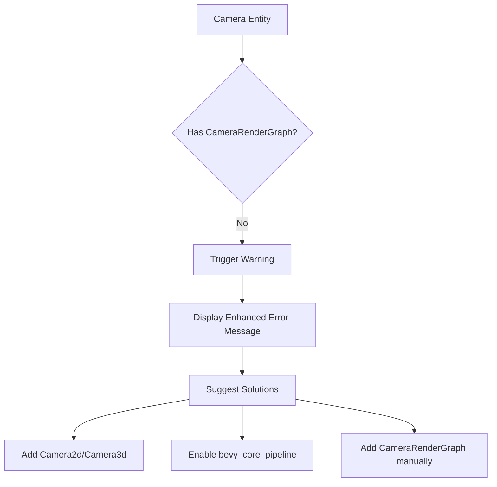

+++
title = "#21112 Improve error message for warn_on_no_render_graph"
date = "2025-09-18T00:00:00"
draft = false
template = "pull_request_page.html"
in_search_index = true

[taxonomies]
list_display = ["show"]

[extra]
current_language = "en"
available_languages = {"en" = { name = "English", url = "/pull_request/bevy/2025-09/pr-21112-en-20250918" }, "zh-cn" = { name = "中文", url = "/pull_request/bevy/2025-09/pr-21112-zh-cn-20250918" }}
labels = ["A-Rendering", "C-Usability"]
+++

# Improve error message for warn_on_no_render_graph

## Basic Information
- **Title**: Improve error message for warn_on_no_render_graph
- **PR Link**: https://github.com/bevyengine/bevy/pull/21112
- **Author**: alice-i-cecile
- **Status**: MERGED
- **Labels**: A-Rendering, C-Usability, S-Ready-For-Final-Review
- **Created**: 2025-09-18T00:14:33Z
- **Merged**: 2025-09-18T00:59:10Z
- **Merged By**: alice-i-cecile

## Description Translation
Fixes #21090.

## The Story of This Pull Request

This PR addresses a usability issue in Bevy's rendering system where developers encountered unclear error messages when configuring cameras. The problem occurred when an entity had a `Camera` component but lacked a properly configured render graph, which is essential for the camera to function correctly within Bevy's rendering pipeline.

The original error message was technically correct but insufficiently detailed. It suggested adding either a `Camera2d` or `Camera3d` component, or manually adding a `CameraRenderGraph` component for custom render graphs. However, this guidance didn't cover all common scenarios that developers might encounter, particularly cases where the necessary render features weren't enabled due to missing crate dependencies.

The solution approach was straightforward: enhance the warning message to provide more comprehensive guidance. The improved message now includes two additional suggestions:
1. Enabling the `bevy_core_pipeline` crate (which provides the standard 2D and 3D render graphs)
2. Maintaining the existing options for adding standard camera components or custom render graphs

This change required minimal code modification but significantly improves the developer experience. The implementation involved updating the warning string in the `warn_on_no_render_graph` function to provide more specific and actionable guidance. The new message helps developers quickly identify and resolve the underlying issue, whether it's missing components or missing crate dependencies.

The technical insight here is that error messages should not only indicate what's wrong but also provide clear, actionable solutions. In this case, the improved message covers multiple common scenarios that could lead to the same warning, helping developers navigate Bevy's modular architecture where rendering features can be optionally included through crate dependencies.

The impact of this change is improved developer productivity and reduced frustration when working with Bevy's camera system. Developers encountering this warning will now receive more specific guidance that helps them resolve the issue faster, whether they need to add components, enable features, or configure custom render graphs.

## Visual Representation



## Key Files Changed

### `crates/bevy_render/src/camera.rs` (+2/-1)

This file contains the camera-related functionality in Bevy's render system. The change modifies the warning message displayed when a camera entity doesn't have a render graph configured.

**Before:**
```rust
warn!("{}Entity {entity} has a `Camera` component, but it doesn't have a render graph configured. Consider adding a `Camera2d` or `Camera3d` component, or manually adding a `CameraRenderGraph` component if you need a custom render graph.", caller.map(|location|format!("{location}: ")).unwrap_or_default());
```

**After:**
```rust
warn!("{}Entity {entity} has a `Camera` component, but it doesn't have a render graph configured. Usually, adding a `Camera2d` or `Camera3d` component will work.
        However, you may instead need to enable `bevy_core_pipeline`, or may want to manually add a `CameraRenderGraph` component to create a custom render graph.", caller.map(|location|format!("{location}: ")).unwrap_or_default());
```

The change improves the error message by:
1. Adding a line break for better readability
2. Including a suggestion to enable `bevy_core_pipeline` when appropriate
3. Maintaining all previous suggestions while making them more specific

## Further Reading

- [Bevy Camera Documentation](https://bevyengine.org/learn/books/introduction/3d-camera/)
- [Bevy Render Graph System](https://bevyengine.org/learn/books/introduction/rendering/#render-graphs)
- [Bevy Core Pipeline Crate](https://docs.rs/bevy_core_pipeline/latest/bevy_core_pipeline/)
- [Rust Error Message Guidelines](https://rust-lang.github.io/api-guidelines/diagnostics.html)

## Full Code Diff
```diff
diff --git a/crates/bevy_render/src/camera.rs b/crates/bevy_render/src/camera.rs
index 65b8edfe6eb1f..e1837d2740d16 100644
--- a/crates/bevy_render/src/camera.rs
+++ b/crates/bevy_render/src/camera.rs
@@ -87,7 +87,8 @@ impl Plugin for CameraPlugin {
 
 fn warn_on_no_render_graph(world: DeferredWorld, HookContext { entity, caller, .. }: HookContext) {
     if !world.entity(entity).contains::<CameraRenderGraph>() {
-        warn!("{}Entity {entity} has a `Camera` component, but it doesn't have a render graph configured. Consider adding a `Camera2d` or `Camera3d` component, or manually adding a `CameraRenderGraph` component if you need a custom render graph.", caller.map(|location|format!("{location}: ")).unwrap_or_default());
+        warn!("{}Entity {entity} has a `Camera` component, but it doesn't have a render graph configured. Usually, adding a `Camera2d` or `Camera3d` component will work.
+        However, you may instead need to enable `bevy_core_pipeline`, or may want to manually add a `CameraRenderGraph` component to create a custom render graph.", caller.map(|location|format!("{location}: ")).unwrap_or_default());
     }
 }
 
```