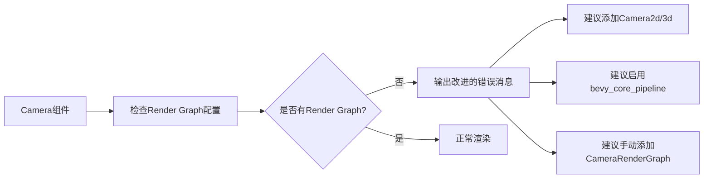

+++
title = "#21112 Improve error message for warn_on_no_render_graph"
date = "2025-09-18T00:00:00"
draft = false
template = "pull_request_page.html"
in_search_index = false

[extra]
current_language = "zh-cn"
available_languages = {"en" = { name = "English", url = "/pull_request/bevy/2025-09/pr-21112-en-20250918" }, "zh-cn" = { name = "中文", url = "/pull_request/bevy/2025-09/pr-21112-zh-cn-20250918" }}
+++

# Improve error message for warn_on_no_render_graph

## 基本信息
- **标题**: Improve error message for warn_on_no_render_graph
- **PR链接**: https://github.com/bevyengine/bevy/pull/21112
- **作者**: alice-i-cecile
- **状态**: 已合并
- **标签**: A-Rendering, C-Usability, S-Ready-For-Final-Review
- **创建时间**: 2025-09-18T00:14:33Z
- **合并时间**: 2025-09-18T00:59:10Z
- **合并者**: alice-i-cecile

## 描述翻译
修复 #21090。

## 这个Pull Request的故事

这个PR解决了一个具体的用户体验问题：当开发者在使用Bevy引擎时，如果实体有`Camera`组件但没有配置渲染图(render graph)，系统会输出警告信息，但原来的警告信息不够清晰，导致开发者不知道如何正确解决问题。

问题的核心在于原来的错误消息只提供了部分解决方案建议："考虑添加`Camera2d`或`Camera3d`组件，或者手动添加`CameraRenderGraph`组件"。这对于不熟悉Bevy渲染系统的开发者来说可能不够明确，特别是当他们可能缺少必要的依赖包时。

开发者alice-i-cecile识别到了这个问题，并决定改进错误消息的质量。改进的方案是在警告信息中添加更多具体的指导：

1. 明确指出通常的解决方案是添加`Camera2d`或`Camera3d`组件
2. 提示开发者可能需要启用`bevy_core_pipeline`功能
3. 保留手动添加`CameraRenderGraph`组件的选项供高级使用场景

这个改进看似简单，但实际上对开发者体验有显著影响。清晰的错误消息可以节省开发者大量的调试时间，特别是对于新手来说，明确的指导比模糊的建议更有价值。

从技术实现角度看，这个修改只涉及一个函数中的一行代码，但通过更详细的消息内容，提供了更完整的解决方案路径。新的错误消息采用了多行字符串格式，保持了代码的可读性，同时提供了更丰富的信息。

```rust
// 修改前：
warn!("{}Entity {entity} has a `Camera` component, but it doesn't have a render graph configured. Consider adding a `Camera2d` or `Camera3d` component, or manually adding a `CameraRenderGraph` component if you need a custom render graph.", caller.map(|location|format!("{location}: ")).unwrap_or_default());

// 修改后：
warn!("{}Entity {entity} has a `Camera` component, but it doesn't have a render graph configured. Usually, adding a `Camera2d` or `Camera3d` component will work.
However, you may instead need to enable `bevy_core_pipeline`, or may want to manually add a `CameraRenderGraph` component to create a custom render graph.", caller.map(|location|format!("{location}: ")).unwrap_or_default());
```

这个修改体现了良好的错误消息设计原则：不仅要告诉用户出了问题，还要提供明确的下一步行动指导。特别是添加了关于`bevy_core_pipeline`的提示，这解决了#21090中报告的具体问题，即开发者可能没有启用必要的依赖包。

## 可视化表示



## 关键文件变更

- `crates/bevy_render/src/camera.rs` (+2/-1)

这个文件包含了相机系统的核心实现，修改的是`warn_on_no_render_graph`函数中的警告消息。

**变更详情：**
```rust
// 修改前：
warn!("{}Entity {entity} has a `Camera` component, but it doesn't have a render graph configured. Consider adding a `Camera2d` or `Camera3d` component, or manually adding a `CameraRenderGraph` component if you need a custom render graph.", caller.map(|location|format!("{location}: ")).unwrap_or_default());

// 修改后：
warn!("{}Entity {entity} has a `Camera` component, but it doesn't have a render graph configured. Usually, adding a `Camera2d` or `Camera3d` component will work.
However, you may instead need to enable `bevy_core_pipeline`, or may want to manually add a `CameraRenderGraph` component to create a custom render graph.", caller.map(|location|format!("{location}: ")).unwrap_or_default());
```

这个修改通过提供更详细和准确的解决方案建议，改善了开发者遇到此错误时的调试体验。

## 扩展阅读

- [Bevy渲染图文档](https://bevyengine.org/learn/books/introduction/rendering/render-graphs/)
- [Bevy相机系统](https://bevyengine.org/learn/books/introduction/rendering/cameras/)
- [错误消息设计最佳实践](https://rust-lang.github.io/api-guidelines/documentation.html#c-question-mark-error)