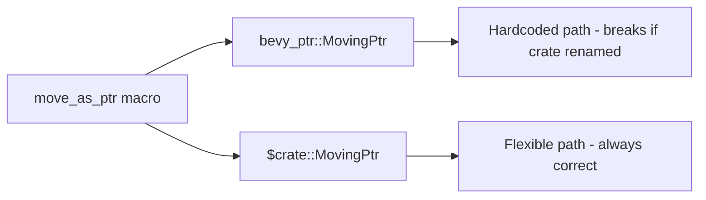

+++
title = "#21113 Use `$crate` instead of `bevy_ptr` in `move_as_ptr` macro"
date = "2025-09-18T00:00:00"
draft = false
template = "pull_request_page.html"
in_search_index = true

[taxonomies]
list_display = ["show"]

[extra]
current_language = "en"
available_languages = {"en" = { name = "English", url = "/pull_request/bevy/2025-09/pr-21113-en-20250918" }, "zh-cn" = { name = "中文", url = "/pull_request/bevy/2025-09/pr-21113-zh-cn-20250918" }}
labels = ["C-Bug", "A-ECS", "D-Macros"]
+++

# Use `$crate` instead of `bevy_ptr` in `move_as_ptr` macro

## Basic Information
- **Title**: Use `$crate` instead of `bevy_ptr` in `move_as_ptr` macro
- **PR Link**: https://github.com/bevyengine/bevy/pull/21113
- **Author**: chescock
- **Status**: MERGED
- **Labels**: C-Bug, A-ECS, D-Macros
- **Created**: 2025-09-18T00:25:18Z
- **Merged**: 2025-09-18T03:34:44Z
- **Merged By**: james7132

## Description Translation
# Objective

Fixes #21050

## Solution

Use the `$crate` metavariable in the `move_as_ptr` macro so that it always resolves the `bevy_ptr` crate correctly.

## The Story of This Pull Request

The issue began when a developer encountered a compilation error while using the `move_as_ptr` macro from the `bevy_ptr` crate. The macro was hardcoded to reference `bevy_ptr::MovingPtr` directly, which caused problems when the crate was imported under a different name or when the macro was used in contexts where the `bevy_ptr` path wasn't directly available.

This was a classic macro hygiene issue in Rust. Macros need to be written carefully to ensure they work correctly regardless of how users import them into their code. The `move_as_ptr` macro was generating code that assumed the `bevy_ptr` crate would always be available under that exact name, which isn't guaranteed in all usage scenarios.

The solution was straightforward but important: replace the hardcoded `bevy_ptr` reference with the `$crate` metavariable. In Rust procedural macros, `$crate` automatically expands to the absolute path of the crate where the macro is defined, ensuring that the macro always references the correct crate regardless of how it's imported.

The change was minimal but significant. It involved modifying just one line in the macro definition:

```rust
// Before:
let $value = unsafe { bevy_ptr::MovingPtr::from_value(&mut $value) };

// After:
let $value = unsafe { $crate::MovingPtr::from_value(&mut $value) };
```

This change ensures that the macro will always resolve to the correct `MovingPtr` type from its own crate, making the macro more robust and portable. The fix follows Rust's best practices for macro design, where `$crate` is the standard way to reference items from the macro's defining crate.

The impact of this change is that the `move_as_ptr` macro now works correctly in all import scenarios, preventing compilation errors that would occur when the crate was renamed or used in complex module structures. This improves the developer experience and makes the Bevy ECS system more reliable.

## Visual Representation



## Key Files Changed

**crates/bevy_ptr/src/lib.rs** (+1/-1)

This file contains the `move_as_ptr` macro that was modified. The change ensures the macro correctly references its own crate's items regardless of import context.

```rust
// Before:
let $value = unsafe { bevy_ptr::MovingPtr::from_value(&mut $value) };

// After:
let $value = unsafe { $crate::MovingPtr::from_value(&mut $value) };
```

The change replaces the hardcoded `bevy_ptr` reference with the `$crate` metavariable, which automatically expands to the correct crate path.

## Further Reading

- [Rust Reference: The `$crate` metavariable](https://doc.rust-lang.org/reference/macros-by-example.html#the-crate-metavariable)
- [Rust Book: Macro Hygiene](https://doc.rust-lang.org/book/ch19-06-macros.html)
- [Bevy ECS Documentation](https://docs.rs/bevy_ecs/latest/bevy_ecs/)

# Full Code Diff
```diff
diff --git a/crates/bevy_ptr/src/lib.rs b/crates/bevy_ptr/src/lib.rs
index 3a69d3c94b51f..ddd98770209c5 100644
--- a/crates/bevy_ptr/src/lib.rs
+++ b/crates/bevy_ptr/src/lib.rs
@@ -1212,7 +1212,7 @@ macro_rules! move_as_ptr {
         //   it is impossible to refer to the original value, preventing further access after
         //   the `MovingPtr` has been used. `MaybeUninit` also prevents the compiler from
         //   dropping the original value.
-        let $value = unsafe { bevy_ptr::MovingPtr::from_value(&mut $value) };
+        let $value = unsafe { $crate::MovingPtr::from_value(&mut $value) };
     };
 }
 
```