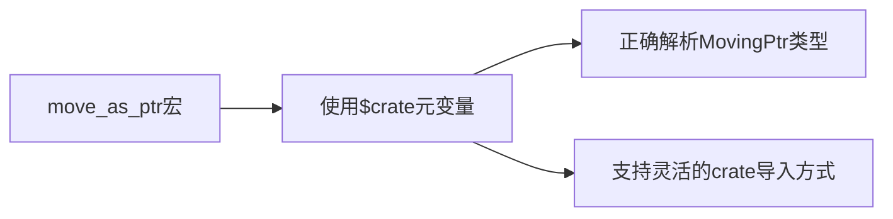

+++
title = "#21113 Use `$crate` instead of `bevy_ptr` in `move_as_ptr` macro"
date = "2025-09-18T00:00:00"
draft = false
template = "pull_request_page.html"
in_search_index = false

[extra]
current_language = "zh-cn"
available_languages = {"en" = { name = "English", url = "/pull_request/bevy/2025-09/pr-21113-en-20250918" }, "zh-cn" = { name = "中文", url = "/pull_request/bevy/2025-09/pr-21113-zh-cn-20250918" }}
+++

# Title

## 基本信息
- **标题**: Use `$crate` instead of `bevy_ptr` in `move_as_ptr` macro
- **PR链接**: https://github.com/bevyengine/bevy/pull/21113
- **作者**: chescock
- **状态**: 已合并
- **标签**: C-Bug, A-ECS, D-Macros
- **创建时间**: 2025-09-18T00:25:18Z
- **合并时间**: 2025-09-18T03:34:44Z
- **合并者**: james7132

## 描述翻译
### 目标

修复 #21050

### 解决方案

在 `move_as_ptr` 宏中使用 `$crate` 元变量，确保始终能正确解析 `bevy_ptr` crate。

## 这个PR的故事

这个PR解决了一个看似简单但影响重大的宏导入问题。问题出现在 `bevy_ptr` crate 的 `move_as_ptr` 宏中，当开发者以非标准方式导入这个crate时，宏无法正确解析其内部类型。

### 问题背景

在Rust的宏系统中，当宏需要引用自身crate中的类型时，直接使用crate名称会导致问题。如果用户通过不同的名称导入crate（例如使用 `use some_other_name as bevy_ptr`），或者将宏重导出到其他模块中，直接硬编码的crate名称就无法正确解析。

具体到这个问题，`move_as_ptr` 宏内部需要引用 `MovingPtr` 类型，但原实现直接使用了 `bevy_ptr::MovingPtr` 这样的硬编码路径。这违反了Rust宏的最佳实践，导致了issue #21050中报告的问题。

### 解决方案

修复方法很直接但很重要：使用Rust提供的 `$crate` 元变量来代替硬编码的crate名称。`$crate` 是一个特殊的元变量，在宏展开时总是解析到定义该宏的crate的根路径，无论用户如何导入或重导出这个宏。

```rust
// 修复前：
let $value = unsafe { bevy_ptr::MovingPtr::from_value(&mut $value) };

// 修复后：
let $value = unsafe { $crate::MovingPtr::from_value(&mut $value) };
```

这个修改确保了无论开发者如何导入 `bevy_ptr` crate，`move_as_ptr` 宏都能正确找到 `MovingPtr` 类型。

### 技术细节

`move_as_ptr` 宏是Bevy ECS系统中的重要工具，它用于安全地移动值并获取其指针，同时防止对原始值的进一步访问。宏的实现使用了 `MovingPtr` 类型和 `MaybeUninit` 来确保内存安全。

这个修复虽然只有一行代码的更改，但它解决了宏的可移植性和可用性问题。现在开发者可以更灵活地导入和使用 `bevy_ptr` crate，而不会遇到编译错误。

### 影响和意义

这个修复：
1. 提高了代码的健壮性，避免了因导入方式不同导致的编译错误
2. 遵循了Rust宏编程的最佳实践
3. 保持了向后兼容性，不影响现有代码
4. 为其他类似的宏提供了修复范例

这是一个典型的防御性编程案例，展示了即使是最小的代码更改也能对项目的稳定性和可用性产生积极影响。

## 可视化表示



## 关键文件更改

### `crates/bevy_ptr/src/lib.rs` (+1/-1)

这个文件包含了 `move_as_ptr` 宏的定义。修改将硬编码的 `bevy_ptr` crate 引用替换为 `$crate` 元变量，确保宏在任何导入情况下都能正确工作。

```rust
// 修改前：
let $value = unsafe { bevy_ptr::MovingPtr::from_value(&mut $value) };

// 修改后：
let $value = unsafe { $crate::MovingPtr::from_value(&mut $value) };
```

这个更改解决了当开发者以非标准方式导入 `bevy_ptr` crate 时出现的编译错误问题。

## 扩展阅读

对于想深入了解这个PR相关概念的开发者，建议阅读：

1. [Rust官方文档 - 宏中的$crate](https://doc.rust-lang.org/reference/macros-by-example.html#the-crate-metavariable)
2. [Rust宏小册子](https://danielkeep.github.io/tlborm/book/index.html)
3. [Bevy ECS文档](https://bevyengine.org/learn/books/bevy-ecs-book/)

# 完整代码差异
```diff
diff --git a/crates/bevy_ptr/src/lib.rs b/crates/bevy_ptr/src/lib.rs
index 3a69d3c94b51f..ddd98770209c5 100644
--- a/crates/bevy_ptr/src/lib.rs
+++ b/crates/bevy_ptr/src/lib.rs
@@ -1212,7 +1212,7 @@ macro_rules! move_as_ptr {
         //   it is impossible to refer to the original value, preventing further access after
         //   the `MovingPtr` has been used. `MaybeUninit` also prevents the compiler from
         //   dropping the original value.
-        let $value = unsafe { bevy_ptr::MovingPtr::from_value(&mut $value) };
+        let $value = unsafe { $crate::MovingPtr::from_value(&mut $value) };
     };
 }
 
```