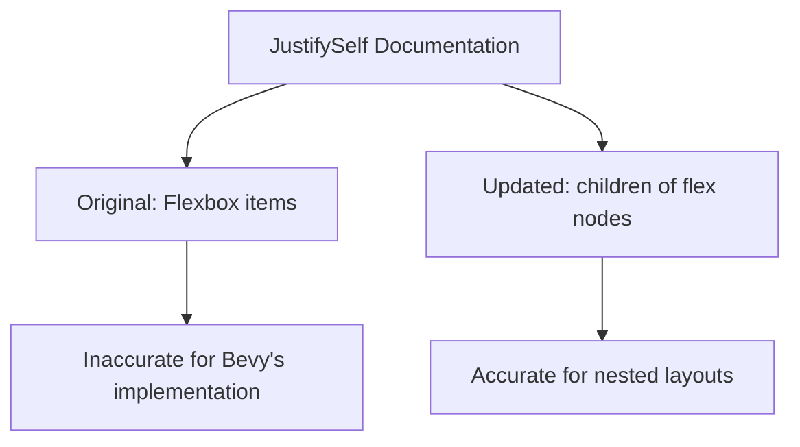

+++
title = "#21130 `JustifySelf` doc comment edit"
date = "2025-09-21T00:00:00"
draft = false
template = "pull_request_page.html"
in_search_index = true

[taxonomies]
list_display = ["show"]

[extra]
current_language = "en"
available_languages = {"en" = { name = "English", url = "/pull_request/bevy/2025-09/pr-21130-en-20250921" }, "zh-cn" = { name = "中文", url = "/pull_request/bevy/2025-09/pr-21130-zh-cn-20250921" }}
labels = ["C-Docs", "A-UI"]
+++

# JustifySelf Doc Comment Edit

## Basic Information
- **Title**: `JustifySelf` doc comment edit
- **PR Link**: https://github.com/bevyengine/bevy/pull/21130
- **Author**: ickshonpe
- **Status**: MERGED
- **Labels**: C-Docs, A-UI, S-Needs-Review
- **Created**: 2025-09-19T13:45:46Z
- **Merged**: 2025-09-21T09:14:30Z
- **Merged By**: mockersf

## Description Translation
# Objective

Changed the doc comment for `JustifySelf` as it's a bit misleading, flex nodes are affected by `JustifySelf` if they have a parent grid node.

A lot of the doc comments need some de-css

## The Story of This Pull Request

This PR addresses a documentation accuracy issue in Bevy's UI system. The problem was in the doc comment for the `JustifySelf` enum, which incorrectly stated that the property has no effect on Flexbox items. While this is generally true in pure CSS contexts, it's misleading in Bevy's layout system where flex nodes can exist within grid containers.

The original documentation followed CSS conventions too strictly without considering Bevy's specific implementation details. In Bevy's UI system, when a flex container is placed inside a grid container, the `JustifySelf` property does affect the flex node's alignment within its grid area. This nuance wasn't captured in the original documentation.

The solution was straightforward - a precise wording change from "Flexbox items" to "children of flex nodes" to better reflect the actual behavior in Bevy's layout system. This change maintains technical accuracy while making the documentation more useful for developers working with nested layout systems.

The implementation involved a single line change in the `ui_node.rs` file, specifically modifying the doc comment for the `JustifySelf` enum. The new wording clarifies that while `JustifySelf` doesn't affect children of flex nodes (which aligns with CSS behavior), it does work for flex nodes themselves when they're placed within grid containers.

This change improves developer experience by providing more accurate documentation that reflects Bevy's actual layout behavior. It helps prevent confusion when developers are working with complex nested layouts that combine flex and grid systems.

## Visual Representation



## Key Files Changed

**File**: `crates/bevy_ui/src/ui_node.rs`

**Change**: Modified the doc comment for `JustifySelf` to clarify its behavior in nested layout scenarios.

**Before**:
```rust
/// Used to control how the specified item is aligned within the space it's given.
/// - For Flexbox items, this property has no effect. See `justify_content` for main axis alignment of flex items.
/// - For CSS Grid items, controls inline (horizontal) axis alignment of a grid item within its grid area.
///
/// <https://developer.mozilla.org/en-US/docs/Web/CSS/justify-self>
```

**After**:
```rust
/// Used to control how the specified item is aligned within the space it's given.
/// - For children of flex nodes, this property has no effect. See `justify_content` for main axis alignment of flex items.
/// - For CSS Grid items, controls inline (horizontal) axis alignment of a grid item within its grid area.
///
/// <https://developer.mozilla.org/en-US/docs/Web/CSS/justify-self>
```

This change ensures the documentation accurately reflects that `JustifySelf` can affect flex nodes when they are children of grid nodes, while maintaining that it doesn't affect children of flex nodes themselves.

## Further Reading

- [MDN Web Docs: justify-self](https://developer.mozilla.org/en-US/docs/Web/CSS/justify-self)
- [Bevy UI Layout Documentation](https://bevyengine.org/learn/books/introduction/ui/)
- [CSS Grid Layout Specification](https://www.w3.org/TR/css-grid-1/)
- [Flexbox Layout Specification](https://www.w3.org/TR/css-flexbox-1/)

# Full Code Diff
```diff
diff --git a/crates/bevy_ui/src/ui_node.rs b/crates/bevy_ui/src/ui_node.rs
index df699f576011b..a734b0cd0d613 100644
--- a/crates/bevy_ui/src/ui_node.rs
+++ b/crates/bevy_ui/src/ui_node.rs
@@ -857,7 +857,7 @@ impl Default for AlignSelf {
 }
 
 /// Used to control how the specified item is aligned within the space it's given.
-/// - For Flexbox items, this property has no effect. See `justify_content` for main axis alignment of flex items.
+/// - For children of flex nodes, this property has no effect. See `justify_content` for main axis alignment of flex items.
 /// - For CSS Grid items, controls inline (horizontal) axis alignment of a grid item within its grid area.
 ///
 /// <https://developer.mozilla.org/en-US/docs/Web/CSS/justify-self>
```