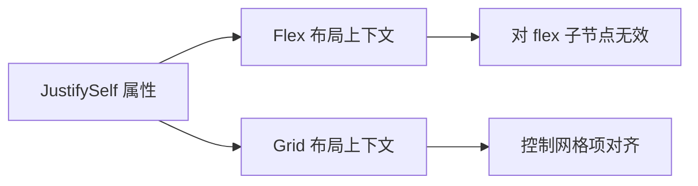

+++
title = "#21130 JustifySelf` doc comment edit"
date = "2025-09-21T00:00:00"
draft = false
template = "pull_request_page.html"
in_search_index = false

[extra]
current_language = "zh-cn"
available_languages = {"en" = { name = "English", url = "/pull_request/bevy/2025-09/pr-21130-en-20250921" }, "zh-cn" = { name = "中文", url = "/pull_request/bevy/2025-09/pr-21130-zh-cn-20250921" }}
+++

# JustifySelf 文档注释修正

## 基本信息
- **标题**: `JustifySelf` doc comment edit
- **PR 链接**: https://github.com/bevyengine/bevy/pull/21130
- **作者**: ickshonpe
- **状态**: 已合并
- **标签**: C-Docs, A-UI, S-Needs-Review
- **创建时间**: 2025-09-19T13:45:46Z
- **合并时间**: 2025-09-21T09:14:30Z
- **合并者**: mockersf

## 描述翻译
# 目标

修改了 `JustifySelf` 的文档注释，因为之前的描述有些误导性 - 如果 flex 节点有父级网格节点，它们也会受到 `JustifySelf` 的影响。

很多文档注释都需要去 CSS 化。

## 这个 PR 的故事

这个 PR 解决了一个看似微小但实际上很重要的文档准确性问题。在 Bevy 的 UI 系统中，`JustifySelf` 属性用于控制项目在其给定空间内的对齐方式，但原来的文档注释存在不准确的描述。

问题的核心在于原注释表述："For Flexbox items, this property has no effect"（对 Flexbox 项目，此属性无效）。这种说法过于绝对，没有考虑到嵌套布局的复杂情况。在实际的 UI 布局中，一个 flex 容器内的项目如果同时处于网格布局的上下文中，仍然会受到 `JustifySelf` 属性的影响。

作者 ickshonpe 识别到了这个文档的不准确之处，并提出了更精确的表述。修正后的注释明确指出："For children of flex nodes, this property has no effect"（对 flex 节点的子节点，此属性无效）。这个修改虽然只是几个单词的变化，但准确地反映了属性的实际行为范围。

从技术角度来看，这个修改体现了对 CSS 布局模型深入理解。在复杂的 UI 层级中，一个节点可能同时受到多种布局约束的影响，文档需要准确描述每种属性在什么情况下生效。原来的注释可能误导开发者认为 `JustifySelf` 在所有 flex 布局场景中都无效，而实际上它只是在纯 flex 布局中不适用。

这个修改也反映了 Bevy 项目对文档质量的重视。虽然只是单行修改，但它有助于开发者更准确地理解和使用 UI 布局系统，避免在实际开发中产生误解。

## 视觉表示



## 关键文件更改

**crates/bevy_ui/src/ui_node.rs** (+1/-1)
这个文件包含了 UI 节点的核心定义和布局相关属性。修改针对 `JustifySelf` 属性的文档注释，使其更准确地描述该属性在不同布局上下文中的行为。

```rust
// 修改前:
/// - For Flexbox items, this property has no effect. See `justify_content` for main axis alignment of flex items.

// 修改后:
/// - For children of flex nodes, this property has no effect. See `justify_content` for main axis alignment of flex items.
```

这个修改确保了文档准确反映了 `JustifySelf` 属性的实际行为，特别澄清了在 flex 布局上下文中的限制条件。

## 延伸阅读

- [MDN Web Docs: justify-self](https://developer.mozilla.org/en-US/docs/Web/CSS/justify-self)
- [CSS Box Alignment Module Level 3](https://www.w3.org/TR/css-align-3/)
- [Bevy UI 布局系统文档](https://bevyengine.org/learn/books/introduction/ui)

# 完整代码差异
```diff
diff --git a/crates/bevy_ui/src/ui_node.rs b/crates/bevy_ui/src/ui_node.rs
index df699f576011b..a734b0cd0d613 100644
--- a/crates/bevy_ui/src/ui_node.rs
+++ b/crates/bevy_ui/src/ui_node.rs
@@ -857,7 +857,7 @@ impl Default for AlignSelf {
 }
 
 /// Used to control how the specified item is aligned within the space it's given.
-/// - For Flexbox items, this property has no effect. See `justify_content` for main axis alignment of flex items.
+/// - For children of flex nodes, this property has no effect. See `justify_content` for main axis alignment of flex items.
 /// - For CSS Grid items, controls inline (horizontal) axis alignment of a grid item within its grid area.
 ///
 /// <https://developer.mozilla.org/en-US/docs/Web/CSS/justify-self>
```