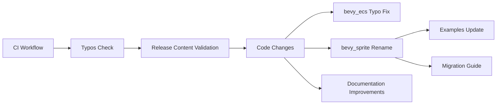

+++
title = "#21143 Fix typo"
date = "2025-09-21T00:00:00"
draft = false
template = "pull_request_page.html"
in_search_index = true

[taxonomies]
list_display = ["show"]

[extra]
current_language = "en"
available_languages = {"en" = { name = "English", url = "/pull_request/bevy/2025-09/pr-21143-en-20250921" }, "zh-cn" = { name = "中文", url = "/pull_request/bevy/2025-09/pr-21143-zh-cn-20250921" }}
labels = ["C-Docs", "D-Trivial", "A-ECS"]
+++

# Fix typo

## Basic Information
- **Title**: Fix typo
- **PR Link**: https://github.com/bevyengine/bevy/pull/21143
- **Author**: hukasu
- **Status**: MERGED
- **Labels**: C-Docs, D-Trivial, A-ECS, S-Ready-For-Final-Review, X-Uncontroversial
- **Created**: 2025-09-21T00:01:56Z
- **Merged**: 2025-09-21T00:50:37Z
- **Merged By**: james7132

## Description Translation
There is a new typo detected by new typos version blocking the merge of #21047 

## Solution

Fix typo

## The Story of This Pull Request

This PR started as a simple typo fix but evolved into a more comprehensive cleanup that addressed multiple issues across the codebase. The initial problem was straightforward: a new version of the typos checker detected a spelling error that was blocking another PR (#21047) from being merged.

The typo in question was in `crates/bevy_ecs/src/storage/table/mod.rs` where "columnts" was misspelled instead of "columns". However, during the review process, the developers identified several other improvements that could be made while addressing the typo.

The most significant change was renaming `ScalingMode` to `SpriteScalingMode` in the `bevy_sprite` crate. This resolved a naming conflict between `bevy_sprite::sprite::ScalingMode` and `bevy_camera::projection::ScalingMode`, which violated Bevy's one-namespace rule. The change required updates throughout the codebase, including examples and migration guides.

Other changes included:
- Adding a new CI job to validate release content
- Fixing various documentation issues
- Improving error messages and warnings
- Adding missing trait implementations
- Cleaning up test code and examples

The implementation followed Bevy's established patterns and conventions. For the `ScalingMode` rename, the approach was systematic:
1. Rename the enum and update all references in the `bevy_sprite` crate
2. Update all examples that used the old name
3. Create a migration guide to help users transition
4. Ensure all tests continued to pass

The changes were mostly mechanical but required careful attention to detail to ensure consistency across the codebase. The PR also included improvements to the `CommandQueue` implementation, adding better error tracking when commands are dropped without being applied.

## Visual Representation



## Key Files Changed

### `crates/bevy_ecs/src/storage/table/mod.rs` (+1/-1)
Fixed a typo in a comment: "columnts" → "columns"

```rust
// Before:
// it must be the correct capacity to allocate, reallocate, and deallocate all columnts.

// After:
// it must be the correct capacity to allocate, reallocate, and deallocate all columns.
```

### `crates/bevy_sprite/src/sprite.rs` (+20/-20)
Renamed `ScalingMode` to `SpriteScalingMode` to resolve naming conflict:

```rust
// Before:
pub enum ScalingMode {
    FillCenter,
    // ...
}

// After:
pub enum SpriteScalingMode {
    FillCenter,
    // ...
}
```

### `examples/2d/sprite_scale.rs` (+20/-20)
Updated the example to use the new `SpriteScalingMode` name:

```rust
// Before:
image_mode: SpriteImageMode::Scale(ScalingMode::FillCenter),

// After:
image_mode: SpriteImageMode::Scale(SpriteScalingMode::FillCenter),
```

### `release-content/migration-guides/rename_bevy_sprite_ScalingMode_to_SpriteScalingMode.md` (+8/-0)
Added a migration guide for the rename:

```markdown
---
title: Rename `ScalingMode` to `SpriteScalingMode`
pull_requests: [21100]
---

In the previous release, both `bevy_sprite::sprite` and `bevy_camera::projection` defined an enum named `ScalingMode`, in violation of our one-namespace rule.

To resolve this, the `ScalingMode` enum from `bevy::sprite` has been renamed to `SpriteScalingMode`.
```

### `crates/bevy_ecs/src/world/command_queue.rs` (+28/-4)
Improved error reporting when commands are dropped without being applied:

```rust
// Added caller tracking for better error messages
#[cfg(feature = "track_location")]
pub(crate) caller: MaybeLocation,

// Enhanced drop warning with caller information
#[cfg(feature = "track_location")]
warn!("CommandQueue has un-applied commands being dropped. Did you forget to call SystemState::apply? caller:{:?}",self.caller.into_option());
```

## Further Reading

- [Bevy Engine GitHub Repository](https://github.com/bevyengine/bevy)
- [Bevy Engine Documentation](https://docs.rs/bevy/)
- [Rust API Guidelines on Naming](https://rust-lang.github.io/api-guidelines/naming.html)
- [Semantic Versioning and Breaking Changes](https://semver.org/)

# Full Code Diff
<details>
<summary>Click to expand full diff</summary>

```diff
diff --git a/.github/workflows/ci.yml b/.github/workflows/ci.yml
index b67c5babf1f52..3d9bc2a99ba55 100644
--- a/.github/workflows/ci.yml
+++ b/.github/workflows/ci.yml
@@ -522,3 +522,14 @@ jobs:
               echo " Example: 'use bevy::sprite::Mesh2d;' instead of 'bevy_internal::sprite::Mesh2d;'"
               exit 1
           fi
+
+  check-release-content:
+    runs-on: ubuntu-latest
+    timeout-minutes: 30
+    steps:
+      - uses: actions/checkout@v5
+      - uses: dtolnay/rust-toolchain@stable
+      - name: Check Release Content
+        shell: bash
+        run: |
+          cargo run --package export-content -- --check
diff --git a/README.md b/README.md
index 73cc0e7a8d51c..ace4b5fd414d9 100644
--- a/README.md
+++ b/README.md
@@ -1,4 +1,4 @@
-# [](https://bevy.org)
+# [](https://bevy.org)
 
 [](https://github.com/bevyengine/bevy#license)
 [](https://crates.io/crates/bevy)
diff --git a/crates/bevy_camera/src/camera.rs b/crates/bevy_camera/src/camera.rs
index 35f165fc469a5..48e546a8bfced 100644
--- a/crates/bevy_camera/src/camera.rs
+++ b/crates/bevy_camera/src/camera.rs
@@ -162,7 +162,7 @@ impl Default for SubCameraView {
 }
 
 /// Information about the current [`RenderTarget`].
-#[derive(Default, Debug, Clone)]
+#[derive(Debug, Clone)]
 pub struct RenderTargetInfo {
     /// The physical size of this render target (in physical pixels, ignoring scale factor).
     pub physical_size: UVec2,
@@ -173,6 +173,15 @@ pub struct RenderTargetInfo {
     pub scale_factor: f32,
 }
 
+impl Default for RenderTargetInfo {
+    fn default() -> Self {
+        Self {
+            physical_size: Default::default(),
+            scale_factor: 1.,
+        }
+    }
+}
+
 /// Holds internally computed [`Camera`] values.
 #[derive(Default, Debug, Clone)]
 pub struct ComputedCameraValues {
@@ -873,6 +882,8 @@ pub enum NormalizedRenderTarget {
 }
 
 /// A unique id that corresponds to a specific `ManualTextureView` in the `ManualTextureViews` collection.
+///
+/// See `ManualTextureViews` in `bevy_camera` for more details.
 #[derive(Default, Debug, Clone, Copy, PartialEq, Eq, Hash, PartialOrd, Ord, Component, Reflect)]
 #[reflect(Component, Default, Debug, PartialEq, Hash, Clone)]
 pub struct ManualTextureViewHandle(pub u32);
diff --git a/crates/bevy_camera/src/visibility/mod.rs b/crates/bevy_camera/src/visibility/mod.rs
index 8ac0ea4fe565d..c4e313428a9c6 100644
--- a/crates/bevy_camera/src/visibility/mod.rs
+++ b/crates/bevy_camera/src/visibility/mod.rs
@@ -150,11 +150,16 @@ impl InheritedVisibility {
 /// When adding a new renderable component, you'll typically want to write an
 /// add-component hook that adds the type ID of that component to the
 /// [`VisibilityClass`] array. See `custom_phase_item` for an example.
+///
+/// `VisibilityClass` is automatically added by a hook on the `Mesh3d` and
+/// `Mesh2d` components. To avoid duplicating the `VisibilityClass` and
+/// causing issues when cloning, we use `#[component(clone_behavior=Ignore)]`
 //
 // Note: This can't be a `ComponentId` because the visibility classes are copied
 // into the render world, and component IDs are per-world.
 #[derive(Clone, Component, Default, Reflect, Deref, DerefMut)]
 #[reflect(Component, Default, Clone)]
+#[component(clone_behavior=Ignore)]
 pub struct VisibilityClass(pub SmallVec<[TypeId; 1]>);
 
 /// Algorithmically-computed indication of whether an entity is visible and should be extracted for rendering.
@@ -988,4 +993,27 @@ mod test {
         assert_eq!(1, size_of::<Visibility>());
         assert_eq!(1, size_of::<Option<Visibility>>());
     }
+
+    #[derive(Component, Default, Clone, Reflect)]
+    #[require(VisibilityClass)]
+    #[reflect(Component, Default, Clone)]
+    #[component(on_add = add_visibility_class::<Self>)]
+    struct TestVisibilityClassHook;
+
+    #[test]
+    fn test_add_visibility_class_hook() {
+        let mut world = World::new();
+        let entity = world.spawn(TestVisibilityClassHook).id();
+        let entity_clone = world.spawn_empty().id();
+        world
+            .entity_mut(entity)
+            .clone_with_opt_out(entity_clone, |_| {});
+
+        let entity_visibility_class = world.entity(entity).get::<VisibilityClass>().unwrap();
+        assert_eq!(entity_visibility_class.len(), 1);
+
+        let entity_clone_visibility_class =
+            world.entity(entity_clone).get::<VisibilityClass>().unwrap();
+        assert_eq!(entity_clone_visibility_class.len(), 1);
+    }
 }
diff --git a/crates/bevy_dev_tools/src/fps_overlay.rs b/crates/bevy_dev_tools/src/fps_overlay.rs
index 3c573611f70b3..ea5c0fde4318b 100644
--- a/crates/bevy_dev_tools/src/fps_overlay.rs
+++ b/crates/bevy_dev_tools/src/fps_overlay.rs
@@ -2,18 +2,16 @@
 
 use bevy_app::{Plugin, Startup, Update};
 use bevy_asset::{Assets, Handle};
-use bevy_camera::visibility::Visibility;
 use bevy_color::Color;
 use bevy_diagnostic::{DiagnosticsStore, FrameTimeDiagnosticsPlugin};
 use bevy_ecs::{
-    change_detection::DetectChangesMut,
     component::Component,
     entity::Entity,
     prelude::Local,
-    query::With,
+    query::{With, Without},
     resource::Resource,
     schedule::{common_conditions::resource_changed, IntoScheduleConfigs},
-    system::{Commands, Query, Res, ResMut},
+    system::{Commands, Query, Res, ResMut, Single},
 };
 use bevy_picking::Pickable;
 use bevy_render::storage::ShaderStorageBuffer;
@@ -247,26 +245,23 @@ fn customize_overlay(
 
 fn toggle_display(
     overlay_config: Res<FpsOverlayConfig>,
-    mut query: Query<&mut Visibility, With<FpsText>>,
-    mut graph_style: Query<&mut Node, With<FrameTimeGraph>>,
+    mut text_node: Single<&mut Node, (With<FpsText>, Without<FrameTimeGraph>)>,
+    mut graph_node: Single<&mut Node, (With<FrameTimeGraph>, Without<FpsText>)>,
 ) {
-    for mut visibility in &mut query {
-        visibility.set_if_neq(match overlay_config.enabled {
-            true => Visibility::Visible,
-            false => Visibility::Hidden,
-        });
+    if overlay_config.enabled {
+        text_node.display = bevy_ui::Display::DEFAULT;
+    } else {
+        text_node.display = bevy_ui::Display::None;
     }
 
-    if let Ok(mut graph_style) = graph_style.single_mut() {
-        if overlay_config.frame_time_graph_config.enabled {
-            // Scale the frame time graph based on the font size of the overlay
-            let font_size = overlay_config.text_config.font_size;
-            graph_style.width = Val::Px(font_size * FRAME_TIME_GRAPH_WIDTH_SCALE);
-            graph_style.height = Val::Px(font_size * FRAME_TIME_GRAPH_HEIGHT_SCALE);
+    if overlay_config.frame_time_graph_config.enabled {
+        // Scale the frame time graph based on the font size of the overlay
+        let font_size = overlay_config.text_config.font_size;
+        graph_node.width = Val::Px(font_size * FRAME_TIME_GRAPH_WIDTH_SCALE);
+        graph_node.height = Val::Px(font_size * FRAME_TIME_GRAPH_HEIGHT_SCALE);
 
-            graph_style.display = bevy_ui::Display::DEFAULT;
-        } else {
-            graph_style.display = bevy_ui::Display::None;
-        }
+        graph_node.display = bevy_ui::Display::DEFAULT;
+    } else {
+        graph_node.display = bevy_ui::Display::None;
     }
 }
diff --git a/crates/bevy_ecs/src/archetype.rs b/crates/bevy_ecs/src/archetype.rs
index 9a9f80aa0d995..1885c801e8802 100644
--- a/crates/bevy_ecs/src/archetype.rs
+++ b/crates/bevy_ecs/src/archetype.rs
@@ -25,6 +25,7 @@ use crate::{
     entity::{Entity, EntityLocation},
     event::Event,
     observer::Observers,
+    query::DebugCheckedUnwrap,
     storage::{ImmutableSparseSet, SparseArray, SparseSet, TableId, TableRow},
 };
 use alloc::{boxed::Box, vec::Vec};
@@ -142,24 +143,27 @@ pub(crate) struct ArchetypeAfterBundleInsert {
     ///
     /// The initial values are determined based on the provided constructor, falling back to the `Default` trait if none is given.
     pub required_components: Box<[RequiredComponentConstructor]>,
-    /// The components added by this bundle. This includes any Required Components that are inserted when adding this bundle.
-    pub(crate) added: Box<[ComponentId]>,
-    /// The components that were explicitly contributed by this bundle, but already existed in the archetype. This _does not_ include any
-    /// Required Components.
-    pub(crate) existing: Box<[ComponentId]>,
+    /// The components inserted by this bundle, with added components before existing ones.
+    /// Added components includes any Required Components that are inserted when adding this bundle,
+    /// but existing components only includes ones explicitly contributed by this bundle.
+    inserted: Box<[ComponentId]>,
+    /// The number of components added by this bundle, including Required Components.
+    added_len: usize,
 }
 
 impl ArchetypeAfterBundleInsert {
-    pub(crate) fn iter_inserted(&self) -> impl Iterator<Item = ComponentId> + Clone + '_ {
-        self.added.iter().chain(self.existing.iter()).copied()
+    pub(crate) fn inserted(&self) -> &[ComponentId] {
+        &self.inserted
     }
 
-    pub(crate) fn iter_added(&self) -> impl Iterator<Item = ComponentId> + Clone + '_ {
-        self.added.iter().copied()
+    pub(crate) fn added(&self) -> &[ComponentId] {
+        // SAFETY: `added_len` is always in range `0..=inserted.len()`
+        unsafe { self.inserted.get(..self.added_len).debug_checked_unwrap() }
     }
 
-    pub(crate) fn iter_existing(&self) -> impl Iterator<Item = ComponentId> + Clone + '_ {
-        self.existing.iter().copied()
+    pub(crate) fn existing(&self) -> &[ComponentId] {
+        // SAFETY: `added_len` is always in range `0..=inserted.len()`
+        unsafe { self.inserted.get(self.added_len..).debug_checked_unwrap() }
     }
 }
 
@@ -244,17 +248,21 @@ impl Edges {
         archetype_id: ArchetypeId,
       