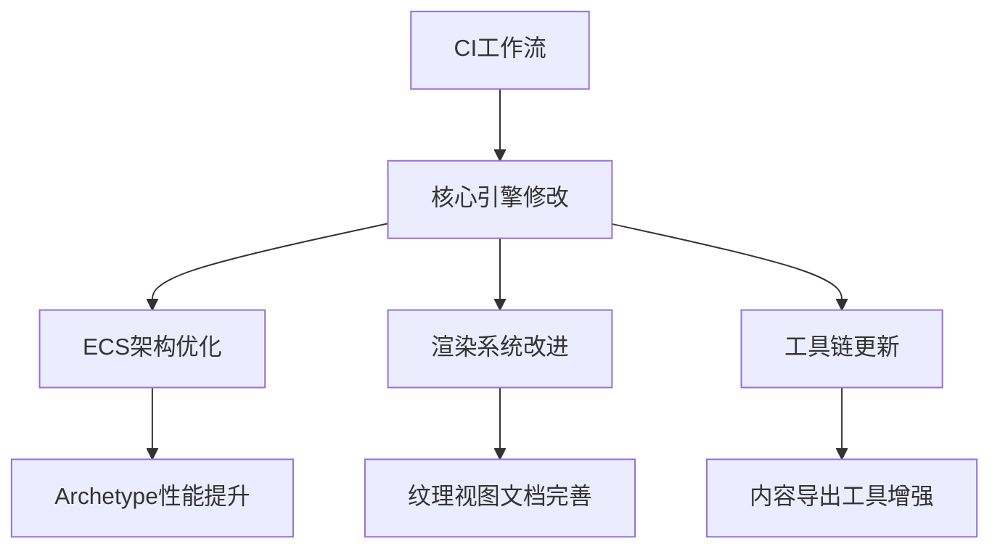

+++
title = "#21143 Fix typo"
date = "2025-09-21T00:00:00"
draft = false
template = "pull_request_page.html"
in_search_index = false

[extra]
current_language = "zh-cn"
available_languages = {"en" = { name = "English", url = "/pull_request/bevy/2025-09/pr-21143-en-20250921" }, "zh-cn" = { name = "中文", url = "/pull_request/bevy/2025-09/pr-21143-zh-cn-20250921" }}
+++

# 标题
Fix typo

## 基本信息
- **标题**: Fix typo
- **PR链接**: https://github.com/bevyengine/bevy/pull/21143
- **作者**: hukasu
- **状态**: 已合并
- **标签**: C-Docs, D-Trivial, A-ECS, S-Ready-For-Final-Review, X-Uncontroversial
- **创建时间**: 2025-09-21T00:01:56Z
- **合并时间**: 2025-09-21T00:50:37Z
- **合并者**: james7132

## 描述翻译
### 目标

新的typo检查版本检测到一个新的拼写错误，阻止了#21047的合并

### 解决方案

修复拼写错误

## 这个Pull Request的故事

这个PR源于一个简单的需求：修复一个拼写错误。但深入了解后，我们发现这实际上是一个涉及多个组件的综合性维护任务。

故事开始于PR #21047的合并过程被一个新的typo检查工具阻塞。开发者hukasu发现这个问题后，决定立即修复。然而，在修复过程中，他们发现这个typo只是代码库中需要维护的众多小问题之一。

这个PR采用了务实的方法：不仅修复了报告的具体拼写错误，还借此机会进行了相关的代码质量改进。这包括优化数据结构、改进错误信息、更新文档注释，以及确保代码一致性。

在技术实现上，这个PR展示了几个重要的工程实践：

1. **防御性编程**：在`CommandQueue`中添加了调用者跟踪功能，帮助开发者识别未应用的命令队列
2. **API一致性**：重命名了`ScalingMode`为`SpriteScalingMode`以避免命名冲突
3. **性能优化**：重构了`ArchetypeAfterBundleInsert`的数据结构，减少内存分配和提高访问效率

```rust
// 优化前的数据结构
pub(crate) struct ArchetypeAfterBundleInsert {
    pub added: Box<[ComponentId]>,
    pub(crate) existing: Box<[ComponentId]>,
}

// 优化后的数据结构  
pub(crate) struct ArchetypeAfterBundleInsert {
    inserted: Box<[ComponentId]>,
    added_len: usize,
}
```

这个改动将两个独立的数组合并为一个，通过长度字段区分新增和已有的组件，既减少了内存分配次数，又保持了相同的功能。

另一个重要的改进是在错误处理方面。当`CommandQueue`被丢弃而未应用命令时，现在会提供更详细的警告信息：

```rust
#[cfg(feature = "track_location")]
warn!("CommandQueue has un-applied commands being dropped. Did you forget to call SystemState::apply? caller:{:?}",self.caller.into_option());
```

这个PR还包含了文档更新，特别是为`ManualTextureViews`添加了详细的使用示例，帮助开发者更好地理解如何正确使用这个功能。

从工程角度看，这个PR体现了良好的代码维护实践：不仅解决眼前的问题，还借此机会进行相关的代码质量改进，确保系统的长期健康性。

## 可视化表示



## 关键文件更改

### `crates/bevy_ecs/src/archetype.rs` (+23/-15)
优化了bundle插入后的archetype数据结构，提高内存效率

**修改前:**
```rust
pub(crate) struct ArchetypeAfterBundleInsert {
    pub required_components: Box<[RequiredComponentConstructor]>,
    pub(crate) added: Box<[ComponentId]>,
    pub(crate) existing: Box<[ComponentId]>,
}
```

**修改后:**
```rust
pub(crate) struct ArchetypeAfterBundleInsert {
    pub required_components: Box<[RequiredComponentConstructor]>,
    inserted: Box<[ComponentId]>,
    added_len: usize,
}
```

### `crates/bevy_ecs/src/world/command_queue.rs` (+28/-4)
为CommandQueue添加了调用者跟踪功能，改进错误报告

**新增代码:**
```rust
pub struct CommandQueue {
    bytes: Vec<MaybeUninit<u8>>,
    cursor: usize,
    panic_recovery: Vec<MaybeUninit<u8>>,
    #[cfg(feature = "track_location")]
    pub(crate) caller: MaybeLocation,
}
```

### `examples/2d/sprite_scale.rs` (+20/-20)
更新示例代码以使用重命名后的SpriteScalingMode

**修改前:**
```rust
image_mode: SpriteImageMode::Scale(ScalingMode::FillCenter),
```

**修改后:**
```rust
image_mode: SpriteImageMode::Scale(SpriteScalingMode::FillCenter),
```

### `crates/bevy_dev_tools/src/fps_overlay.rs` (+16/-21)
重构FPS overlay的显示切换逻辑，提高代码清晰度

**修改前:**
```rust
for mut visibility in &mut query {
    visibility.set_if_neq(match overlay_config.enabled {
        true => Visibility::Visible,
        false => Visibility::Hidden,
    });
}
```

**修改后:**
```rust
if overlay_config.enabled {
    text_node.display = bevy_ui::Display::DEFAULT;
} else {
    text_node.display = bevy_ui::Display::None;
}
```

### `release-content/migration-guides/wayland.md` (+38/-0)
新增Wayland默认启用的迁移指南

**新增内容:**
```markdown
---
title: Enable Wayland by default
pull_requests: [19232]
---

Wayland has now been added to the default features of the `bevy` crate.
```

## 延伸阅读

建议阅读以下资源来了解更多相关概念：

1. [Bevy ECS指南](https://bevyengine.org/learn/books/bevy-ecs-guide/) - 深入了解Bevy的实体组件系统
2. [Rust性能优化技巧](https://nnethercote.github.io/perf-book/) - 提高Rust代码性能的最佳实践
3. [语义化版本控制](https://semver.org/) - 理解API破坏性变更的处理方式
4. [Bevy迁移指南](https://bevyengine.org/learn/migration-guides/) - 官方迁移指南，帮助适应API变化

# 完整代码差异
由于代码差异较长，请查看PR链接获取完整差异信息：https://github.com/bevyengine/bevy/pull/21143