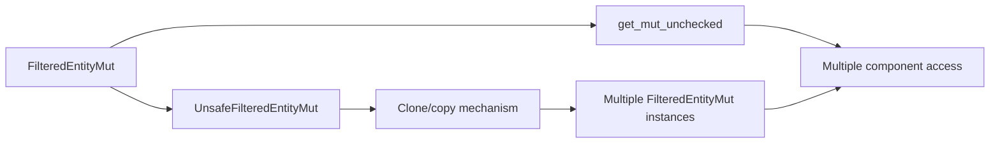

+++
title = "#21182 Allow querying multiple components from FilteredEntityMut"
date = "2025-09-29T00:00:00"
draft = false
template = "pull_request_page.html"
in_search_index = true

[taxonomies]
list_display = ["show"]

[extra]
current_language = "en"
available_languages = {"en" = { name = "English", url = "/pull_request/bevy/2025-09/pr-21182-en-20250929" }, "zh-cn" = { name = "中文", url = "/pull_request/bevy/2025-09/pr-21182-zh-cn-20250929" }}
labels = ["C-Feature", "A-ECS", "D-Complex", "X-Contentious", "D-Unsafe"]
+++

# Title
Allow querying multiple components from FilteredEntityMut

## Basic Information
- **Title**: Allow querying multiple components from FilteredEntityMut
- **PR Link**: https://github.com/bevyengine/bevy/pull/21182
- **Author**: cBournhonesque
- **Status**: MERGED
- **Labels**: C-Feature, A-ECS, S-Ready-For-Final-Review, D-Complex, X-Contentious, D-Unsafe
- **Created**: 2025-09-23T14:24:04Z
- **Merged**: 2025-09-29T23:15:59Z
- **Merged By**: alice-i-cecile

## Description Translation
# Objective

https://github.com/bevyengine/bevy/pull/20265 introduced a way to fetch multiple mutable components from an `EntityMut`, but it's still impossible to do so via an `FilteredEntityMut`.

I believe it is currently impossible to get two mutable components from a `FilteredEntityMut`, which somewhat limits use cases with dynamic queries.

## Solution

A similar solution is harder to implement for `FilteredEntityMut` because the QueryData must go through the access checks, and it's not obvious to get the ComponentIds from a `ReleaseStateQueryData`.

Instead, I opt in to provide a similar abstraction as `UnsafeEntityCell` and `UnsafeWorldCell`, which are both public and Clone: an opt-in escape catch for advanced users that can guarantee that they are not causing any aliasing violations.

Here, instead we provide a method that copies the underlying `UnsafeEntityCell`, so the safety requirements are similar to `UnsafeEntityCell` and `UnsafeWorldCell`.

## Testing

Added a doctest.

## The Story of This Pull Request

This PR addresses a limitation in Bevy's ECS system where developers couldn't query multiple mutable components from a single `FilteredEntityMut`. The problem stemmed from Rust's borrowing rules - since `FilteredEntityMut` methods required `&mut self`, you couldn't call `get_mut` multiple times on the same instance to access different components.

The core issue was that `FilteredEntityMut` represents a filtered view of an entity with specific component access permissions, but the safe API was overly restrictive. While PR #20265 had solved this problem for `EntityMut`, the same capability was missing for `FilteredEntityMut`.

The developer considered implementing a safe solution similar to what was done for `EntityMut`, but found it challenging due to the complexity of access checks and component ID resolution in filtered queries. Instead, they opted for a pragmatic approach: provide unsafe escape hatches that give advanced users the tools to work around borrow checker limitations while maintaining safety through explicit documentation and requirements.

The solution introduces two key components:

1. **UnsafeFilteredEntityMut**: A new struct that acts as a "copyable handle" to a `FilteredEntityMut`. This follows the same pattern as `UnsafeEntityCell` and `UnsafeWorldCell` elsewhere in Bevy's codebase.

2. **Unsafe methods on FilteredEntityMut**: New methods `get_mut_unchecked` and `get_mut_by_id_unchecked` that only require `&self` instead of `&mut self`, allowing multiple mutable component accesses from the same `FilteredEntityMut`.

The implementation carefully maintains the existing safe API while adding unsafe alternatives. The safe methods (`get_mut` and `get_mut_by_id`) are now implemented in terms of their unsafe counterparts, with the safety guarantee coming from the fact that they take `&mut self`, preventing multiple simultaneous uses.

The key insight here is recognizing when to use unsafe code as an escape hatch for advanced use cases while maintaining a safe default API. This pattern is common in systems programming where you need to balance safety with flexibility for performance-critical or complex scenarios.

## Visual Representation



## Key Files Changed

### `crates/bevy_ecs/src/world/entity_ref.rs`

This file received the bulk of the changes, adding the new `UnsafeFilteredEntityMut` struct and unsafe access methods.

**Key additions:**
```rust
#[derive(Copy, Clone)]
pub struct UnsafeFilteredEntityMut<'w, 's> {
    entity: UnsafeEntityCell<'w>,
    access: &'s Access,
}

impl<'w, 's> UnsafeFilteredEntityMut<'w, 's> {
    #[inline]
    pub fn new_readonly(filtered_entity_mut: &FilteredEntityMut<'w, 's>) -> Self {
        Self {
            entity: filtered_entity_mut.entity,
            access: filtered_entity_mut.access,
        }
    }

    #[inline]
    pub unsafe fn into_mut(self) -> FilteredEntityMut<'w, 's> {
        FilteredEntityMut::new(self.entity, self.access)
    }
}
```

**Unsafe access methods:**
```rust
pub unsafe fn get_mut_unchecked<T: Component<Mutability = Mutable>>(
    &self,
) -> Option<Mut<'_, T>> {
    let id = self
        .entity
        .world()
        .components()
        .get_valid_id(TypeId::of::<T>())?;
    self.access
        .has_component_write(id)
        .then(|| unsafe { self.entity.get_mut() })
        .flatten()
}

pub unsafe fn get_mut_by_id_unchecked(
    &self,
    component_id: ComponentId,
) -> Option<MutUntyped<'_>> {
    self.access
        .has_component_write(component_id)
        .then(|| unsafe { self.entity.get_mut_by_id(component_id).ok() })
        .flatten()
}
```

**Safe methods updated to use unsafe implementations:**
```rust
pub fn get_mut<T: Component<Mutability = Mutable>>(&mut self) -> Option<Mut<'_, T>> {
    // SAFETY: we use a mutable reference to self, so we cannot use the `FilteredEntityMut` to access
    // another component
    unsafe { self.get_mut_unchecked() }
}
```

### `crates/bevy_ecs/src/world/mod.rs`

This file had a minimal change to export the new type:

```rust
// Before:
pub use entity_ref::{
    ComponentEntry, DynamicComponentFetch, EntityMut, EntityMutExcept, EntityRef, EntityRefExcept,
    EntityWorldMut, FilteredEntityMut, FilteredEntityRef, OccupiedComponentEntry,
    TryFromFilteredError, VacantComponentEntry,
};

// After:  
pub use entity_ref::{
    ComponentEntry, DynamicComponentFetch, EntityMut, EntityMutExcept, EntityRef, EntityRefExcept,
    EntityWorldMut, FilteredEntityMut, FilteredEntityRef, OccupiedComponentEntry,
    TryFromFilteredError, UnsafeFilteredEntityMut, VacantComponentEntry,
};
```

## Further Reading

- [Bevy ECS: Entity and Component](https://bevyengine.org/learn/book/ecs/entity-component/)
- [Rustonomicon: Working with Unsafe](https://doc.rust-lang.org/nomicon/working-with-unsafe.html)
- [Bevy `UnsafeEntityCell` documentation](https://docs.rs/bevy_ecs/latest/bevy_ecs/world/struct.UnsafeEntityCell.html)
- [PR #20265: Multiple mutable component access from EntityMut](https://github.com/bevyengine/bevy/pull/20265)