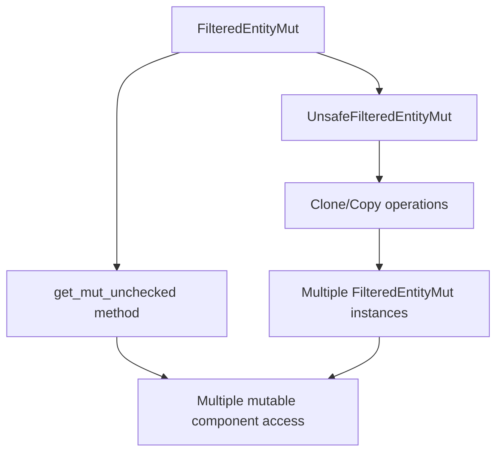

+++
title = "#21182 Allow querying multiple components from FilteredEntityMut"
date = "2025-09-29T00:00:00"
draft = false
template = "pull_request_page.html"
in_search_index = false

[extra]
current_language = "zh-cn"
available_languages = {"en" = { name = "English", url = "/pull_request/bevy/2025-09/pr-21182-en-20250929" }, "zh-cn" = { name = "中文", url = "/pull_request/bevy/2025-09/pr-21182-zh-cn-20250929" }}
labels = ["C-Feature", "A-ECS", "D-Complex", "X-Contentious", "D-Unsafe"]
+++

# Allow querying multiple components from FilteredEntityMut

## Basic Information
- **Title**: Allow querying multiple components from FilteredEntityMut
- **PR Link**: https://github.com/bevyengine/bevy/pull/21182
- **Author**: cBournhonesque
- **Status**: MERGED
- **Labels**: C-Feature, A-ECS, S-Ready-For-Final-Review, D-Complex, X-Contentious, D-Unsafe
- **Created**: 2025-09-23T14:24:04Z
- **Merged**: 2025-09-29T23:15:59Z
- **Merged By**: alice-i-cecile

## Description Translation
# 目标

https://github.com/bevyengine/bevy/pull/20265 引入了从 `EntityMut` 获取多个可变组件的方法，但仍然无法通过 `FilteredEntityMut` 实现。

我相信目前无法从 `FilteredEntityMut` 获取两个可变组件，这在某种程度上限制了动态查询的使用场景。

## 解决方案

为 `FilteredEntityMut` 实现类似的解决方案更加困难，因为 QueryData 必须通过访问检查，并且从 `ReleaseStateQueryData` 获取 ComponentIds 并不明显。

相反，我选择提供一个类似于 `UnsafeEntityCell` 和 `UnsafeWorldCell` 的抽象，这两者都是公共且可克隆的：为高级用户提供的一个选择性的逃生舱，他们可以保证不会引起任何别名违规。

在这里，我们提供了一个复制底层 `UnsafeEntityCell` 的方法，因此安全要求与 `UnsafeEntityCell` 和 `UnsafeWorldCell` 类似。

## 测试

添加了一个文档测试。

## The Story of This Pull Request

这个PR解决了一个在Bevy ECS系统中存在的实际限制：无法从单个`FilteredEntityMut`同时获取多个可变组件。问题的根源在于Rust的借用检查器——当使用安全的`get_mut`方法时，需要`&mut self`引用，这意味着一次只能获取一个组件的可变引用。

开发者面临的具体问题是：虽然PR #20265为`EntityMut`添加了多组件查询能力，但`FilteredEntityMut`仍然受到限制。这在动态查询场景中特别成问题，因为`FilteredEntityMut`常用于构建基于运行时条件的查询。

解决方案采用了双重方法。首先，引入了`UnsafeFilteredEntityMut`结构体，它包装了底层的`UnsafeEntityCell`和访问权限信息。这个结构体是`Copy`和`Clone`的，允许创建多个副本：

```rust
#[derive(Copy, Clone)]
pub struct UnsafeFilteredEntityMut<'w, 's> {
    entity: UnsafeEntityCell<'w>,
    access: &'s Access,
}
```

关键洞察是：虽然`FilteredEntityMut`本身不能被安全地克隆，但可以创建一个包含相同信息的"只读"版本，然后通过unsafe操作将其转换回功能完整的`FilteredEntityMut`。

第二个解决方案是添加了`get_mut_unchecked`方法，它只需要`&self`而不是`&mut self`：

```rust
pub unsafe fn get_mut_unchecked<T: Component<Mutability = Mutable>>(
    &self,
) -> Option<Mut<'_, T>> {
```

这种方法的工程权衡很明确：通过使用unsafe代码，为高级用户提供了绕过借用检查器限制的能力，同时保持了类型系统的安全保证。用户必须手动确保不会创建别名引用，这与Rust的所有权模型一致。

实现细节显示了良好的架构设计。现有的安全方法`get_mut`和`get_mut_by_id`现在委托给它们对应的unsafe版本：

```rust
pub fn get_mut<T: Component<Mutability = Mutable>>(&mut self) -> Option<Mut<'_, T>> {
    // SAFETY: we use a mutable reference to self, so we cannot use the `FilteredEntityMut` to access
    // another component
    unsafe { self.get_mut_unchecked() }
}
```

这种重构保持了代码的一致性，同时确保安全API继续提供预期的保证。

从技术角度看，这个PR展示了如何在不破坏现有安全保证的情况下扩展API。`UnsafeFilteredEntityMut`遵循了Bevy中已建立的模式，类似于`UnsafeEntityCell`和`UnsafeWorldCell`，为高级用例提供了逃生舱。

这个改变的影响是显著的：它使得基于动态查询的复杂系统能够更自然地表达，同时保持了Rust的内存安全保证。代价是用户需要在unsafe块中明确承认他们对安全保证的责任。

## Visual Representation



## Key Files Changed

### `crates/bevy_ecs/src/world/entity_ref.rs` (+143/-3)

这个文件包含了主要的实现更改：

1. **新增`UnsafeFilteredEntityMut`结构体**：
```rust
#[derive(Copy, Clone)]
pub struct UnsafeFilteredEntityMut<'w, 's> {
    entity: UnsafeEntityCell<'w>,
    access: &'s Access,
}

impl<'w, 's> UnsafeFilteredEntityMut<'w, 's> {
    #[inline]
    pub fn new_readonly(filtered_entity_mut: &FilteredEntityMut<'w, 's>) -> Self {
        Self {
            entity: filtered_entity_mut.entity,
            access: filtered_entity_mut.access,
        }
    }

    #[inline]
    pub unsafe fn into_mut(self) -> FilteredEntityMut<'w, 's> {
        FilteredEntityMut::new(self.entity, self.access)
    }
}
```

2. **新增unsafe访问方法**：
```rust
pub unsafe fn get_mut_unchecked<T: Component<Mutability = Mutable>>(
    &self,
) -> Option<Mut<'_, T>> {
    let id = self
        .entity
        .world()
        .components()
        .get_valid_id(TypeId::of::<T>())?;
    self.access
        .has_component_write(id)
        .then(|| unsafe { self.entity.get_mut() })
        .flatten()
}

pub unsafe fn get_mut_by_id_unchecked(
    &self,
    component_id: ComponentId,
) -> Option<MutUntyped<'_>> {
    self.access
        .has_component_write(component_id)
        .then(|| unsafe { self.entity.get_mut_by_id(component_id).ok() })
        .flatten()
}
```

3. **重构现有安全方法**：
```rust
// 之前：
pub fn get_mut<T: Component<Mutability = Mutable>>(&mut self) -> Option<Mut<'_, T>> {
    let id = self.entity.world().components().get_valid_id(TypeId::of::<T>())?;
    self.access
        .has_component_write(id)
        .then(|| unsafe { self.entity.get_mut() })
        .flatten()
}

// 之后：
pub fn get_mut<T: Component<Mutability = Mutable>>(&mut self) -> Option<Mut<'_, T>> {
    unsafe { self.get_mut_unchecked() }
}
```

### `crates/bevy_ecs/src/world/mod.rs` (+1/-1)

这个文件只是进行了重新导出以公开新的类型：

```rust
// 之前：
pub use entity_ref::{
    ComponentEntry, DynamicComponentFetch, EntityMut, EntityMutExcept, EntityRef, EntityRefExcept,
    EntityWorldMut, FilteredEntityMut, FilteredEntityRef, OccupiedComponentEntry,
    TryFromFilteredError, VacantComponentEntry,
};

// 之后：
pub use entity_ref::{
    ComponentEntry, DynamicComponentFetch, EntityMut, EntityMutExcept, EntityRef, EntityRefExcept,
    EntityWorldMut, FilteredEntityMut, FilteredEntityRef, OccupiedComponentEntry,
    TryFromFilteredError, UnsafeFilteredEntityMut, VacantComponentEntry,
};
```

## Further Reading

- [Bevy ECS 官方文档](https://bevyengine.org/learn/quick-start/ecs/)
- [Rust Unsafe Code Guidelines](https://rust-lang.github.io/unsafe-code-guidelines/)
- [Bevy 中的实体组件系统模式](https://github.com/bevyengine/bevy/blob/main/docs/plugins_guidelines.md#ecs)
- [之前的 PR #20265: EntityMut 的多组件查询](https://github.com/bevyengine/bevy/pull/20265)