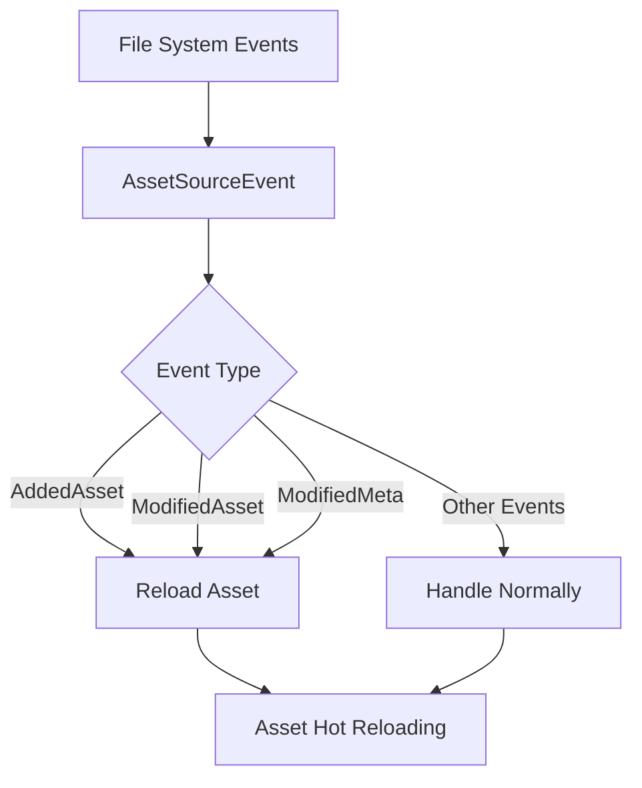

+++
title = "#21183 Fix assets not reloading on AddedAsset event"
date = "2025-09-25T00:00:00"
draft = false
template = "pull_request_page.html"
in_search_index = true

[taxonomies]
list_display = ["show"]

[extra]
current_language = "en"
available_languages = {"en" = { name = "English", url = "/pull_request/bevy/2025-09/pr-21183-en-20250925" }, "zh-cn" = { name = "中文", url = "/pull_request/bevy/2025-09/pr-21183-zh-cn-20250925" }}
labels = ["C-Bug", "A-Assets"]
+++

# Title

## Basic Information
- **Title**: Fix assets not reloading on AddedAsset event
- **PR Link**: https://github.com/bevyengine/bevy/pull/21183
- **Author**: dloukadakis
- **Status**: MERGED
- **Labels**: C-Bug, A-Assets, S-Ready-For-Final-Review
- **Created**: 2025-09-23T15:50:31Z
- **Merged**: 2025-09-25T19:38:57Z
- **Merged By**: alice-i-cecile

## Description Translation

# Objective

- Fix asset reloading not working caused by some software while saving creating an unamed temporary file with `open` using `O_TMPFILE`, then link it to the filesystem with `linkat` on a temporary file and replace the existing asset file with that file. This only triggers `AssetSourceEvent::AddedAsset` which causes the assets to not reload when its are overwritten.

## Solution

- Reload files when `AssetSourceEvent::AddedAsset` is triggered.

## Testing

- Did you test these changes? If so, how?
I made a simple scene with a sprite then deleted the sprite image and recreated it.
See also #21203

- Are there any parts that need more testing?
No
- How can other people (reviewers) test your changes? Is there anything specific they need to know?
See #21203
- If relevant, what platforms did you test these changes on, and are there any important ones you can't test?
Linux

## The Story of This Pull Request

This PR addresses a specific edge case in Bevy's asset hot-reloading system. The core issue stems from how certain Linux applications handle file saving operations. When applications like text editors use the `O_TMPFILE` flag with `open()` followed by `linkat()` to replace existing files, they trigger an `AddedAsset` event instead of a `ModifiedAsset` event in Bevy's file watching system.

The problem was that Bevy's asset server only handled reloading for `ModifiedAsset` and `ModifiedMeta` events, but ignored `AddedAsset` events. This meant that when files were replaced using this specific saving technique, the assets wouldn't hot-reload as expected.

The solution approach was straightforward: treat `AddedAsset` events similarly to modification events when it comes to asset reloading. The implementation involved refactoring the event handling logic to consolidate common reloading behavior and ensure `AddedAsset` events trigger the same reloading pipeline.

The key insight here is that from Bevy's perspective, a file replacement that triggers an "added" event is functionally equivalent to a modification - the asset content has changed and needs to be reloaded. The implementation maintains the existing behavior for other event types while extending the reloading logic to cover this previously missed case.

The changes are minimal and focused, affecting only the asset event handling logic. The refactoring also improves code organization by extracting common reloading behavior into a reusable closure, making the logic more maintainable.

## Visual Representation



## Key Files Changed

**File: `crates/bevy_asset/src/server/mod.rs`**

This file contains the core asset server implementation and the event handling logic for asset hot-reloading. The changes focus on modifying how `AssetSourceEvent::AddedAsset` events are processed.

**Key Changes:**

1. **Refactored `reload_parent_folders` function**: Improved the implementation to use `path.ancestors().skip(1)` for cleaner folder traversal.

```rust
// Before:
let reload_parent_folders = |path: PathBuf, source: &AssetSourceId<'static>| {
    let mut current_folder = path;
    while let Some(parent) = current_folder.parent() {
        current_folder = parent.to_path_buf();
        let parent_asset_path = 
            AssetPath::from(current_folder.clone()).with_source(source.clone());
        // ... folder reloading logic
    }
};

// After:
let reload_parent_folders = |path: &PathBuf, source: &AssetSourceId<'static>| {
    for parent in path.ancestors().skip(1) {
        let parent_asset_path = 
            AssetPath::from(parent.to_path_buf()).with_source(source.clone());
        // ... folder reloading logic
    }
};
```

2. **Added `reload_path` closure**: Created a reusable function to handle the common reloading logic.

```rust
let mut reload_path = |path: PathBuf, source: &AssetSourceId<'static>| {
    let path = AssetPath::from(path).with_source(source);
    queue_ancestors(&path, &infos, &mut paths_to_reload);
    paths_to_reload.insert(path);
};
```

3. **Modified event handling**: Updated the event handler to process `AddedAsset` events similarly to modification events.

```rust
// Before:
AssetSourceEvent::AddedAsset(path) => {
    reload_parent_folders(path, &source);
}

// After:
AssetSourceEvent::AddedAsset(path) => {
    reload_parent_folders(&path, &source);
    reload_path(path, &source);
}
```

The changes ensure that `AddedAsset` events now trigger both parent folder reloading and individual asset reloading, matching the behavior of modification events.

## Further Reading

- [Bevy Asset System Documentation](https://bevyengine.org/learn/book/assets/)
- [Linux O_TMPFILE flag documentation](https://man7.org/linux/man-pages/man2/open.2.html)
- [File watching and hot-reloading patterns in game engines](https://gamedev.stackexchange.com/questions/12018/how-do-game-engines-handle-asset-hot-reloading)