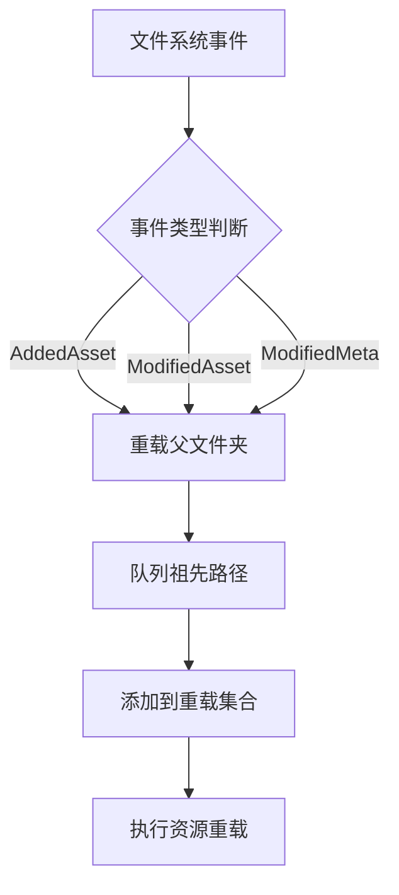

+++
title = "#21183 Fix assets not reloading on AddedAsset event"
date = "2025-09-25T00:00:00"
draft = false
template = "pull_request_page.html"
in_search_index = false

[extra]
current_language = "zh-cn"
available_languages = {"en" = { name = "English", url = "/pull_request/bevy/2025-09/pr-21183-en-20250925" }, "zh-cn" = { name = "中文", url = "/pull_request/bevy/2025-09/pr-21183-zh-cn-20250925" }}
labels = ["C-Bug", "A-Assets"]
+++

# Fix assets not reloading on AddedAsset event

## Basic Information
- **Title**: Fix assets not reloading on AddedAsset event
- **PR Link**: https://github.com/bevyengine/bevy/pull/21183
- **Author**: dloukadakis
- **Status**: MERGED
- **Labels**: C-Bug, A-Assets, S-Ready-For-Final-Review
- **Created**: 2025-09-23T15:50:31Z
- **Merged**: 2025-09-25T19:38:57Z
- **Merged By**: alice-i-cecile

## Description Translation
**目标**
- 修复某些软件在保存时使用 `O_TMPFILE` 创建未命名临时文件，然后通过 `linkat` 将其链接到文件系统中的临时文件并替换现有资源文件时导致的资源重载不工作问题。这只会触发 `AssetSourceEvent::AddedAsset`，导致资源被覆盖时无法重载。

**解决方案**
- 当触发 `AssetSourceEvent::AddedAsset` 时重载文件。

**测试**
- 你是否测试了这些更改？如果是，如何测试的？
我创建了一个包含精灵的简单场景，然后删除并重新创建了精灵图像。
另见 #21203

- 是否有任何部分需要更多测试？
否
- 其他人（审阅者）如何测试你的更改？他们需要了解什么具体信息吗？
见 #21203
- 如果相关，你在哪些平台上测试了这些更改，是否有你无法测试的重要平台？
Linux

## The Story of This Pull Request

这个PR解决了一个在Linux环境下特定的资源重载问题。问题的根源在于某些文件编辑软件使用了一种特殊的文件保存策略：它们先通过`O_TMPFILE`标志创建一个未命名的临时文件，然后使用`linkat`系统调用将其链接到文件系统，最后用这个新文件替换原有的资源文件。这个过程只触发了`AssetSourceEvent::AddedAsset`事件，而没有触发预期的修改事件。

在Bevy的资产系统中，原有的代码逻辑只对`ModifiedAsset`和`ModifiedMeta`事件进行资源重载处理，而忽略了`AddedAsset`事件。这意味着当文件被这种方式覆盖时，引擎无法检测到变化并重新加载资源，导致用户看到的仍然是旧版本的内容。

开发者通过分析事件处理逻辑，发现需要扩展重载机制来覆盖`AddedAsset`情况。解决方案的核心是统一处理资源添加和修改事件，确保无论文件是通过标准方式修改还是通过临时文件替换，都能正确触发重载。

实现上，代码进行了两处主要改进。首先重构了`reload_parent_folders`函数，使用更简洁的`path.ancestors()`方法来遍历父目录，替代了原来的while循环。其次引入了`reload_path`闭包来统一处理资源路径的重载逻辑，避免了代码重复。

```rust
let reload_path = |path: PathBuf, source: &AssetSourceId<'static>| {
    let path = AssetPath::from(path).with_source(source);
    queue_ancestors(&path, &infos, &mut paths_to_reload);
    paths_to_reload.insert(path);
};
```

关键修改是在事件处理匹配模式中新增了对`AddedAsset`的处理：

```rust
AssetSourceEvent::AddedAsset(path) => {
    reload_parent_folders(&path, &source);
    reload_path(path, &source);
}
```

这种实现方式保持了代码的简洁性和一致性，将新增事件的处理与现有修改事件的处理统一起来。从工程角度看，这是一个典型的边界情况处理改进 - 通过扩展现有逻辑的覆盖范围来解决特定的平台兼容性问题。

## Visual Representation



## Key Files Changed

### `crates/bevy_asset/src/server/mod.rs` (+18/-13)

这个文件包含了资产服务器的核心逻辑，特别是处理文件系统事件的部分。修改主要集中在`handle_internal_asset_events`函数中。

**主要修改：**

1. **重构父文件夹重载逻辑**
```rust
// 修改前：
let reload_parent_folders = |path: PathBuf, source: &AssetSourceId<'static>| {
    let mut current_folder = path;
    while let Some(parent) = current_folder.parent() {
        current_folder = parent.to_path_buf();
        // ... 处理逻辑
    }
};

// 修改后：
let reload_parent_folders = |path: &PathBuf, source: &AssetSourceId<'static>| {
    for parent in path.ancestors().skip(1) {
        // ... 处理逻辑
    }
};
```

2. **新增统一的重载路径处理**
```rust
let mut reload_path = |path: PathBuf, source: &AssetSourceId<'static>| {
    let path = AssetPath::from(path).with_source(source);
    queue_ancestors(&path, &infos, &mut paths_to_reload);
    paths_to_reload.insert(path);
};
```

3. **扩展事件处理逻辑**
```rust
// 新增 AddedAsset 事件处理
AssetSourceEvent::AddedAsset(path) => {
    reload_parent_folders(&path, &source);
    reload_path(path, &source);
}
```

这些修改确保了当文件通过临时文件替换方式更新时，资产系统能够正确检测并重载相关资源。

## Further Reading

- [Bevy Assets 系统文档](https://bevyengine.org/learn/book/getting-started/assets/)
- [Linux O_TMPFILE 标志说明](https://man7.org/linux/man-pages/man2/open.2.html)
- [文件系统事件处理模式](https://doc.rust-lang.org/std/fs/struct.File.html)