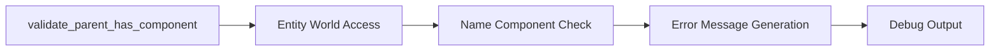

+++
title = "#21189 Print `Name` in `validate_parent_has_component`"
date = "2025-09-25T00:00:00"
draft = false
template = "pull_request_page.html"
in_search_index = true

[taxonomies]
list_display = ["show"]

[extra]
current_language = "en"
available_languages = {"en" = { name = "English", url = "/pull_request/bevy/2025-09/pr-21189-en-20250925" }, "zh-cn" = { name = "中文", url = "/pull_request/bevy/2025-09/pr-21189-zh-cn-20250925" }}
labels = ["A-ECS", "D-Straightforward"]
+++

# Title

## Basic Information
- **Title**: Print `Name` in `validate_parent_has_component`
- **PR Link**: https://github.com/bevyengine/bevy/pull/21189
- **Author**: Zeophlite
- **Status**: MERGED
- **Labels**: A-ECS, S-Ready-For-Final-Review, D-Straightforward
- **Created**: 2025-09-24T09:12:22Z
- **Merged**: 2025-09-25T17:12:32Z
- **Merged By**: alice-i-cecile

## Description Translation
# Objective

- `validate_parent_has_component` has a TODO to print the `Name` when available

## Solution

- Print `Name`

## Testing

- CI, local testing in my repo

## The Story of This Pull Request

This PR addresses a straightforward but important improvement to Bevy's Entity Component System (ECS) hierarchy validation. The core issue was in the `validate_parent_has_component` function, which performs critical validation checks when entities have parent-child relationships with specific component requirements.

The problem was that when this validation failed, the error messages were not as helpful as they could be. The original implementation had a TODO comment indicating that the function should print entity names when available, but this functionality wasn't implemented. Instead, the error messages only showed raw entity IDs, which are difficult for developers to correlate with their actual game objects during debugging.

The solution approach was direct: leverage the existing `Name` component that had since been moved into `bevy_ecs` (making it available for use in this context). The implementation required updating the error message formatting to extract and display entity names when they exist, while falling back to entity IDs when names aren't available.

The key technical insight here is about improving developer experience through better error messages. When working with complex entity hierarchies, being able to quickly identify which specific entities are causing validation issues significantly reduces debugging time. The changes follow Rust's common pattern of using `map_or_else` to handle optional values gracefully.

The implementation refactors the validation logic slightly for clarity. Instead of using `is_ok_and`, it now uses an `if let` pattern that makes the control flow more explicit. This change also allows for cleaner extraction of both the child and parent entity names within the same conditional block.

The impact of this change is purely positive - it enhances debugging capabilities without affecting performance or functionality. Developers now get immediately actionable information when hierarchy validation fails, showing exactly which named entities are involved in the problem.

## Visual Representation



## Key Files Changed

### `crates/bevy_ecs/src/hierarchy.rs` (+13/-5)

This file contains the core hierarchy validation logic for Bevy's ECS system. The changes improve the error messaging in the `validate_parent_has_component` function.

**Key Changes:**

1. **Import Addition**: Added `Name` component import to make it available for use
2. **Logic Refactoring**: Changed from `is_ok_and` to explicit `if let` pattern for better readability
3. **Error Message Enhancement**: Added entity name extraction and formatting

```rust
// Before:
if !world.get_entity(parent).is_ok_and(|e| e.contains::<C>()) {
    // TODO: print name here once Name lives in bevy_ecs
    let name: Option<String> = None;
    let debug_name = DebugName::type_name::<C>();
    warn!(
        "warning[B0004]: {}{name} with the {ty_name} component has a parent ({parent}) without {ty_name}.\n\
        This will cause inconsistent behaviors! See: https://bevy.org/learn/errors/b0004",
        caller.map(|c| format!("{c}: ")).unwrap_or_default(),
        ty_name = debug_name.shortname(),
        name = name.map_or_else(
            || format!("Entity {entity}"),
            |s| format!("The {s} entity")
        ),
    );
}

// After:
let maybe_parent_ref = world.get_entity(parent);
if let Ok(parent_ref) = maybe_parent_ref
    && !parent_ref.contains::<C>()
{
    let name = entity_ref.get::<Name>();
    let debug_name = DebugName::type_name::<C>();
    let parent_name = parent_ref.get::<Name>();
    warn!(
        "warning[B0004]: {}{name} with the {ty_name} component has a parent ({parent_name}) without {ty_name}.\n\
        This will cause inconsistent behaviors! See: https://bevy.org/learn/errors/b0004",
        caller.map(|c| format!("{c}: ")).unwrap_or_default(),
        ty_name = debug_name.shortname(),
        name = name.map_or_else(
            || format!("Entity {entity}"),
            |s| format!("The {s} entity")
        ),
        parent_name = parent_name.map_or_else(
            || format!("{parent} entity"),
            |s| format!("the {s} entity")
        ),
    );
}
```

The changes relate directly to the PR's purpose by implementing the previously noted TODO comment and making error messages more developer-friendly.

## Further Reading

- [Bevy ECS Documentation](https://docs.rs/bevy_ecs/latest/bevy_ecs/) - Comprehensive guide to Bevy's Entity Component System
- [Rust Option Type Documentation](https://doc.rust-lang.org/std/option/enum.Option.html) - Understanding how `map_or_else` works with optional values
- [Bevy Error B0004](https://bevy.org/learn/errors/b0004) - Official documentation for the specific error being improved

# Full Code Diff
```diff
diff --git a/crates/bevy_ecs/src/hierarchy.rs b/crates/bevy_ecs/src/hierarchy.rs
index ad390db97bf72..83419c70eb964 100644
--- a/crates/bevy_ecs/src/hierarchy.rs
+++ b/crates/bevy_ecs/src/hierarchy.rs
@@ -13,11 +13,12 @@ use crate::{
     component::Component,
     entity::Entity,
     lifecycle::HookContext,
+    name::Name,
     relationship::{RelatedSpawner, RelatedSpawnerCommands},
     system::EntityCommands,
     world::{DeferredWorld, EntityWorldMut, FromWorld, World},
 };
-use alloc::{format, string::String, vec::Vec};
+use alloc::{format, vec::Vec};
 #[cfg(feature = "bevy_reflect")]
 use bevy_reflect::std_traits::ReflectDefault;
 #[cfg(all(feature = "serialize", feature = "bevy_reflect"))]
@@ -456,12 +457,15 @@ pub fn validate_parent_has_component<C: Component>(
         return;
     };
     let parent = child_of.parent();
-    if !world.get_entity(parent).is_ok_and(|e| e.contains::<C>()) {
-        // TODO: print name here once Name lives in bevy_ecs
-        let name: Option<String> = None;
+    let maybe_parent_ref = world.get_entity(parent);
+    if let Ok(parent_ref) = maybe_parent_ref
+        && !parent_ref.contains::<C>()
+    {
+        let name = entity_ref.get::<Name>();
         let debug_name = DebugName::type_name::<C>();
+        let parent_name = parent_ref.get::<Name>();
         warn!(
-            "warning[B0004]: {}{name} with the {ty_name} component has a parent ({parent}) without {ty_name}.\n\
+            "warning[B0004]: {}{name} with the {ty_name} component has a parent ({parent_name}) without {ty_name}.\n\
             This will cause inconsistent behaviors! See: https://bevy.org/learn/errors/b0004",
             caller.map(|c| format!("{c}: ")).unwrap_or_default(),
             ty_name = debug_name.shortname(),
@@ -469,6 +473,10 @@ pub fn validate_parent_has_component<C: Component>(
                 || format!("Entity {entity}"),
                 |s| format!("The {s} entity")
             ),
+            parent_name = parent_name.map_or_else(
+                || format!("{parent} entity"),
+                |s| format!("the {s} entity")
+            ),
         );
     }
 }
```