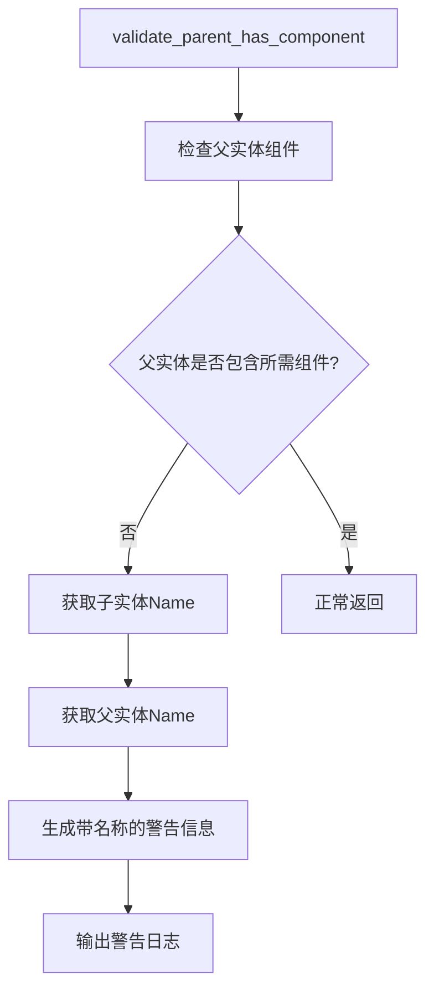

+++
title = "#21189 Print `Name` in `validate_parent_has_component`"
date = "2025-09-25T00:00:00"
draft = false
template = "pull_request_page.html"
in_search_index = false

[extra]
current_language = "zh-cn"
available_languages = {"en" = { name = "English", url = "/pull_request/bevy/2025-09/pr-21189-en-20250925" }, "zh-cn" = { name = "中文", url = "/pull_request/bevy/2025-09/pr-21189-zh-cn-20250925" }}
labels = ["A-ECS", "D-Straightforward"]
+++

# Title

## Basic Information
- **Title**: Print `Name` in `validate_parent_has_component`
- **PR Link**: https://github.com/bevyengine/bevy/pull/21189
- **Author**: Zeophlite
- **Status**: MERGED
- **Labels**: A-ECS, S-Ready-For-Final-Review, D-Straightforward
- **Created**: 2025-09-24T09:12:22Z
- **Merged**: 2025-09-25T17:12:32Z
- **Merged By**: alice-i-cecile

## Description Translation
# Objective

- `validate_parent_has_component` 有一个 TODO，要求在可用时打印 `Name`

## Solution

- 打印 `Name`

## Testing

- CI，以及在我自己的仓库中进行本地测试

## The Story of This Pull Request

这个 PR 解决了一个简单但重要的调试信息改进问题。在 Bevy 的 ECS（Entity Component System）系统中，当验证父子实体关系时，如果父实体缺少必需的组件，系统会发出警告。原来的警告信息只显示实体 ID，这在调试时不够直观，因为开发者通常更熟悉实体的名称而不是数字 ID。

问题的核心在于 `validate_parent_has_component` 函数中有一个 TODO 注释，表明应该在有 Name 组件时打印实体名称，但由于 Name 组件之前不在 bevy_ecs 模块中，这个功能一直没有实现。随着 Name 组件被移动到 bevy_ecs 模块，现在可以方便地实现这个功能。

开发者采用了直接的方法来解决这个问题。主要的改进包括：

1. 重构了条件判断逻辑，使用更清晰的 `if let` 语法
2. 同时获取子实体和父实体的 Name 组件
3. 在警告信息中显示实体的名称（如果有的话），否则回退到显示实体 ID

这个改进显著提升了调试体验。当出现父子组件不匹配的错误时，开发者现在可以看到具体的实体名称，而不是抽象的数字 ID，这使得定位问题更加高效。例如，如果有一个名为 "Player" 的实体缺少必需的组件，警告信息会明确显示 "Player" 实体，而不是一个难以记忆的实体 ID。

从技术实现角度看，这个 PR 展示了几个良好的编程实践：
- 利用 Rust 的 `if let` 语法进行清晰的条件判断
- 使用 `map_or_else` 方法优雅地处理 Option 类型
- 保持向后兼容，当 Name 组件不存在时仍然显示实体 ID

这个修改虽然简单，但对开发者体验有实质性提升，体现了对调试工具链的持续改进。

## Visual Representation



## Key Files Changed

### `crates/bevy_ecs/src/hierarchy.rs` (+13/-5)

这个文件包含了主要的修改，改进了 `validate_parent_has_component` 函数的警告信息输出。

**修改前：**
```rust
pub fn validate_parent_has_component<C: Component>(
    // ... 参数省略
) {
    // ... 前面的代码省略
    if !world.get_entity(parent).is_ok_and(|e| e.contains::<C>()) {
        // TODO: print name here once Name lives in bevy_ecs
        let name: Option<String> = None;
        let debug_name = DebugName::type_name::<C>();
        warn!(
            "warning[B0004]: {}{name} with the {ty_name} component has a parent ({parent}) without {ty_name}.\n\
            This will cause inconsistent behaviors! See: https://bevy.org/learn/errors/b0004",
            caller.map(|c| format!("{c}: ")).unwrap_or_default(),
            ty_name = debug_name.shortname(),
            name = name.map_or_else(
                || format!("Entity {entity}"),
                |s| format!("The {s} entity")
            ),
        );
    }
}
```

**修改后：**
```rust
pub fn validate_parent_has_component<C: Component>(
    // ... 参数省略
) {
    // ... 前面的代码省略
    let maybe_parent_ref = world.get_entity(parent);
    if let Ok(parent_ref) = maybe_parent_ref
        && !parent_ref.contains::<C>()
    {
        let name = entity_ref.get::<Name>();
        let debug_name = DebugName::type_name::<C>();
        let parent_name = parent_ref.get::<Name>();
        warn!(
            "warning[B0004]: {}{name} with the {ty_name} component has a parent ({parent_name}) without {ty_name}.\n\
            This will cause inconsistent behaviors! See: https://bevy.org/learn/errors/b0004",
            caller.map(|c| format!("{c}: ")).unwrap_or_default(),
            ty_name = debug_name.shortname(),
            name = name.map_or_else(
                || format!("Entity {entity}"),
                |s| format!("The {s} entity")
            ),
            parent_name = parent_name.map_or_else(
                || format!("{parent} entity"),
                |s| format!("the {s} entity")
            ),
        );
    }
}
```

主要改进包括：
1. 重构条件判断，使用更清晰的 `if let` 语法
2. 获取子实体和父实体的 Name 组件
3. 在警告信息中同时显示子实体和父实体的名称
4. 移除了不必要的 String 导入

## Further Reading

- [Bevy ECS 文档](https://docs.rs/bevy_ecs/latest/bevy_ecs/) - 了解 Bevy 的实体组件系统
- [Rust Option 类型处理](https://doc.rust-lang.org/std/option/enum.Option.html) - 学习 Rust 中 Option 类型的常用处理方法
- [Bevy 错误代码 B0004](https://bevy.org/learn/errors/b0004) - 了解这个特定错误代码的详细解释

# Full Code Diff
```
diff --git a/crates/bevy_ecs/src/hierarchy.rs b/crates/bevy_ecs/src/hierarchy.rs
index ad390db97bf72..83419c70eb964 100644
--- a/crates/bevy_ecs/src/hierarchy.rs
+++ b/crates/bevy_ecs/src/hierarchy.rs
@@ -13,11 +13,12 @@ use crate::{
     component::Component,
     entity::Entity,
     lifecycle::HookContext,
+    name::Name,
     relationship::{RelatedSpawner, RelatedSpawnerCommands},
     system::EntityCommands,
     world::{DeferredWorld, EntityWorldMut, FromWorld, World},
 };
-use alloc::{format, string::String, vec::Vec};
+use alloc::{format, vec::Vec};
 #[cfg(feature = "bevy_reflect")]
 use bevy_reflect::std_traits::ReflectDefault;
 #[cfg(all(feature = "serialize", feature = "bevy_reflect"))]
@@ -456,12 +457,15 @@ pub fn validate_parent_has_component<C: Component>(
         return;
     };
     let parent = child_of.parent();
-    if !world.get_entity(parent).is_ok_and(|e| e.contains::<C>()) {
-        // TODO: print name here once Name lives in bevy_ecs
-        let name: Option<String> = None;
+    let maybe_parent_ref = world.get_entity(parent);
+    if let Ok(parent_ref) = maybe_parent_ref
+        && !parent_ref.contains::<C>()
+    {
+        let name = entity_ref.get::<Name>();
         let debug_name = DebugName::type_name::<C>();
+        let parent_name = parent_ref.get::<Name>();
         warn!(
-            "warning[B0004]: {}{name} with the {ty_name} component has a parent ({parent}) without {ty_name}.\n\
+            "warning[B0004]: {}{name} with the {ty_name} component has a parent ({parent_name}) without {ty_name}.\n\
             This will cause inconsistent behaviors! See: https://bevy.org/learn/errors/b0004",
             caller.map(|c| format!("{c}: ")).unwrap_or_default(),
             ty_name = debug_name.shortname(),
@@ -469,6 +473,10 @@ pub fn validate_parent_has_component<C: Component>(
                 || format!("Entity {entity}"),
                 |s| format!("The {s} entity")
             ),
+            parent_name = parent_name.map_or_else(
+                || format!("{parent} entity"),
+                |s| format!("the {s} entity")
+            ),
         );
     }
 }
```