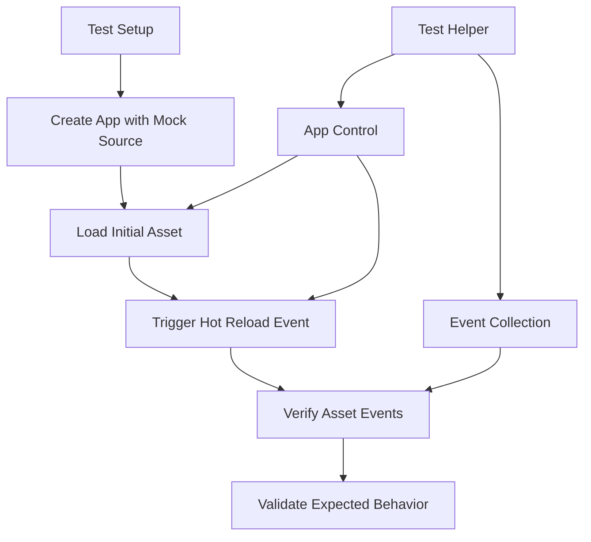

+++
title = "#21203 Add two basic tests for asset hot reloading."
date = "2025-09-26T00:00:00"
draft = false
template = "pull_request_page.html"
in_search_index = true

[taxonomies]
list_display = ["show"]

[extra]
current_language = "en"
available_languages = {"en" = { name = "English", url = "/pull_request/bevy/2025-09/pr-21203-en-20250926" }, "zh-cn" = { name = "中文", url = "/pull_request/bevy/2025-09/pr-21203-zh-cn-20250925" }}
labels = ["A-Assets", "C-Testing", "D-Straightforward"]
+++

# Title
Add two basic tests for asset hot reloading

## Basic Information
- **Title**: Add two basic tests for asset hot reloading.
- **PR Link**: https://github.com/bevyengine/bevy/pull/21203
- **Author**: andriyDev
- **Status**: MERGED
- **Labels**: A-Assets, S-Ready-For-Final-Review, C-Testing, D-Straightforward
- **Created**: 2025-09-25T03:20:44Z
- **Merged**: 2025-09-25T23:43:36Z
- **Merged By**: alice-i-cecile

## Description Translation
# Objective

- Improve testing of `bevy_asset`.

## Solution

- Add a simple test for hot reloading, as well as a helper function for testing hot reloading in general.
- Add an ignored test which should be fixed by #21183.

## Testing

- :)

## The Story of This Pull Request

This PR addresses a gap in the Bevy asset system's test coverage by adding comprehensive tests for asset hot reloading functionality. The developer recognized that while the asset system supports hot reloading (where assets can be updated while the application is running), there were no dedicated tests verifying this critical feature.

The implementation follows a systematic approach to testing hot reloading scenarios. The developer created a helper function `create_app_with_source_event_sender()` that sets up a test environment with a mock asset source and returns the necessary components for testing. This function:

- Creates a Bevy app with a memory-based asset reader
- Sets up a channel to capture asset source events
- Configures the asset plugin with hot reloading enabled

```rust
fn create_app_with_source_event_sender() -> (App, Dir, Sender<AssetSourceEvent>) {
    let mut app = App::new();
    let dir = Dir::default();
    let memory_reader = MemoryAssetReader { root: dir.clone() };
    
    // Channel setup for event communication
    let (sender_sender, sender_receiver) = crossbeam_channel::bounded(1);
    
    // ... configuration continues
}
```

Two main test scenarios are implemented:

1. **Asset modification test** (`reloads_asset_after_source_event`): Verifies that when an asset file is modified, the system correctly reloads it and emits appropriate modification events.

2. **Missing asset recovery test** (`added_asset_reloads_previously_missing_asset`): Tests the scenario where an asset that was previously missing becomes available, ensuring the system properly handles the transition from failed load to successful load.

The tests use a custom `run_app_until()` function (assumed to exist elsewhere) that runs the app until specific conditions are met, allowing for precise control over when assertions are evaluated.

A key technical insight in this implementation is the use of event collection helpers:

```rust
fn collect_asset_events<A: Asset>(world: &mut World) -> Vec<AssetEvent<A>> {
    world
        .resource_mut::<Messages<AssetEvent<A>>>()
        .drain()
        .collect()
}
```

These functions extract and clear event messages from the world, enabling clean assertion of expected event sequences.

The PR also includes a minor but important fix in `crates/bevy_asset/src/server/mod.rs` to prevent potential deadlocks in single-threaded environments. The change adds an explicit drop of a lock before spawning tasks that might block on the same lock:

```rust
// Drop the lock on `AssetInfos` before spawning a task that may block on it in
// single-threaded.
#[cfg(any(target_arch = "wasm32", not(feature = "multi_threaded")))]
drop(infos);
```

This change demonstrates good defensive programming practices, anticipating edge cases in different execution environments.

The tests validate that asset events follow the expected sequence:
- For modifications: `LoadedWithDependencies` followed by `Modified`
- For recovered assets: `LoadedWithDependencies` followed by `Added`

The implementation shows careful attention to test isolation and cleanup, with proper event draining between test phases to prevent cross-contamination of test results.

## Visual Representation



## Key Files Changed

### `crates/bevy_asset/src/lib.rs` (+167/-2)
This file received the bulk of the changes, adding comprehensive test infrastructure for asset hot reloading.

**Key additions:**
- Helper function `create_app_with_source_event_sender()` for test setup
- Event collection utilities `collect_asset_events()` and `collect_asset_load_failed_events()`
- Two main test cases covering different hot reloading scenarios

```rust
// Example of the main test structure
#[test]
fn reloads_asset_after_source_event() {
    let (mut app, dir, source_events) = create_app_with_source_event_sender();
    // Test implementation...
}

#[test]
fn added_asset_reloads_previously_missing_asset() {
    let (mut app, dir, source_events) = create_app_with_source_event_sender();
    // Test implementation...
}
```

### `crates/bevy_asset/src/server/mod.rs` (+5/-0)
Minor but important fix to prevent potential deadlocks in single-threaded environments.

```rust
// Added code to prevent deadlocks
#[cfg(any(target_arch = "wasm32", not(feature = "multi_threaded")))]
drop(infos);
```

## Further Reading

- [Bevy Asset System Documentation](https://bevyengine.org/learn/books/assets/)
- [Rust Testing Guide](https://doc.rust-lang.org/book/ch11-00-testing.html)
- [Crossbeam Channels for Inter-thread Communication](https://docs.rs/crossbeam/latest/crossbeam/channel/)
- [Asset Hot Reloading Patterns in Game Engines](https://gameprogrammingpatterns.com/observer.html)

# Full Code Diff
```diff
diff --git a/crates/bevy_asset/src/lib.rs b/crates/bevy_asset/src/lib.rs
index bd210d3218c26..a8d5ad7d62f98 100644
--- a/crates/bevy_asset/src/lib.rs
+++ b/crates/bevy_asset/src/lib.rs
@@ -706,7 +706,8 @@ mod tests {
         io::{
             gated::{GateOpener, GatedReader},
             memory::{Dir, MemoryAssetReader},
-            AssetReader, AssetReaderError, AssetSource, AssetSourceId, Reader,
+            AssetReader, AssetReaderError, AssetSource, AssetSourceEvent, AssetSourceId,
+            AssetWatcher, Reader,
         },
         loader::{AssetLoader, LoadContext},
         Asset, AssetApp, AssetEvent, AssetId, AssetLoadError, AssetLoadFailedEvent, AssetPath,
@@ -730,8 +731,9 @@ mod tests {
     use bevy_platform::collections::{HashMap, HashSet};
     use bevy_reflect::TypePath;
     use core::time::Duration;
+    use crossbeam_channel::Sender;
     use serde::{Deserialize, Serialize};
-    use std::path::Path;
+    use std::path::{Path, PathBuf};
     use thiserror::Error;
 
     #[derive(Asset, TypePath, Debug, Default)]
@@ -2064,4 +2066,167 @@ mod tests {
             Err(InvalidGenerationError::Removed { index })
         );
     }
+
+    // Creates a basic app with the default asset source engineered to get back the asset event
+    // sender.
+    fn create_app_with_source_event_sender() -> (App, Dir, Sender<AssetSourceEvent>) {
+        let mut app = App::new();
+        let dir = Dir::default();
+        let memory_reader = MemoryAssetReader { root: dir.clone() };
+
+        // Create a channel to pass the source event sender back to us.
+        let (sender_sender, sender_receiver) = crossbeam_channel::bounded(1);
+
+        struct FakeWatcher;
+        impl AssetWatcher for FakeWatcher {}
+
+        app.register_asset_source(
+            AssetSourceId::Default,
+            AssetSource::build()
+                .with_reader(move || Box::new(memory_reader.clone()))
+                .with_watcher(move |sender| {
+                    sender_sender.send(sender).unwrap();
+                    Some(Box::new(FakeWatcher))
+                }),
+        )
+        .add_plugins((
+            TaskPoolPlugin::default(),
+            AssetPlugin {
+                watch_for_changes_override: Some(true),
+                ..Default::default()
+            },
+        ));
+
+        let sender = sender_receiver.try_recv().unwrap();
+
+        (app, dir, sender)
+    }
+
+    fn collect_asset_events<A: Asset>(world: &mut World) -> Vec<AssetEvent<A>> {
+        world
+            .resource_mut::<Messages<AssetEvent<A>>>()
+            .drain()
+            .collect()
+    }
+
+    fn collect_asset_load_failed_events<A: Asset>(
+        world: &mut World,
+    ) -> Vec<AssetLoadFailedEvent<A>> {
+        world
+            .resource_mut::<Messages<AssetLoadFailedEvent<A>>>()
+            .drain()
+            .collect()
+    }
+
+    #[test]
+    fn reloads_asset_after_source_event() {
+        let (mut app, dir, source_events) = create_app_with_source_event_sender();
+        let asset_server = app.world().resource::<AssetServer>().clone();
+
+        dir.insert_asset_text(
+            Path::new("abc.cool.ron"),
+            r#"(
+    text: "a",
+    dependencies: [],
+    embedded_dependencies: [],
+    sub_texts: [],
+)"#,
+        );
+
+        app.init_asset::<CoolText>()
+            .init_asset::<SubText>()
+            .register_asset_loader(CoolTextLoader);
+
+        let handle: Handle<CoolText> = asset_server.load("abc.cool.ron");
+        run_app_until(&mut app, |world| {
+            let messages = collect_asset_events(world);
+            if messages.is_empty() {
+                return None;
+            }
+            assert_eq!(
+                messages,
+                [
+                    AssetEvent::LoadedWithDependencies { id: handle.id() },
+                    AssetEvent::Added { id: handle.id() },
+                ]
+            );
+            Some(())
+        });
+
+        // Sending an asset event should result in the asset being reloaded - resulting in a
+        // "Modified" message.
+        source_events
+            .send(AssetSourceEvent::ModifiedAsset(PathBuf::from(
+                "abc.cool.ron",
+            )))
+            .unwrap();
+
+        run_app_until(&mut app, |world| {
+            let messages = collect_asset_events(world);
+            if messages.is_empty() {
+                return None;
+            }
+            assert_eq!(
+                messages,
+                [
+                    AssetEvent::LoadedWithDependencies { id: handle.id() },
+                    AssetEvent::Modified { id: handle.id() }
+                ]
+            );
+            Some(())
+        });
+    }
+
+    #[test]
+    fn added_asset_reloads_previously_missing_asset() {
+        let (mut app, dir, source_events) = create_app_with_source_event_sender();
+        let asset_server = app.world().resource::<AssetServer>().clone();
+
+        app.init_asset::<CoolText>()
+            .init_asset::<SubText>()
+            .register_asset_loader(CoolTextLoader);
+
+        let handle: Handle<CoolText> = asset_server.load("abc.cool.ron");
+        run_app_until(&mut app, |world| {
+            let failed_ids = collect_asset_load_failed_events(world)
+                .drain(..)
+                .map(|event| event.id)
+                .collect::<Vec<_>>();
+            if failed_ids.is_empty() {
+                return None;
+            }
+            assert_eq!(failed_ids, [handle.id()]);
+            Some(())
+        });
+
+        // The asset has already been considered as failed to load. Now we add the asset data, and
+        // send an AddedAsset event.
+        dir.insert_asset_text(
+            Path::new("abc.cool.ron"),
+            r#"(
+    text: "a",
+    dependencies: [],
+    embedded_dependencies: [],
+    sub_texts: [],
+)"#,
+        );
+        source_events
+            .send(AssetSourceEvent::AddedAsset(PathBuf::from("abc.cool.ron")))
+            .unwrap();
+
+        run_app_until(&mut app, |world| {
+            let messages = collect_asset_events(world);
+            if messages.is_empty() {
+                return None;
+            }
+            assert_eq!(
+                messages,
+                [
+                    AssetEvent::LoadedWithDependencies { id: handle.id() },
+                    AssetEvent::Added { id: handle.id() }
+                ]
+            );
+            Some(())
+        });
+    }
 }
diff --git a/crates/bevy_asset/src/server/mod.rs b/crates/bevy_asset/src/server/mod.rs
index 534359801eb23..5c938404643ff 100644
--- a/crates/bevy_asset/src/server/mod.rs
+++ b/crates/bevy_asset/src/server/mod.rs
@@ -1763,6 +1763,11 @@ pub fn handle_internal_asset_events(world: &mut World) {
             }
         }
 
+        // Drop the lock on `AssetInfos` before spawning a task that may block on it in
+        // single-threaded.
+        #[cfg(any(target_arch = "wasm32", not(feature = "multi_threaded"))]
+        drop(infos);
+
         for path in paths_to_reload {
             info!("Reloading {path} because it has changed");
             server.reload(path);
```