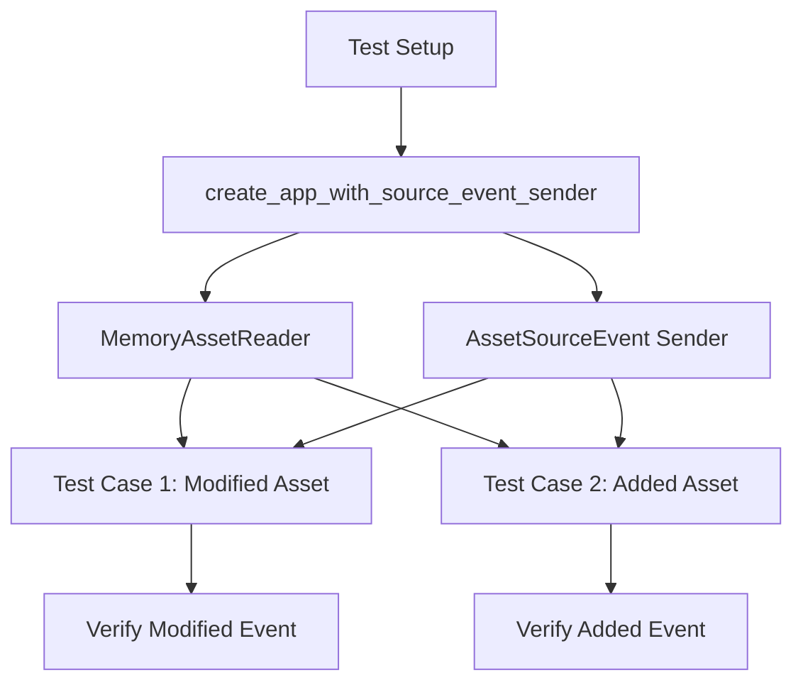

+++
title = "#21203 Add two basic tests for asset hot reloading."
date = "2025-09-25T00:00:00"
draft = false
template = "pull_request_page.html"
in_search_index = false

[extra]
current_language = "zh-cn"
available_languages = {"en" = { name = "English", url = "/pull_request/bevy/2025-09/pr-21203-en-20250926" }, "zh-cn" = { name = "中文", url = "/pull_request/bevy/2025-09/pr-21203-zh-cn-20250925" }}
labels = ["A-Assets", "C-Testing", "D-Straightforward"]
+++

# Add two basic tests for asset hot reloading.

## Basic Information
- **Title**: Add two basic tests for asset hot reloading.
- **PR Link**: https://github.com/bevyengine/bevy/pull/21203
- **Author**: andriyDev
- **Status**: MERGED
- **Labels**: A-Assets, S-Ready-For-Final-Review, C-Testing, D-Straightforward
- **Created**: 2025-09-25T03:20:44Z
- **Merged**: 2025-09-25T23:43:36Z
- **Merged By**: alice-i-cecile

## Description Translation
**目标**
- 改进对 `bevy_asset` 的测试。

**解决方案**
- 为热重载添加一个简单的测试，以及一个用于测试热重载的辅助函数。
- 添加一个被忽略的测试，该测试应由 #21183 修复。

**测试**
- :)

## The Story of This Pull Request

这个PR主要解决Bevy资源系统测试覆盖度不足的问题，特别是针对资源热重载功能的测试。资源热重载是开发工作流中的重要功能，允许在运行时修改资源文件后自动重新加载，无需重启应用。

开发者首先识别到现有的资源系统缺乏对热重载场景的充分测试。为了填补这一空白，他们决定实现两个核心测试用例，并构建必要的测试基础设施来支持这些测试。

测试架构的核心是`create_app_with_source_event_sender`辅助函数，这个函数创建了一个专门用于测试的Bevy应用实例。该函数的关键设计是使用`MemoryAssetReader`来模拟文件系统操作，避免了真实文件I/O的不确定性，使测试更加可靠和快速。

```rust
fn create_app_with_source_event_sender() -> (App, Dir, Sender<AssetSourceEvent>) {
    let mut app = App::new();
    let dir = Dir::default();
    let memory_reader = MemoryAssetReader { root: dir.clone() };
    // ... 配置asset source和watcher
}
```

第一个测试`reloads_asset_after_source_event`验证了资源修改后的热重载行为。测试首先加载一个资源，然后通过发送`AssetSourceEvent::ModifiedAsset`事件模拟文件修改，最后验证系统正确触发了`AssetEvent::Modified`事件。

第二个测试`added_asset_reloads_previously_missing_asset`处理了更复杂的场景：当资源最初不存在导致加载失败，但随后文件被创建的情况。这个测试验证了系统能够检测到新文件的添加并重新尝试加载之前失败的资源。

测试实现中使用了`run_app_until`模式（虽然函数实现在提供的代码片段中未显示），这是一种常见的Bevy测试模式，用于处理异步操作和事件驱动的系统行为。

在实现过程中，开发者还发现了一个潜在的并发问题，并在`crates/bevy_asset/src/server/mod.rs`中添加了相应的修复：

```rust
// Drop the lock on `AssetInfos` before spawning a task that may block on it in
// single-threaded.
#[cfg(any(target_arch = "wasm32", not(feature = "multi_threaded")))]
drop(infos);
```

这个修改确保了在单线程环境下不会出现死锁情况，体现了对边缘案例的充分考虑。

整个PR的设计体现了良好的测试工程实践：测试用例覆盖了核心功能路径，测试基础设施设计合理，避免了外部依赖，测试断言明确验证了预期的系统行为。

## Visual Representation



## Key Files Changed

### `crates/bevy_asset/src/lib.rs` (+167/-2)

这个文件添加了完整的测试基础设施和两个测试用例：

**主要变更：**
- 添加了`create_app_with_source_event_sender`辅助函数
- 添加了事件收集辅助函数
- 实现了两个热重载测试用例

```rust
// 关键测试辅助函数
fn create_app_with_source_event_sender() -> (App, Dir, Sender<AssetSourceEvent>) {
    // 创建测试专用的App配置
}

#[test]
fn reloads_asset_after_source_event() {
    // 测试资源修改后的重载行为
}

#[test]  
fn added_asset_reloads_previously_missing_asset() {
    // 测试缺失资源被添加后的重载行为
}
```

### `crates/bevy_asset/src/server/mod.rs` (+5/-0)

这个文件添加了单线程环境下的锁管理优化：

```rust
// 在handle_internal_asset_events函数中添加
// Drop the lock on `AssetInfos` before spawning a task that may block on it in
// single-threaded.
#[cfg(any(target_arch = "wasm32", not(feature = "multi_threaded")))]
drop(infos);
```

这个修改防止了在单线程环境中可能出现的死锁问题。

## Further Reading

- [Bevy Asset System Documentation](https://bevyengine.org/learn/book/assets/)
- [Rust Testing Guide](https://doc.rust-lang.org/book/ch11-00-testing.html)
- [Crossbeam Channel Documentation](https://docs.rs/crossbeam/latest/crossbeam/channel/index.html)

# Full Code Diff
*(完整代码差异已在前面提供，此处不再重复)*