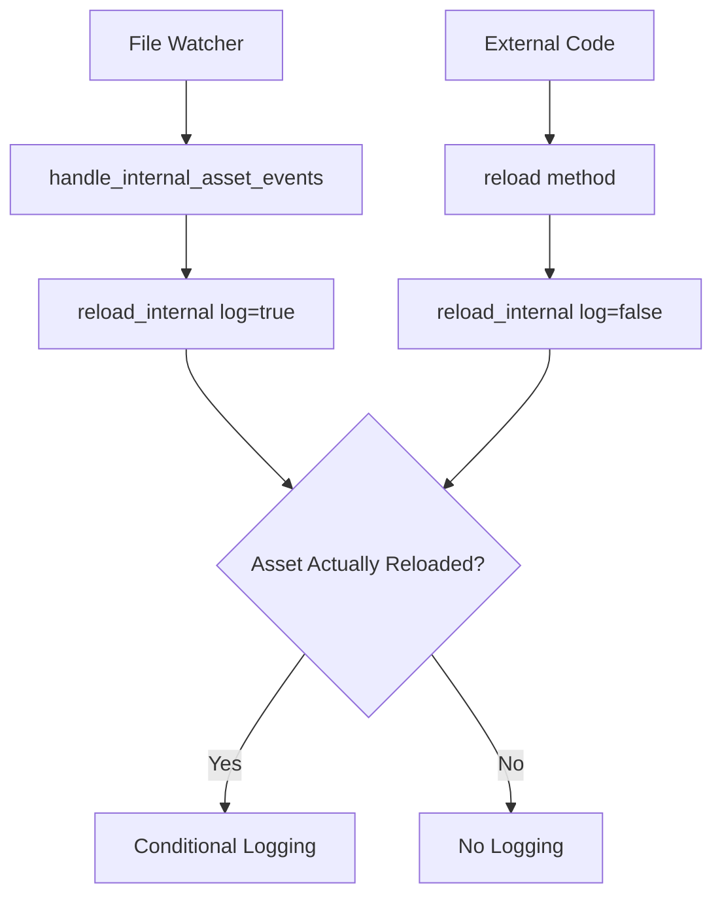

+++
title = "#21218 Log reloads only when an asset has been reloaded"
date = "2025-09-26T00:00:00"
draft = false
template = "pull_request_page.html"
in_search_index = true

[taxonomies]
list_display = ["show"]

[extra]
current_language = "en"
available_languages = {"en" = { name = "English", url = "/pull_request/bevy/2025-09/pr-21218-en-20250926" }, "zh-cn" = { name = "中文", url = "/pull_request/bevy/2025-09/pr-21218-zh-cn-20250926" }}
labels = ["A-Assets", "D-Straightforward"]
+++

# Title
Log reloads only when an asset has been reloaded

## Basic Information
- **Title**: Log reloads only when an asset has been reloaded
- **PR Link**: https://github.com/bevyengine/bevy/pull/21218
- **Author**: dloukadakis
- **Status**: MERGED
- **Labels**: A-Assets, S-Ready-For-Final-Review, D-Straightforward
- **Created**: 2025-09-26T00:22:42Z
- **Merged**: 2025-09-26T04:17:46Z
- **Merged By**: alice-i-cecile

## Description Translation
# Objective

- Prevent logging reloading for all the files that change in the assets folder to avoid logging for temporary files that are usually created during save or for raw asset files that are never really loaded because they are exported in another format. For example the asset folder could have .blender files but the user is exporting to glb/gltf.

## Solution

- Added a new function called reload_internal that has a log parameter and moved the logging inside that function.

## Testing

- Did you test these changes? If so, how?
cargo run --example hot_asset_reloading --features bevy/file_watcher
cp assets/models/animated/MorphStressTest.gltf assets/models/torus/torus.gltf
- Are there any parts that need more testing?
No
- How can other people (reviewers) test your changes? Is there anything specific they need to know?
This can be tested easily by running an example that loads an asset and do changes to it.
- If relevant, what platforms did you test these changes on, and are there any important ones you can't test?
Linux

## The Story of This Pull Request

The problem this PR addresses is straightforward but important for developer experience: the asset system was logging reload attempts for every file change in the assets directory, regardless of whether the file was actually loaded or being used by the application.

In practical terms, this meant that when developers worked with assets using tools that create temporary files (like many editors do during save operations), or when they had source asset files (like .blender files) that weren't actually loaded by the game (because they exported to formats like .gltf), the console would be flooded with unnecessary reload messages. This created noise that made it harder to identify actual asset reloading events.

The solution implemented here is a clean refactor that separates the logging concern from the reloading logic. The developer introduced a new private method `reload_internal` that accepts a boolean `log` parameter. The existing public `reload` method now delegates to this internal method with `log` set to `false`, while the file watcher event handler calls it with `log` set to `true`.

The key insight in the implementation is moving the reload logging inside the conditional check that actually determines if an asset was reloaded. Previously, the logging happened unconditionally when a file change was detected. Now, the log message only appears when:
1. The `log` parameter is `true` (indicating this is a file-watcher-triggered reload)
2. The asset was actually reloaded (`reloaded` is `true`)

The implementation also improves error handling by using a match statement for the `load_internal` call, which provides clearer control flow compared to the previous approach of using `if let Err`.

This change demonstrates good software engineering practice by separating concerns and making the logging behavior explicit rather than implicit. It's a focused change that solves a specific usability problem without introducing unnecessary complexity.

## Visual Representation



## Key Files Changed

### `crates/bevy_asset/src/server/mod.rs` (+14/-7)

This file contains the core asset server implementation. The changes focus on the asset reloading functionality.

**Key modifications:**

1. **New internal method added:**
```rust
fn reload_internal<'a>(&self, path: impl Into<AssetPath<'a>>, log: bool) {
    // Implementation with conditional logging
}
```

2. **Public method refactored:**
```rust
// Before:
pub fn reload<'a>(&self, path: impl Into<AssetPath<'a>>) {
    // Original implementation with unconditional logging
}

// After:
pub fn reload<'a>(&self, path: impl Into<AssetPath<'a>>) {
    self.reload_internal(path, false);
}
```

3. **Improved reload logic with better error handling:**
```rust
// Before:
if !reloaded
    && server.data.infos.read().should_reload(&path)
    && let Err(err) = server.load_internal(None, path, true, None).await
{
    error!("{}", err);
}

// After:
if !reloaded && server.data.infos.read().should_reload(&path) {
    match server.load_internal(None, path.clone(), true, None).await {
        Ok(_) => reloaded = true,
        Err(err) => error!("{}", err),
    }
}

if log && reloaded {
    info!("Reloaded {}", path);
}
```

4. **File watcher integration updated:**
```rust
// Before:
for path in paths_to_reload {
    info!("Reloading {path} because it has changed");
    server.reload(path);
}

// After:
for path in paths_to_reload {
    server.reload_internal(path, true);
}
```

These changes ensure that logging only occurs when assets are actually reloaded through file watching, reducing console noise while maintaining useful debugging information.

## Further Reading

- [Bevy Asset System Documentation](https://bevyengine.org/learn/book/features/assets/)
- [Rust Logging Best Practices](https://rust-lang-nursery.github.io/rust-cookbook/development_tools/debugging/config_log.html)
- [Conditional Compilation in Rust](https://doc.rust-lang.org/reference/conditional-compilation.html) (relevant for the platform-specific code in the file)