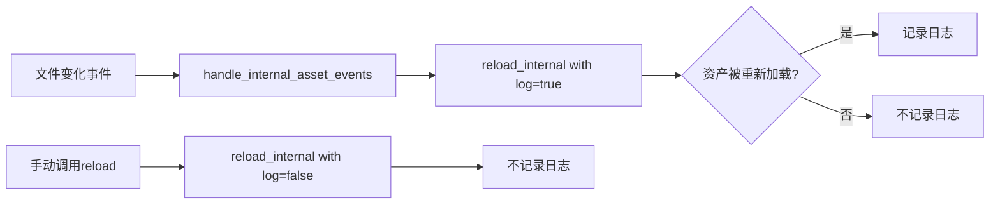

+++
title = "#21218 Log reloads only when an asset has been reloaded"
date = "2025-09-26T00:00:00"
draft = false
template = "pull_request_page.html"
in_search_index = false

[extra]
current_language = "zh-cn"
available_languages = {"en" = { name = "English", url = "/pull_request/bevy/2025-09/pr-21218-en-20250926" }, "zh-cn" = { name = "中文", url = "/pull_request/bevy/2025-09/pr-21218-zh-cn-20250926" }}
+++

# Log reloads only when an asset has been reloaded

## 基本信息
- **标题**: Log reloads only when an asset has been reloaded
- **PR链接**: https://github.com/bevyengine/bevy/pull/21218
- **作者**: dloukadakis
- **状态**: 已合并
- **标签**: A-Assets, S-Ready-For-Final-Review, D-Straightforward
- **创建时间**: 2025-09-26T00:22:42Z
- **合并时间**: 2025-09-26T04:17:46Z
- **合并者**: alice-i-cecile

## 描述翻译

### 目标
- 防止记录资源文件夹中所有更改文件的重新加载，以避免记录在保存期间通常创建的临时文件或从未真正加载的原始资源文件（因为它们以另一种格式导出）。例如，资源文件夹可能有.blender文件，但用户导出为glb/gltf。

### 解决方案
- 添加了一个名为`reload_internal`的新函数，该函数带有一个日志参数，并将日志记录移入该函数内部。

### 测试
- 你是否测试了这些更改？如果是，如何测试的？
运行命令：`cargo run --example hot_asset_reloading --features bevy/file_watcher`
然后执行：`cp assets/models/animated/MorphStressTest.gltf assets/models/torus/torus.gltf`
- 是否有任何部分需要更多测试？
没有
- 其他人（评审者）如何测试你的更改？他们需要了解什么具体信息吗？
可以通过运行一个加载资源并对其进行更改的示例来轻松测试。
- 如果相关，你在哪些平台上测试了这些更改，有哪些重要的平台你无法测试？
Linux

## 这个Pull Request的故事

### 问题和背景
在Bevy引擎的资产热重载功能中，存在一个日志记录过于宽泛的问题。当文件监视器检测到资产文件夹中的任何文件发生变化时，系统会无条件地记录"Reloading {path} because it has changed"信息。这种实现方式会导致大量不必要的日志输出，特别是对于以下两种情况：

1. **临时文件**：许多编辑器和工具在保存过程中会创建临时文件或备份文件
2. **原始资产文件**：如.blender文件，用户实际上使用的是导出的glb/gltf格式，这些原始文件从未被真正加载

这种过度记录不仅增加了日志噪音，还使得开发者难以识别真正被重载的资产，降低了调试效率。

### 解决方案方法
开发者采用了一个直接而有效的解决方案：将日志记录的条件从"文件发生变化"改为"资产实际被重新加载"。这意味着只有当资产确实被成功重新加载时，才会记录相应的日志信息。

技术实现上，通过重构现有的`reload`函数，提取出一个新的内部函数`reload_internal`，并添加一个布尔参数`log`来控制日志记录行为。

### 实现细节
核心修改集中在`AssetServer`的实现上。原来的`reload`函数被修改为调用新的内部函数：

```rust
pub fn reload<'a>(&self, path: impl Into<AssetPath<'a>>) {
    self.reload_internal(path, false);
}
```

新的`reload_internal`函数包含了原有的重载逻辑，但增加了条件日志记录：

```rust
fn reload_internal<'a>(&self, path: impl Into<AssetPath<'a>>, log: bool) {
    let server = self.clone();
    let path = path.into().into_owned();
    IoTaskPool::get()
        .spawn(async move {
            let mut reloaded = false;
            // 依赖资产的重载逻辑保持不变
            if let Some(dependents) = server.data.infos.read().get_dependents(&path) {
                for dependent in dependents {
                    if server.data.infos.read().should_reload(dependent) {
                        if let Err(err) = server.load_internal(None, dependent, true, None).await {
                            error!("{}", err);
                        } else {
                            reloaded = true;
                        }
                    }
                }
            }

            // 主要资产的重载逻辑，现在使用match处理结果
            if !reloaded && server.data.infos.read().should_reload(&path) {
                match server.load_internal(None, path.clone(), true, None).await {
                    Ok(_) => reloaded = true,
                    Err(err) => error!("{}", err),
                }
            }

            // 新增的条件日志记录
            if log && reloaded {
                info!("Reloaded {}", path);
            }
        })
        .detach();
}
```

关键改进在于将原来的无条件日志记录改为条件判断：
- 只有当`log`参数为`true`且资产确实被重新加载时(`reloaded == true`)才记录日志
- 使用`match`语句更清晰地处理`load_internal`的结果

在文件变化事件处理中，调用方式也相应改变：

```rust
// 修改前：
info!("Reloading {path} because it has changed");
server.reload(path);

// 修改后：
server.reload_internal(path, true);
```

### 技术洞察
这个修改展示了几个重要的软件工程原则：

1. **关注点分离**：将日志记录逻辑从核心重载逻辑中分离出来
2. **条件日志记录**：避免不必要的日志输出，提高日志质量
3. **错误处理改进**：使用`match`语句替代原来的`if let Err`模式，使代码更清晰

从性能角度看，这个修改减少了不必要的字符串格式化和日志输出操作，特别是在文件监视频繁触发的场景下。

### 影响
这个PR带来的主要改进包括：
- **减少日志噪音**：只记录真正重要的重载事件
- **提高调试效率**：开发者可以更轻松地识别哪些资产确实被重载
- **更好的用户体验**：在开发过程中，控制台输出更加清晰和有用

这个修改是向后兼容的，不会影响现有的API或功能，只是优化了日志记录行为。

## 视觉表示



## 关键文件更改

- `crates/bevy_asset/src/server/mod.rs` (+14/-7)

这个文件包含了Bevy资产服务器的核心实现。主要修改包括：

1. **新增`reload_internal`函数**：
```rust
fn reload_internal<'a>(&self, path: impl Into<AssetPath<'a>>, log: bool) {
    // 重载逻辑...
    if log && reloaded {
        info!("Reloaded {}", path);
    }
}
```

2. **修改`reload`函数**：
```rust
// 修改前：
pub fn reload<'a>(&self, path: impl Into<AssetPath<'a>>) {
    // 直接的重载实现
}

// 修改后：
pub fn reload<'a>(&self, path: impl Into<AssetPath<'a>>) {
    self.reload_internal(path, false);
}
```

3. **修改事件处理逻辑**：
```rust
// 修改前：
for path in paths_to_reload {
    info!("Reloading {path} because it has changed");
    server.reload(path);
}

// 修改后：
for path in paths_to_reload {
    server.reload_internal(path, true);
}
```

这些修改共同实现了只在资产实际被重载时才记录日志的目标。

## 进一步阅读

对于想了解更多相关技术的开发者，建议参考：
- Bevy资产系统文档：https://bevyengine.org/learn/books/introduction/assets/
- Rust日志记录最佳实践
- 文件监视和热重载模式的相关资料