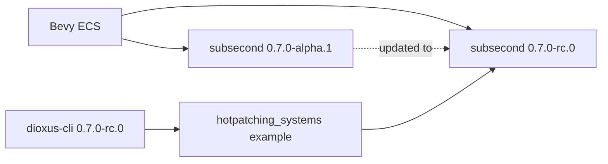

+++
title = "#21220 Update subsecond to 0.7.0-rc.0"
date = "2025-09-26T00:00:00"
draft = false
template = "pull_request_page.html"
in_search_index = true

[taxonomies]
list_display = ["show"]

[extra]
current_language = "en"
available_languages = {"en" = { name = "English", url = "/pull_request/bevy/2025-09/pr-21220-en-20250926" }, "zh-cn" = { name = "中文", url = "/pull_request/bevy/2025-09/pr-21220-zh-cn-20250926" }}
labels = ["A-ECS", "C-Dependencies"]
+++

# Update subsecond to 0.7.0-rc.0

## Basic Information
- **Title**: Update subsecond to 0.7.0-rc.0
- **PR Link**: https://github.com/bevyengine/bevy/pull/21220
- **Author**: cart
- **Status**: MERGED
- **Labels**: A-ECS, C-Dependencies, S-Ready-For-Final-Review
- **Created**: 2025-09-26T02:17:26Z
- **Merged**: 2025-09-26T04:07:24Z
- **Merged By**: alice-i-cecile

## Description Translation

# Objective

subsecond has had a number of alpha releases and an RC release. We should update to the latest version.

## Solution

Update subsecond to 0.7.0-rc.0.

The hotpatching_systems example still works (in combination with dioxus-cli 0.7.0-rc.0)

## The Story of This Pull Request

This PR represents a straightforward but important maintenance task: updating a key dependency in the Bevy ECS (Entity Component System) to a more stable release candidate version. The `subsecond` crate, which provides hot-reloading capabilities for Bevy systems, had progressed through several alpha releases and was now available as a release candidate (RC).

The core issue was that Bevy was using an alpha version (`0.7.0-alpha.1`) of `subsecond`, which meant the dependency was still in early development and potentially unstable. Moving to the RC version (`0.7.0-rc.0`) provides greater stability and indicates the library is approaching production readiness.

The implementation approach was simple but required validation. The change involved updating the version string in the Cargo.toml file, but the critical verification step was ensuring that the hotpatching functionality continued to work correctly. The author confirmed that the `hotpatching_systems` example still functioned properly with the updated dependency, particularly when used in conjunction with `dioxus-cli` at the same RC version.

This type of dependency update is essential for maintaining a healthy codebase. While seemingly minor, it demonstrates good dependency management practices: keeping dependencies current, testing critical functionality after updates, and ensuring compatibility across related tools in the ecosystem.

## Visual Representation



## Key Files Changed

### `crates/bevy_ecs/Cargo.toml`

This file contains the dependency configuration for Bevy's ECS crate. The change updates the `subsecond` dependency from an alpha version to a release candidate version.

**Key modification:**
```toml
# Before:
subsecond = { version = "0.7.0-alpha.1", optional = true }

# After:
subsecond = { version = "0.7.0-rc.0", optional = true }
```

The change is minimal but significant - it moves the dependency from an unstable alpha release to a more stable release candidate, which is marked as optional since hot-reloading functionality is not required for all Bevy applications.

## Further Reading

- [Cargo SemVer Documentation](https://doc.rust-lang.org/cargo/reference/semver.html)
- [Bevy Hot Reloading Guide](https://bevyengine.org/learn/quick-start/advanced/hot-reloading/)
- [Semantic Versioning Specification](https://semver.org/)

# Full Code Diff

```diff
diff --git a/crates/bevy_ecs/Cargo.toml b/crates/bevy_ecs/Cargo.toml
index 5a2db11f094e2..eb39ed859e33a 100644
--- a/crates/bevy_ecs/Cargo.toml
+++ b/crates/bevy_ecs/Cargo.toml
@@ -120,7 +120,7 @@ variadics_please = { version = "1.1", default-features = false }
 tracing = { version = "0.1", default-features = false, optional = true }
 log = { version = "0.4", default-features = false }
 bumpalo = "3"
-subsecond = { version = "0.7.0-alpha.1", optional = true }
+subsecond = { version = "0.7.0-rc.0", optional = true }
 slotmap = { version = "1.0.7", default-features = false }
 
 concurrent-queue = { version = "2.5.0", default-features = false }
```