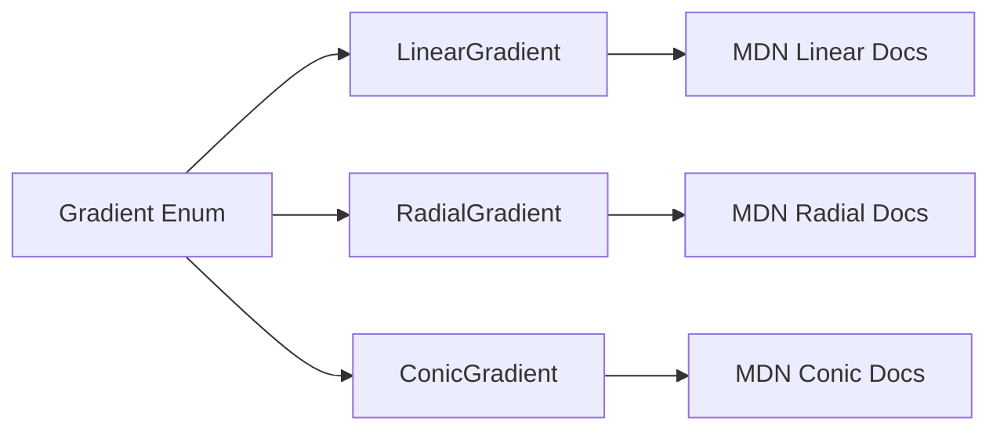

+++
title = "#21227 Fix typo in gradient types link"
date = "2025-09-26T00:00:00"
draft = false
template = "pull_request_page.html"
in_search_index = true

[taxonomies]
list_display = ["show"]

[extra]
current_language = "en"
available_languages = {"en" = { name = "English", url = "/pull_request/bevy/2025-09/pr-21227-en-20250926" }, "zh-cn" = { name = "中文", url = "/pull_request/bevy/2025-09/pr-21227-zh-cn-20250926" }}
labels = ["C-Docs", "D-Trivial", "A-UI"]
+++

# Fix typo in gradient types link

## Basic Information
- **Title**: Fix typo in gradient types link
- **PR Link**: https://github.com/bevyengine/bevy/pull/21227
- **Author**: akimakinai
- **Status**: MERGED
- **Labels**: C-Docs, D-Trivial, A-UI, S-Ready-For-Final-Review
- **Created**: 2025-09-26T13:20:31Z
- **Merged**: 2025-09-26T17:18:11Z
- **Merged By**: mockersf

## Description Translation
Fixed MDN links for radial and conic.

## The Story of This Pull Request

This PR addresses a straightforward documentation issue in Bevy's UI gradient system. The problem was simple but important: incorrect documentation links that could mislead developers trying to understand gradient implementations.

The issue was discovered in the gradient type definitions within Bevy's UI module. The code contained Rust documentation comments that referenced Mozilla Developer Network (MDN) documentation for CSS gradients. However, two of these links were incorrectly pointing to the wrong gradient types.

Specifically, the radial gradient documentation was incorrectly linking to the linear gradient MDN page, and the conic gradient documentation was incorrectly linking to the radial gradient page. This created a disconnect between the Rust enum variant names and their corresponding documentation references.

The solution approach was direct and minimal: correct the URL paths in the documentation comments. The developer identified the exact lines where the incorrect links appeared and replaced them with the proper MDN URLs. This type of fix is typical for documentation maintenance and requires no changes to the actual code logic or functionality.

The implementation consisted of exactly two line changes in a single file. Each change followed the same pattern: updating the URL path segment to match the correct gradient type. The corrections ensure that developers reading the Rust documentation can easily access the relevant CSS gradient specifications on MDN.

From a technical perspective, this fix demonstrates the importance of maintaining accurate external documentation references. While the gradient implementations themselves were unchanged, accurate documentation links are crucial for developer productivity and understanding. The fix also shows how Bevy's codebase follows good practices by including external references for complex graphical concepts like CSS gradients.

The impact of this change is primarily on developer experience. Developers exploring Bevy's gradient system will now be directed to the correct documentation, preventing confusion and saving time that might have been spent following incorrect links. This aligns with Bevy's commitment to providing clear and accurate documentation for its graphical systems.

## Visual Representation



## Key Files Changed

### `crates/bevy_ui/src/gradients.rs` (+2/-2)

This file contains the gradient type definitions for Bevy's UI system. The changes fix incorrect MDN documentation links in the Rust doc comments.

**Key modifications:**

```rust
// File: crates/bevy_ui/src/gradients.rs
// Before:
/// A radial gradient
///
/// <https://developer.mozilla.org/en-US/docs/Web/CSS/gradient/linear-gradient>
Radial(RadialGradient),

/// A conic gradient
///
/// <https://developer.mozilla.org/en-US/docs/Web/CSS/gradient/radial-gradient>
Conic(ConicGradient),

// After:
/// A radial gradient
///
/// <https://developer.mozilla.org/en-US/docs/Web/CSS/gradient/radial-gradient>
Radial(RadialGradient),

/// A conic gradient
///
/// <https://developer.mozilla.org/en-US/docs/Web/CSS/gradient/conic-gradient>
Conic(ConicGradient),
```

The changes correct the URL paths to point to the appropriate MDN documentation for each gradient type, ensuring developers have access to the correct reference material.

## Further Reading

- [MDN Documentation for CSS Radial Gradients](https://developer.mozilla.org/en-US/docs/Web/CSS/gradient/radial-gradient)
- [MDN Documentation for CSS Conic Gradients](https://developer.mozilla.org/en-US/docs/Web/CSS/gradient/conic-gradient)
- [Bevy UI Documentation](https://docs.rs/bevy_ui/latest/bevy_ui/)
- [Rust Documentation Comments Guide](https://doc.rust-lang.org/rustdoc/how-to-write-documentation.html)

# Full Code Diff
diff --git a/crates/bevy_ui/src/gradients.rs b/crates/bevy_ui/src/gradients.rs
index ce7371fbe552a..af8d6319fe22c 100644
--- a/crates/bevy_ui/src/gradients.rs
+++ b/crates/bevy_ui/src/gradients.rs
@@ -468,11 +468,11 @@ pub enum Gradient {
     Linear(LinearGradient),
     /// A radial gradient
     ///
-    /// <https://developer.mozilla.org/en-US/docs/Web/CSS/gradient/linear-gradient>
+    /// <https://developer.mozilla.org/en-US/docs/Web/CSS/gradient/radial-gradient>
     Radial(RadialGradient),
     /// A conic gradient
     ///
-    /// <https://developer.mozilla.org/en-US/docs/Web/CSS/gradient/radial-gradient>
+    /// <https://developer.mozilla.org/en-US/docs/Web/CSS/gradient/conic-gradient>
     Conic(ConicGradient),
 }
