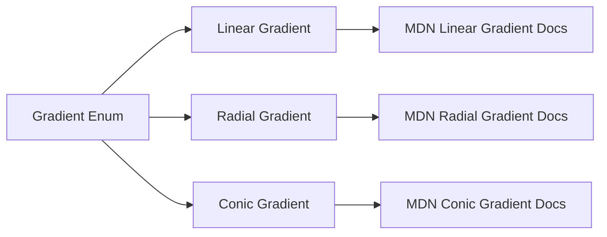

+++
title = "#21227 Fix typo in gradient types link"
date = "2025-09-26T00:00:00"
draft = false
template = "pull_request_page.html"
in_search_index = false

[extra]
current_language = "zh-cn"
available_languages = {"en" = { name = "English", url = "/pull_request/bevy/2025-09/pr-21227-en-20250926" }, "zh-cn" = { name = "中文", url = "/pull_request/bevy/2025-09/pr-21227-zh-cn-20250926" }}
labels = ["C-Docs", "D-Trivial", "A-UI"]
+++

# Fix typo in gradient types link

## Basic Information
- **Title**: Fix typo in gradient types link
- **PR Link**: https://github.com/bevyengine/bevy/pull/21227
- **Author**: akimakinai
- **Status**: MERGED
- **Labels**: C-Docs, D-Trivial, A-UI, S-Ready-For-Final-Review
- **Created**: 2025-09-26T13:20:31Z
- **Merged**: 2025-09-26T17:18:11Z
- **Merged By**: mockersf

## Description Translation
修复了径向和圆锥渐变类型的MDN链接拼写错误。

## The Story of This Pull Request

这个PR的核心是一个简单的文档修复，但体现了开源项目中常见的质量控制问题。问题出现在Bevy引擎的UI模块渐变类型文档中，具体是在`crates/bevy_ui/src/gradients.rs`文件里。

开发者在查看渐变类型的文档链接时发现，径向渐变（Radial Gradient）和圆锥渐变（Conic Gradient）的MDN文档链接存在错误。径向渐变的注释错误地指向了线性渐变的文档，而圆锥渐变的注释则错误地指向了径向渐变的文档。

这种类型的错误虽然不影响代码功能，但对于开发者体验有负面影响。当其他开发者想要深入了解这些渐变类型的细节时，错误的链接会把他们带到不相关的文档页面，增加了学习和调试的时间成本。

问题的技术背景是Bevy的渐变系统支持三种类型的渐变：线性渐变（Linear Gradient）、径向渐变（Radial Gradient）和圆锥渐变（Conic Gradient）。每种渐变类型都有对应的MDN文档链接，用于提供标准的CSS渐变规范参考。

修复方案直接明了：将错误的链接替换为正确的链接。具体来说：
- 径向渐变的链接从线性渐变改为径向渐变
- 圆锥渐变的链接从径向渐变改为圆锥渐变

这个修改体现了开源项目中文档质量的重要性。即使是简单的拼写错误或链接错误，也会影响整个项目的专业性和可用性。通过及时修复这类问题，项目维护者能够确保开发者在使用Bevy引擎时获得准确的技术参考。

从工程角度看，这个PR展示了良好的开发实践：即使是微小的文档问题也值得关注和修复。这种对细节的关注有助于维护代码库的整体质量，确保所有技术文档的准确性。

## Visual Representation



## Key Files Changed

### `crates/bevy_ui/src/gradients.rs` (+2/-2)

这个文件包含了Bevy UI模块的渐变类型定义。修改的内容是修复了两个枚举变体的文档注释中的MDN链接。

**修改前：**
```rust
/// A radial gradient
///
/// <https://developer.mozilla.org/en-US/docs/Web/CSS/gradient/linear-gradient>
Radial(RadialGradient),
/// A conic gradient
///
/// <https://developer.mozilla.org/en-US/docs/Web/CSS/gradient/radial-gradient>
Conic(ConicGradient),
```

**修改后：**
```rust
/// A radial gradient
///
/// <https://developer.mozilla.org/en-US/docs/Web/CSS/gradient/radial-gradient>
Radial(RadialGradient),
/// A conic gradient
///
/// <https://developer.mozilla.org/en-US/docs/Web/CSS/gradient/conic-gradient>
Conic(ConicGradient),
```

修改将径向渐变的链接从线性渐变修正为径向渐变，将圆锥渐变的链接从径向渐变修正为圆锥渐变。这些修改确保了开发者能够通过文档链接访问正确的技术规范。

## Further Reading

- [MDN Web Docs: CSS Gradients](https://developer.mozilla.org/en-US/docs/Web/CSS/CSS_images/Using_CSS_gradients)
- [Bevy Engine Documentation](https://bevyengine.org/learn/)
- [Rust Documentation Guidelines](https://rust-lang.github.io/rfcs/1574-more-api-documentation-conventions.html)