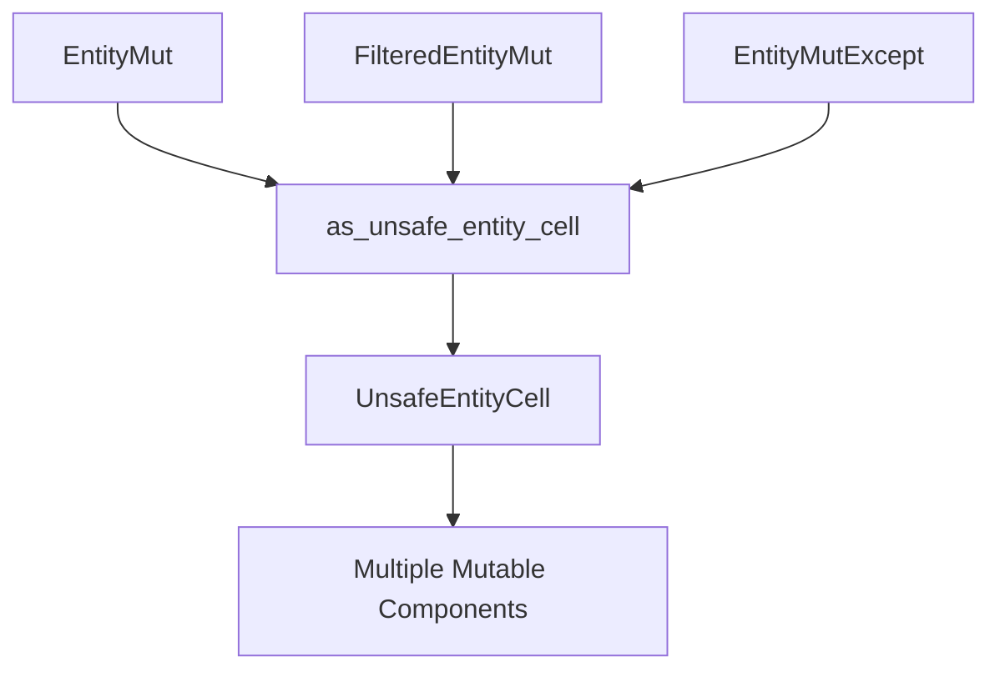

+++
title = "#21234 add methods to *EntityMut to UnsafeEntityCell as an escape hatch"
date = "2025-09-26T00:00:00"
draft = false
template = "pull_request_page.html"
in_search_index = true

[taxonomies]
list_display = ["show"]

[extra]
current_language = "en"
available_languages = {"en" = { name = "English", url = "/pull_request/bevy/2025-09/pr-21234-en-20250926" }, "zh-cn" = { name = "中文", url = "/pull_request/bevy/2025-09/pr-21234-zh-cn-20250926" }}
labels = ["A-ECS", "C-Usability"]
+++

# Title

## Basic Information
- **Title**: add methods to *EntityMut to UnsafeEntityCell as an escape hatch
- **PR Link**: https://github.com/bevyengine/bevy/pull/21234
- **Author**: hymm
- **Status**: MERGED
- **Labels**: A-ECS, C-Usability, S-Ready-For-Final-Review
- **Created**: 2025-09-26T20:53:29Z
- **Merged**: 2025-09-26T22:03:17Z
- **Merged By**: alice-i-cecile

## Description Translation
# Objective

- Sometimes you want to break mutability rules to get multiple mutable components off of an entity.

## Solution

- Allow converting the EntityMut, FilteredEntityMut, and EntityMutExcept into an UnsafeEntityCell. https://docs.rs/bevy/latest/bevy/ecs/world/unsafe_world_cell/struct.UnsafeEntityCell.html

## Testing

- haven't really tested, but changes are straightforward

## The Story of This Pull Request

This PR addresses a specific but important use case in Bevy's ECS (Entity Component System) where developers occasionally need to bypass Rust's standard borrowing rules to access multiple mutable components from the same entity simultaneously. The core issue stems from Rust's ownership system, which normally prevents having multiple mutable references to the same data.

The problem occurs when working with complex entity relationships where multiple systems might need mutable access to different components of the same entity. While Bevy's ECS is designed to work within Rust's safety guarantees, there are legitimate scenarios where developers need an escape hatch for advanced use cases.

The solution implemented is straightforward but powerful: provide conversion methods from various entity mutability wrapper types (`EntityMut`, `FilteredEntityMut`, and `EntityMutExcept`) to `UnsafeEntityCell`. The `UnsafeEntityCell` type serves as Bevy's official escape hatch for these situations, allowing developers to explicitly opt into unsafe operations when they have confidence in their ability to maintain memory safety.

The implementation follows a consistent pattern across all three entity wrapper types. Each gains a new method `as_unsafe_entity_cell()` that returns an `UnsafeEntityCell` reference. This approach maintains the existing safety guarantees by requiring an explicit conversion step, making it clear when developers are stepping outside the normal safety boundaries.

From a technical perspective, this change is minimal but significant. It doesn't alter the existing safe APIs but extends them with an escape route for advanced use cases. The implementation leverages the fact that these entity wrapper types already contain an `UnsafeEntityCell` internally, so the conversion is essentially just exposing that internal representation.

The impact of this change is primarily on developer ergonomics and flexibility. It provides a clean, documented way to perform operations that were previously difficult or required workarounds. By making this functionality part of the official API, it reduces the need for developers to resort to more dangerous techniques or internal hacks.

## Visual Representation



## Key Files Changed

### `crates/bevy_ecs/src/world/entity_ref.rs` (+15/-0)

This file contains the core ECS entity reference implementations. The changes add conversion methods to three different entity wrapper types, allowing them to be converted to `UnsafeEntityCell` for advanced use cases.

**Key modifications:**

1. **EntityMut struct**: Added method to access underlying UnsafeEntityCell
```rust
/// Get access to the underlying [`UnsafeEntityCell`]
pub fn as_unsafe_entity_cell(&mut self) -> UnsafeEntityCell<'_> {
    self.cell
}
```

2. **FilteredEntityMut struct**: Added identical method
```rust
/// Get access to the underlying [`UnsafeEntityCell`]
pub fn as_unsafe_entity_cell(&mut self) -> UnsafeEntityCell<'_> {
    self.entity
}
```

3. **EntityMutExcept struct**: Added the same conversion method
```rust
/// Get access to the underlying [`UnsafeEntityCell`]
pub fn as_unsafe_entity_cell(&mut self) -> UnsafeEntityCell<'_> {
    self.entity
}
```

These changes provide a consistent API across all three mutable entity wrapper types, allowing developers to convert any of them to an `UnsafeEntityCell` when they need to bypass normal borrowing restrictions.

## Further Reading

- [Bevy ECS Documentation](https://docs.rs/bevy_ecs/latest/bevy_ecs/) - Comprehensive guide to Bevy's Entity Component System
- [UnsafeEntityCell API Documentation](https://docs.rs/bevy/latest/bevy/ecs/world/unsafe_world_cell/struct.UnsafeEntityCell.html) - Detailed information about the escape hatch API
- [Rust Unsafe Code Guidelines](https://doc.rust-lang.org/nomicon/) - Understanding when and how to use unsafe code properly
- [Bevy ECS System Parallellism](https://bevyengine.org/learn/book/getting-started/ecs/) - How Bevy's ECS handles parallel system execution

# Full Code Diff
```
diff --git a/crates/bevy_ecs/src/world/entity_ref.rs b/crates/bevy_ecs/src/world/entity_ref.rs
index 15b61afb7ee49..f19a587d07d9b 100644
--- a/crates/bevy_ecs/src/world/entity_ref.rs
+++ b/crates/bevy_ecs/src/world/entity_ref.rs
@@ -479,6 +479,11 @@ impl<'w> EntityMut<'w> {
         EntityRef::from(self)
     }
 
+    /// Get access to the underlying [`UnsafeEntityCell`]
+    pub fn as_unsafe_entity_cell(&mut self) -> UnsafeEntityCell<'_> {
+        self.cell
+    }
+
     /// Returns the [ID](Entity) of the current entity.
     #[inline]
     #[must_use = "Omit the .id() call if you do not need to store the `Entity` identifier."]
@@ -3873,6 +3878,11 @@ impl<'w, 's> FilteredEntityMut<'w, 's> {
         FilteredEntityRef::from(self)
     }
 
+    /// Get access to the underlying [`UnsafeEntityCell`]
+    pub fn as_unsafe_entity_cell(&mut self) -> UnsafeEntityCell<'_> {
+        self.entity
+    }
+
     /// Returns the [ID](Entity) of the current entity.
     #[inline]
     #[must_use = "Omit the .id() call if you do not need to store the `Entity` identifier."]
@@ -4446,6 +4456,11 @@ where
         EntityRefExcept::from(self)
     }
 
+    /// Get access to the underlying [`UnsafeEntityCell`]
+    pub fn as_unsafe_entity_cell(&mut self) -> UnsafeEntityCell<'_> {
+        self.entity
+    }
+
     /// Gets access to the component of type `C` for the current entity. Returns
     /// `None` if the component doesn't have a component of that type or if the
     /// type is one of the excluded components.
```