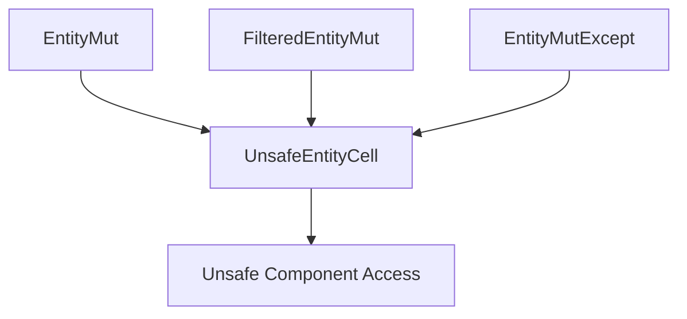

+++
title = "#21234 add methods to *EntityMut to UnsafeEntityCell as an escape hatch"
date = "2025-09-26T00:00:00"
draft = false
template = "pull_request_page.html"
in_search_index = false

[extra]
current_language = "zh-cn"
available_languages = {"en" = { name = "English", url = "/pull_request/bevy/2025-09/pr-21234-en-20250926" }, "zh-cn" = { name = "中文", url = "/pull_request/bevy/2025-09/pr-21234-zh-cn-20250926" }}
labels = ["A-ECS", "C-Usability"]
+++

# Title

## Basic Information
- **Title**: add methods to *EntityMut to UnsafeEntityCell as an escape hatch
- **PR Link**: https://github.com/bevyengine/bevy/pull/21234
- **Author**: hymm
- **Status**: MERGED
- **Labels**: A-ECS, C-Usability, S-Ready-For-Final-Review
- **Created**: 2025-09-26T20:53:29Z
- **Merged**: 2025-09-26T22:03:17Z
- **Merged By**: alice-i-cecile

## Description Translation
**目标**
- 有时候你需要打破可变性规则来从实体获取多个可变组件。

**解决方案**
- 允许将 EntityMut、FilteredEntityMut 和 EntityMutExcept 转换为 UnsafeEntityCell。https://docs.rs/bevy/latest/bevy/ecs/world/unsafe_world_cell/struct.UnsafeEntityCell.html

**测试**
- 没有进行详细测试，但改动是直接的。

## The Story of This Pull Request

这个PR解决了一个在Bevy ECS系统中常见的实际问题：当开发者需要从同一个实体(entity)获取多个可变(mutable)组件时，会遇到Rust的所有权规则限制。在正常的Rust借用检查规则下，一个实体不能同时存在多个可变引用。

问题的核心在于，Bevy的EntityMut类型提供了对实体组件的安全可变访问，但这种安全性是通过限制每次只能有一个可变引用来实现的。然而在实际开发中，有时候确实需要绕过这个限制，比如在性能关键的代码路径中，或者处理复杂的系统间交互时。

开发者hymm提出的解决方案是提供一个"逃生舱口"(escape hatch)——通过添加一个方法将安全的EntityMut类型转换为不安全的UnsafeEntityCell。UnsafeEntityCell是Bevy中用于处理不安全操作的底层类型，它允许开发者绕过正常的借用检查，但要求开发者自己保证内存安全。

实现上，这个PR在三个相关的结构体中添加了相同的方法：
- `EntityMut`
- `FilteredEntityMut` 
- `EntityMutExcept`

每个结构体都新增了一个`as_unsafe_entity_cell`方法，这个方法返回对应的`UnsafeEntityCell`实例。从技术实现上看，这些方法都是简单的访问器(getter)，因为它们只是返回结构体内部已经存在的`UnsafeEntityCell`字段。

这种设计体现了Rust和Bevy的哲学：默认提供安全性，但在必要时提供明确的不安全接口。开发者可以选择使用这个逃生舱口，但需要承担相应的安全责任。

从工程角度看，这个改动虽然小，但很有价值。它没有破坏现有的API，只是扩展了功能。同时，方法的命名很清晰(`as_unsafe_entity_cell`)，明确表明了这是不安全操作，有助于其他开发者理解代码的意图。

## Visual Representation



## Key Files Changed

### `crates/bevy_ecs/src/world/entity_ref.rs` (+15/-0)

这个文件包含了Bevy ECS系统中实体引用的核心实现。PR在这里为三个实体可变引用类型添加了转换为不安全实体单元的方法。

**关键修改：**

1. **EntityMut结构体新增方法：**
```rust
/// Get access to the underlying [`UnsafeEntityCell`]
pub fn as_unsafe_entity_cell(&mut self) -> UnsafeEntityCell<'_> {
    self.cell
}
```

2. **FilteredEntityMut结构体新增方法：**
```rust
/// Get access to the underlying [`UnsafeEntityCell`]
pub fn as_unsafe_entity_cell(&mut self) -> UnsafeEntityCell<'_> {
    self.entity
}
```

3. **EntityMutExcept结构体新增方法：**
```rust
/// Get access to the underlying [`UnsafeEntityCell`]
pub fn as_unsafe_entity_cell(&mut self) -> UnsafeEntityCell<'_> {
    self.entity
}
```

这些修改的共同特点是：
- 方法签名一致，都返回`UnsafeEntityCell<'_>`
- 都带有详细的文档注释说明方法用途
- 实现简单直接，只是返回内部字段
- 使用`&mut self`参数，确保调用时实体处于可变借用状态

## Further Reading

- [Bevy ECS 官方文档](https://bevyengine.org/learn/book/ecs/) - 了解Bevy实体组件系统的基本概念
- [Rust 不安全代码指南](https://doc.rust-lang.org/nomicon/) - 理解不安全操作的正确使用方法
- [Bevy UnsafeEntityCell API文档](https://docs.rs/bevy/latest/bevy/ecs/world/unsafe_world_cell/struct.UnsafeEntityCell.html) - 查看完整的不安全操作接口

# Full Code Diff
diff --git a/crates/bevy_ecs/src/world/entity_ref.rs b/crates/bevy_ecs/src/world/entity_ref.rs
index 15b61afb7ee49..f19a587d07d9b 100644
--- a/crates/bevy_ecs/src/world/entity_ref.rs
+++ b/crates/bevy_ecs/src/world/entity_ref.rs
@@ -479,6 +479,11 @@ impl<'w> EntityMut<'w> {
         EntityRef::from(self)
     }
 
+    /// Get access to the underlying [`UnsafeEntityCell`]
+    pub fn as_unsafe_entity_cell(&mut self) -> UnsafeEntityCell<'_> {
+        self.cell
+    }
+
     /// Returns the [ID](Entity) of the current entity.
     #[inline]
     #[must_use = "Omit the .id() call if you do not need to store the `Entity` identifier."]
@@ -3873,6 +3878,11 @@ impl<'w, 's> FilteredEntityMut<'w, 's> {
         FilteredEntityRef::from(self)
     }
 
+    /// Get access to the underlying [`UnsafeEntityCell`]
+    pub fn as_unsafe_entity_cell(&mut self) -> UnsafeEntityCell<'_> {
+        self.entity
+    }
+
     /// Returns the [ID](Entity) of the current entity.
     #[inline]
     #[must_use = "Omit the .id() call if you do not need to store the `Entity` identifier."]
@@ -4446,6 +4456,11 @@ where
         EntityRefExcept::from(self)
     }
 
+    /// Get access to the underlying [`UnsafeEntityCell`]
+    pub fn as_unsafe_entity_cell(&mut self) -> UnsafeEntityCell<'_> {
+        self.entity
+    }
+
     /// Gets access to the component of type `C` for the current entity. Returns
     /// `None` if the component doesn't have a component of that type or if the
     /// type is one of the excluded components.