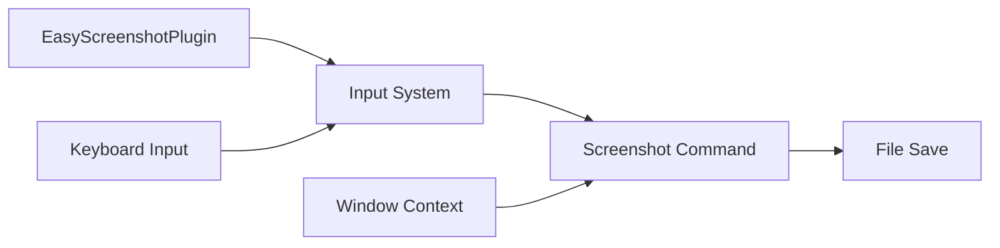

+++
title = "#21235 easy screenshot plugin"
date = "2025-09-30T00:00:00"
draft = false
template = "pull_request_page.html"
in_search_index = true

[taxonomies]
list_display = ["show"]

[extra]
current_language = "en"
available_languages = {"en" = { name = "English", url = "/pull_request/bevy/2025-09/pr-21235-en-20250930" }, "zh-cn" = { name = "中文", url = "/pull_request/bevy/2025-09/pr-21235-zh-cn-20250930" }}
labels = ["C-Feature", "A-Meta", "A-Dev-Tools"]
+++

# Title
easy screenshot plugin

## Basic Information
- **Title**: easy screenshot plugin
- **PR Link**: https://github.com/bevyengine/bevy/pull/21235
- **Author**: mockersf
- **Status**: MERGED
- **Labels**: C-Feature, A-Meta, S-Ready-For-Final-Review, A-Dev-Tools
- **Created**: 2025-09-26T22:00:29Z
- **Merged**: 2025-09-29T23:57:28Z
- **Merged By**: alice-i-cecile

## Description Translation
# Objective

- Part of https://github.com/bevyengine/bevy-website/issues/2253
- Have an easy setup to take screenshots

## Solution

- Make a new `EasyScreenshotPlugin` in the dev tools

## Testing

- Add to any example
```
        .add_plugins(bevy::dev_tools::EasyScreenshotPlugin {
            trigger: KeyCode::KeyP,
            ..default()
        })
```
- Run the example with the feature `bevy_dev_tools` enabled
- press the P key
- screenshot! 🎉 

## The Story of This Pull Request

The problem was straightforward: Bevy lacked a built-in, easy-to-use screenshot functionality. Developers needed to manually implement screenshot capture using Bevy's existing screenshot APIs, which required writing custom systems and handling file saving logic. This was particularly inconvenient for quick testing, documentation, or sharing visual results from examples and applications.

The solution approach focused on creating a minimal, zero-configuration plugin that leverages Bevy's existing screenshot infrastructure while adding convenient defaults and keyboard-triggered capture. The developer chose to implement this as a standalone plugin within the `bevy_dev_tools` module, making it opt-in through feature flags and keeping it separate from the core engine.

The implementation centers around the `EasyScreenshotPlugin` struct, which provides configurable trigger key and format options while using sensible defaults. The core technical insight was using Bevy's existing `Screenshot` component and `save_to_disk` function, combined with input handling through the `input_just_pressed` condition. This approach demonstrates good use of Bevy's ECS patterns - the plugin adds a system that spawns screenshot commands when the trigger key is pressed.

One notable engineering decision was the filename generation strategy. The implementation uses the current timestamp in milliseconds since UNIX epoch to create unique filenames, combining it with the window title for better organization. This prevents file collisions while maintaining human-readable output.

```rust
let since_the_epoch = SystemTime::now()
    .duration_since(UNIX_EPOCH)
    .expect("time should go forward");

commands
    .spawn(Screenshot::primary_window())
    .observe(save_to_disk(format!(
        "{}-{}.{}",
        window.title,
        since_the_epoch.as_millis(),
        match format {
            ScreenshotFormat::Jpeg => "jpg",
            ScreenshotFormat::Png => "png",
            ScreenshotFormat::Bmp => "bmp",
        }
    )));
```

The impact of this change is significant for developer workflow. It reduces the barrier to capturing screenshots from requiring custom implementation to a simple plugin addition. The integration follows Bevy's plugin pattern cleanly and provides sensible defaults while remaining configurable for specific use cases.

## Visual Representation



## Key Files Changed

### `crates/bevy_dev_tools/src/easy_screenshot.rs` (+67/-0)
This is the main implementation file containing the screenshot plugin logic.

Key code:
```rust
pub struct EasyScreenshotPlugin {
    /// Key that will trigger a screenshot
    pub trigger: KeyCode,
    /// Format of the screenshot
    ///
    /// The corresponding image format must be supported by bevy renderer
    pub format: ScreenshotFormat,
}

impl Plugin for EasyScreenshotPlugin {
    fn build(&self, app: &mut App) {
        let format = self.format;
        app.add_systems(
            Update,
            (move |mut commands: Commands, window: Single<&Window, With<PrimaryWindow>>| {
                // ... screenshot logic
            })
            .run_if(input_just_pressed(self.trigger)),
        );
    }
}
```

### `crates/bevy_dev_tools/src/lib.rs` (+3/-0)
This file was modified to include and export the new screenshot module.

Key changes:
```rust
mod easy_screenshot;
// ...
pub use easy_screenshot::*;
```

### `crates/bevy_dev_tools/Cargo.toml` (+1/-0)
Added the necessary dependency for input handling:
```toml
bevy_input = { path = "../bevy_input", version = "0.18.0-dev" }
```

## Further Reading

- [Bevy Plugin System Documentation](https://docs.rs/bevy/latest/bevy/app/trait.Plugin.html)
- [Bevy Input Handling](https://github.com/bevyengine/bevy/blob/main/crates/bevy_input/src/lib.rs)
- [Bevy Screenshot API](https://docs.rs/bevy/latest/bevy/render/view/screenshot/index.html)

# Full Code Diff
```diff
diff --git a/crates/bevy_dev_tools/Cargo.toml b/crates/bevy_dev_tools/Cargo.toml
index 14a72cf121d46..8c78426c497fd 100644
--- a/crates/bevy_dev_tools/Cargo.toml
+++ b/crates/bevy_dev_tools/Cargo.toml
@@ -19,6 +19,7 @@ bevy_camera = { path = "../bevy_camera", version = "0.18.0-dev" }
 bevy_color = { path = "../bevy_color", version = "0.18.0-dev" }
 bevy_diagnostic = { path = "../bevy_diagnostic", version = "0.18.0-dev" }
 bevy_ecs = { path = "../bevy_ecs", version = "0.18.0-dev" }
+bevy_input = { path = "../bevy_input", version = "0.18.0-dev" }
 bevy_math = { path = "../bevy_math", version = "0.18.0-dev" }
 bevy_picking = { path = "../bevy_picking", version = "0.18.0-dev" }
 bevy_render = { path = "../bevy_render", version = "0.18.0-dev" }
diff --git a/crates/bevy_dev_tools/src/easy_screenshot.rs b/crates/bevy_dev_tools/src/easy_screenshot.rs
new file mode 100644
index 0000000000000..4bfacf995f261
--- /dev/null
+++ b/crates/bevy_dev_tools/src/easy_screenshot.rs
@@ -0,0 +1,67 @@
+use std::time::{SystemTime, UNIX_EPOCH};
+
+use bevy_app::{App, Plugin, Update};
+use bevy_ecs::prelude::*;
+use bevy_input::{common_conditions::input_just_pressed, keyboard::KeyCode};
+use bevy_render::view::screenshot::{save_to_disk, Screenshot};
+use bevy_window::{PrimaryWindow, Window};
+
+/// File format the screenshot will be saved in
+#[derive(Clone, Copy)]
+pub enum ScreenshotFormat {
+    /// JPEG format
+    Jpeg,
+    /// PNG format
+    Png,
+    /// BMP format
+    Bmp,
+}
+
+/// Add this plugin to your app to enable easy screenshotting.
+///
+/// Add this plugin, press the key, and you have a screenshot 🎉
+pub struct EasyScreenshotPlugin {
+    /// Key that will trigger a screenshot
+    pub trigger: KeyCode,
+    /// Format of the screenshot
+    ///
+    /// The corresponding image format must be supported by bevy renderer
+    pub format: ScreenshotFormat,
+}
+
+impl Default for EasyScreenshotPlugin {
+    fn default() -> Self {
+        EasyScreenshotPlugin {
+            trigger: KeyCode::PrintScreen,
+            format: ScreenshotFormat::Png,
+        }
+    }
+}
+
+impl Plugin for EasyScreenshotPlugin {
+    fn build(&self, app: &mut App) {
+        let format = self.format;
+        app.add_systems(
+            Update,
+            (move |mut commands: Commands, window: Single<&Window, With<PrimaryWindow>>| {
+                let since_the_epoch = SystemTime::now()
+                    .duration_since(UNIX_EPOCH)
+                    .expect("time should go forward");
+
+                commands
+                    .spawn(Screenshot::primary_window())
+                    .observe(save_to_disk(format!(
+                        "{}-{}.{}",
+                        window.title,
+                        since_the_epoch.as_millis(),
+                        match format {
+                            ScreenshotFormat::Jpeg => "jpg",
+                            ScreenshotFormat::Png => "png",
+                            ScreenshotFormat::Bmp => "bmp",
+                        }
+                    )));
+            })
+            .run_if(input_just_pressed(self.trigger)),
+        );
+    }
+}
diff --git a/crates/bevy_dev_tools/src/lib.rs b/crates/bevy_dev_tools/src/lib.rs
index 8efea87f0007c..dd1e33363be7d 100644
--- a/crates/bevy_dev_tools/src/lib.rs
+++ b/crates/bevy_dev_tools/src/lib.rs
@@ -13,6 +13,7 @@ use bevy_app::prelude::*;
 #[cfg(feature = "bevy_ci_testing")]
 pub mod ci_testing;
 
+mod easy_screenshot;
 pub mod fps_overlay;
 pub mod frame_time_graph;
 
@@ -20,6 +21,8 @@ pub mod picking_debug;
 
 pub mod states;
 
+pub use easy_screenshot::*;
+
 /// Enables developer tools in an [`App`]. This plugin is added automatically with `bevy_dev_tools`
 /// feature.
 ///
```