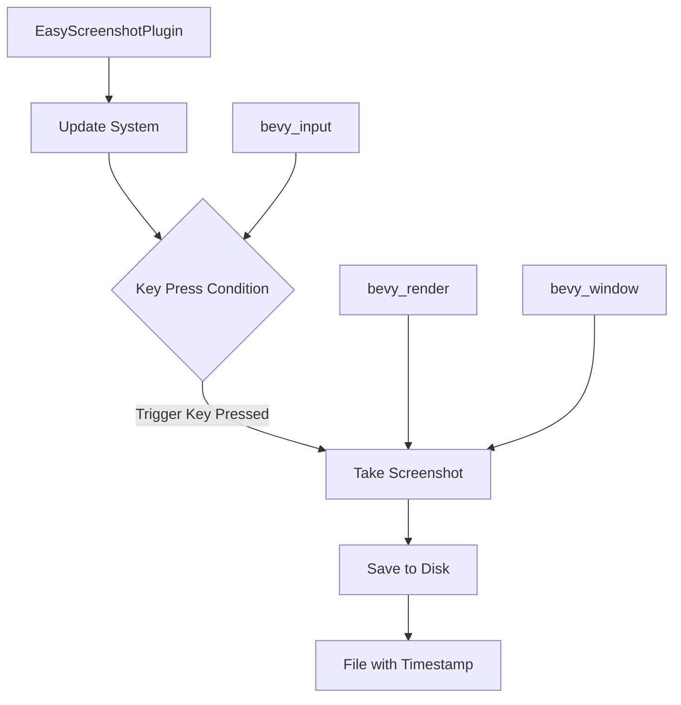

+++
title = "#21235 easy screenshot plugin"
date = "2025-09-30T00:00:00"
draft = false
template = "pull_request_page.html"
in_search_index = false

[extra]
current_language = "zh-cn"
available_languages = {"en" = { name = "English", url = "/pull_request/bevy/2025-09/pr-21235-en-20250930" }, "zh-cn" = { name = "中文", url = "/pull_request/bevy/2025-09/pr-21235-zh-cn-20250930" }}
labels = ["C-Feature", "A-Meta", "A-Dev-Tools"]
+++

# Title
## Basic Information
- **Title**: easy screenshot plugin  
- **PR Link**: https://github.com/bevyengine/bevy/pull/21235  
- **Author**: mockersf  
- **Status**: MERGED  
- **Labels**: C-Feature, A-Meta, S-Ready-For-Final-Review, A-Dev-Tools  
- **Created**: 2025-09-26T22:00:29Z  
- **Merged**: 2025-09-29T23:57:28Z  
- **Merged By**: alice-i-cecile  

## Description Translation
# 目标

- 作为 https://github.com/bevyengine/bevy-website/issues/2253 的一部分
- 提供一个简单的截图设置

## 解决方案

- 在开发工具中创建一个新的 `EasyScreenshotPlugin`

## 测试

- 添加到任意示例中
```
        .add_plugins(bevy::dev_tools::EasyScreenshotPlugin {
            trigger: KeyCode::KeyP,
            ..default()
        })
```
- 启用 `bevy_dev_tools` 功能运行示例
- 按下 P 键
- 截图！🎉

## The Story of This Pull Request

这个PR解决了一个实际的开发需求：为Bevy引擎提供简单易用的截图功能。在游戏开发和引擎测试过程中，开发者经常需要快速截取屏幕画面，但之前需要手动编写代码来实现这个功能。

开发者面临的核心问题是缺少一个开箱即用的截图解决方案。每次需要截图时，开发者都要重新实现截图逻辑，这增加了开发负担并降低了效率。这个PR通过创建一个专门的插件来解决这个问题，让截图功能变得简单易用。

技术实现上，这个插件采用了Bevy的标准插件架构。`EasyScreenshotPlugin` 结构体允许配置触发按键和图片格式，提供了合理的默认值。在实现细节上，插件利用了Bevy现有的截图基础设施，通过 `Screenshot::primary_window()` 获取主窗口的截图，然后使用 `save_to_disk` 函数保存到文件。

一个值得注意的设计选择是使用时间戳来生成唯一的文件名，这避免了文件覆盖的问题。文件名格式包含了窗口标题和毫秒级时间戳，确保了每次截图都能保存为不同的文件。

```rust
let since_the_epoch = SystemTime::now()
    .duration_since(UNIX_EPOCH)
    .expect("time should go forward");
```

插件的系统只在特定按键按下时运行，这是通过 `input_just_pressed` 条件实现的。这种设计既高效又符合用户预期，不会在不需要时消耗系统资源。

从工程角度看，这个实现展示了Bevy ECS系统的几个重要特性：命令缓冲（通过 `Commands` 参数）、查询系统（通过 `Single<&Window, With<PrimaryWindow>>`）和条件系统执行。这些都是Bevy开发中的标准模式，为其他开发者提供了良好的参考示例。

## Visual Representation



## Key Files Changed

### `crates/bevy_dev_tools/src/easy_screenshot.rs` (+67/-0)
这是新创建的文件，包含了截图插件的完整实现。

```rust
// 主要代码结构：
pub enum ScreenshotFormat {
    Jpeg,
    Png,
    Bmp,
}

pub struct EasyScreenshotPlugin {
    pub trigger: KeyCode,
    pub format: ScreenshotFormat,
}

impl Plugin for EasyScreenshotPlugin {
    fn build(&self, app: &mut App) {
        // 系统注册逻辑
    }
}
```

### `crates/bevy_dev_tools/src/lib.rs` (+3/-0)
导出新模块并使其对外可用。

```rust
// 修改内容：
mod easy_screenshot;
pub use easy_screenshot::*;
```

### `crates/bevy_dev_tools/Cargo.toml` (+1/-0)
添加必要的输入系统依赖。

```toml
# 新增依赖：
bevy_input = { path = "../bevy_input", version = "0.18.0-dev" }
```

## Further Reading

- [Bevy Plugin System Documentation](https://bevyengine.org/learn/book/getting-started/plugins/)
- [Bevy Input System](https://bevyengine.org/learn/book/getting-started/input/)
- [Bevy ECS Commands](https://bevyengine.org/learn/book/programming/commands/)

# Full Code Diff
diff --git a/crates/bevy_dev_tools/Cargo.toml b/crates/bevy_dev_tools/Cargo.toml
index 14a72cf121d46..8c78426c497fd 100644
--- a/crates/bevy_dev_tools/Cargo.toml
+++ b/crates/bevy_dev_tools/Cargo.toml
@@ -19,6 +19,7 @@ bevy_camera = { path = "../bevy_camera", version = "0.18.0-dev" }
 bevy_color = { path = "../bevy_color", version = "0.18.0-dev" }
 bevy_diagnostic = { path = "../bevy_diagnostic", version = "0.18.0-dev" }
 bevy_ecs = { path = "../bevy_ecs", version = "0.18.0-dev" }
+bevy_input = { path = "../bevy_input", version = "0.18.0-dev" }
 bevy_math = { path = "../bevy_math", version = "0.18.0-dev" }
 bevy_picking = { path = "../bevy_picking", version = "0.18.0-dev" }
 bevy_render = { path = "../bevy_render", version = "0.18.0-dev" }
diff --git a/crates/bevy_dev_tools/src/easy_screenshot.rs b/crates/bevy_dev_tools/src/easy_screenshot.rs
new file mode 100644
index 0000000000000..4bfacf995f261
--- /dev/null
+++ b/crates/bevy_dev_tools/src/easy_screenshot.rs
@@ -0,0 +1,67 @@
+use std::time::{SystemTime, UNIX_EPOCH};
+
+use bevy_app::{App, Plugin, Update};
+use bevy_ecs::prelude::*;
+use bevy_input::{common_conditions::input_just_pressed, keyboard::KeyCode};
+use bevy_render::view::screenshot::{save_to_disk, Screenshot};
+use bevy_window::{PrimaryWindow, Window};
+
+/// File format the screenshot will be saved in
+#[derive(Clone, Copy)]
+pub enum ScreenshotFormat {
+    /// JPEG format
+    Jpeg,
+    /// PNG format
+    Png,
+    /// BMP format
+    Bmp,
+}
+
+/// Add this plugin to your app to enable easy screenshotting.
+///
+/// Add this plugin, press the key, and you have a screenshot 🎉
+pub struct EasyScreenshotPlugin {
+    /// Key that will trigger a screenshot
+    pub trigger: KeyCode,
+    /// Format of the screenshot
+    ///
+    /// The corresponding image format must be supported by bevy renderer
+    pub format: ScreenshotFormat,
+}
+
+impl Default for EasyScreenshotPlugin {
+    fn default() -> Self {
+        EasyScreenshotPlugin {
+            trigger: KeyCode::PrintScreen,
+            format: ScreenshotFormat::Png,
+        }
+    }
+}
+
+impl Plugin for EasyScreenshotPlugin {
+    fn build(&self, app: &mut App) {
+        let format = self.format;
+        app.add_systems(
+            Update,
+            (move |mut commands: Commands, window: Single<&Window, With<PrimaryWindow>>| {
+                let since_the_epoch = SystemTime::now()
+                    .duration_since(UNIX_EPOCH)
+                    .expect("time should go forward");
+
+                commands
+                    .spawn(Screenshot::primary_window())
+                    .observe(save_to_disk(format!(
+                        "{}-{}.{}",
+                        window.title,
+                        since_the_epoch.as_millis(),
+                        match format {
+                            ScreenshotFormat::Jpeg => "jpg",
+                            ScreenshotFormat::Png => "png",
+                            ScreenshotFormat::Bmp => "bmp",
+                        }
+                    )));
+            })
+            .run_if(input_just_pressed(self.trigger)),
+        );
+    }
+}
diff --git a/crates/bevy_dev_tools/src/lib.rs b/crates/bevy_dev_tools/src/lib.rs
index 8efea87f0007c..dd1e33363be7d 100644
--- a/crates/bevy_dev_tools/src/lib.rs
+++ b/crates/bevy_dev_tools/src/lib.rs
@@ -13,6 +13,7 @@ use bevy_app::prelude::*;
 #[cfg(feature = "bevy_ci_testing")]
 pub mod ci_testing;
 
+mod easy_screenshot;
 pub mod fps_overlay;
 pub mod frame_time_graph;
 
@@ -20,6 +21,8 @@ pub mod picking_debug;
 
 pub mod states;
 
+pub use easy_screenshot::*;
+
 /// Enables developer tools in an [`App`]. This plugin is added automatically with `bevy_dev_tools`
 /// feature.
 ///