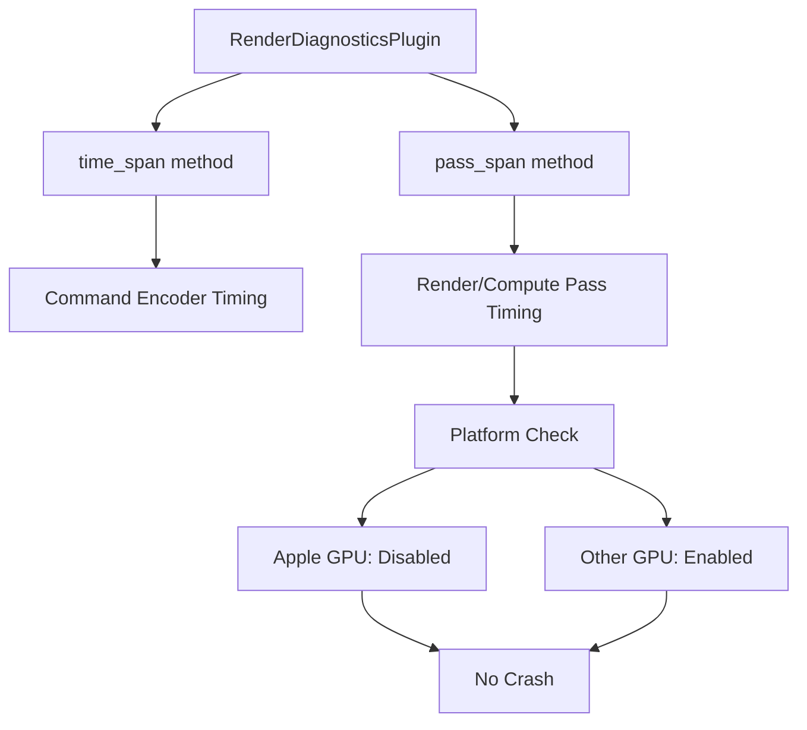

+++
title = "#21238 Fix crash with RenderDiagnosticsPlugin on mac"
date = "2025-09-28T00:00:00"
draft = false
template = "pull_request_page.html"
in_search_index = true

[taxonomies]
list_display = ["show"]

[extra]
current_language = "en"
available_languages = {"en" = { name = "English", url = "/pull_request/bevy/2025-09/pr-21238-en-20250928" }, "zh-cn" = { name = "中文", url = "/pull_request/bevy/2025-09/pr-21238-zh-cn-20250928" }}
labels = ["C-Bug", "D-Trivial", "A-Rendering", "A-Diagnostics"]
+++

# Title
Fix crash with RenderDiagnosticsPlugin on mac

## Basic Information
- **Title**: Fix crash with RenderDiagnosticsPlugin on mac
- **PR Link**: https://github.com/bevyengine/bevy/pull/21238
- **Author**: akimakinai
- **Status**: MERGED
- **Labels**: C-Bug, D-Trivial, A-Rendering, S-Ready-For-Final-Review, A-Diagnostics
- **Created**: 2025-09-27T04:32:27Z
- **Merged**: 2025-09-28T18:38:07Z
- **Merged By**: alice-i-cecile

## Description Translation
**Objective**

- Fixes #21167 
  (happens with `trace_tracy` feature too, as it adds the plugin automatically)
- There are some uses of `time_span` inside passes, which go around [the check](https://github.com/bevyengine/bevy/blob/10325593d5bae88e1089bdf1fa1395f232d5248b/crates/bevy_render/src/diagnostic/internal.rs#L289) for [TIMESTAMP_QUERY_INSIDE_PASSES](https://docs.rs/wgpu-types/latest/wgpu_types/struct.FeaturesWGPU.html#associatedconstant.TIMESTAMP_QUERY_INSIDE_PASSES) feature (unsupported on Apple GPU).
introduced in  #19191

**Solution**

- They look like just typos (all in `let pass_span = time_span` form), so replaced with `pass_span`.

There's an occurence of this pattern in `meshlet/visibility_buffer_raster_node.rs`, but it's the variable name that seems  incorrect in this case. I renamed it instead.

**Testing**

- Running `log_diagnostics` example no longer crashes on Mac.

## The Story of This Pull Request

This PR addresses a specific platform compatibility issue in Bevy's rendering diagnostics system. The core problem was that Apple GPUs don't support the `TIMESTAMP_QUERY_INSIDE_PASSES` feature, which is used for performance timing within render and compute passes.

The issue manifested as crashes on macOS when using the `RenderDiagnosticsPlugin` or the `trace_tracy` feature. These crashes occurred because several rendering nodes were incorrectly using the `time_span` method inside render/compute passes instead of the platform-aware `pass_span` method.

The `time_span` method creates timestamp queries directly on the command encoder, which works fine outside of passes but causes issues inside passes on unsupported hardware. The `pass_span` method, however, includes a platform compatibility check:

```rust
// From bevy_render/src/diagnostic/internal.rs
pub fn pass_span<'a, 'b>(
    &self,
    pass: &'a mut (dyn RenderPass + 'b),
    name: &str,
) -> RenderPassSpan<'a, 'b> {
    if self
        .render_device
        .features()
        .contains(FeaturesWGPU::TIMESTAMP_QUERY_INSIDE_PASSES)
    {
        RenderPassSpan::Enabled(pass.begin_time_span(name))
    } else {
        RenderPassSpan::Disabled
    }
}
```

The fix involved identifying all instances where `time_span` was incorrectly used inside passes and replacing them with `pass_span`. In most cases, this was a straightforward method name replacement, as evidenced by the pattern `let pass_span = diagnostics.time_span(...)` being clearly wrong.

However, one case in the meshlet visibility buffer rasterization code required a different approach. Here, the variable name was incorrect rather than the method call:

```rust
// Before (incorrect variable name):
let pass_span = diagnostics.time_span(render_context.command_encoder(), shadow_view.pass_name.clone());

// After (correct variable name):
let time_span_shadow = diagnostics.time_span(render_context.command_encoder(), shadow_view.pass_name.clone());
```

This distinction is important because in this specific case, the timing was correctly being done on the command encoder (outside a pass), but the variable was misleadingly named `pass_span` when it should have been something like `time_span_shadow`.

The changes demonstrate good software engineering practices:
- Platform-specific constraints are properly handled through abstraction
- The fix is minimal and focused, changing only what's necessary
- Variable names are corrected to accurately reflect their purpose
- The solution maintains backward compatibility while fixing the crash

This fix is particularly important because the `trace_tracy` feature automatically enables the problematic plugin, making this crash affect any macOS user who enables tracing for performance analysis.

## Visual Representation



## Key Files Changed

**crates/bevy_anti_alias/src/contrast_adaptive_sharpening/node.rs**
- Changed from `time_span` to `pass_span` for contrast adaptive sharpening timing
```rust
// Before:
let pass_span = diagnostics.time_span(&mut render_pass, "contrast_adaptive_sharpening");

// After:
let pass_span = diagnostics.pass_span(&mut render_pass, "contrast_adaptive_sharpening");
```

**crates/bevy_pbr/src/atmosphere/node.rs**
- Fixed atmosphere LUTs computation timing
```rust
// Before:
let pass_span = diagnostics.time_span(&mut luts_pass, "atmosphere_luts");

// After:
let pass_span = diagnostics.pass_span(&mut luts_pass, "atmosphere_luts");
```

**crates/bevy_pbr/src/meshlet/visibility_buffer_raster_node.rs**
- Corrected variable name for shadow pass timing
```rust
// Before:
let pass_span = diagnostics.time_span(
    render_context.command_encoder(),
    shadow_view.pass_name.clone(),
);

// After:
let time_span_shadow = diagnostics.time_span(
    render_context.command_encoder(),
    shadow_view.pass_name.clone(),
);
```

**crates/bevy_pbr/src/render/gpu_preprocess.rs**
- Fixed timing for early and late mesh preprocessing
```rust
// Before (multiple instances):
let pass_span = diagnostics.time_span(&mut compute_pass, "early_mesh_preprocessing");

// After:
let pass_span = diagnostics.pass_span(&mut compute_pass, "early_mesh_preprocessing");
```

**crates/bevy_post_process/src/auto_exposure/node.rs**
- Fixed auto-exposure computation timing
```rust
// Before:
let pass_span = diagnostics.time_span(&mut compute_pass, "auto_exposure");

// After:
let pass_span = diagnostics.pass_span(&mut compute_pass, "auto_exposure");
```

## Further Reading

- [WebGPU Timestamp Queries Documentation](https://gpuweb.github.io/gpuweb/#timestamp-query)
- [Bevy Render Diagnostics Source](https://github.com/bevyengine/bevy/blob/main/crates/bevy_render/src/diagnostic/internal.rs)
- [WebGPU Features Enum](https://docs.rs/wgpu-types/latest/wgpu_types/struct.FeaturesWGPU.html)
- [Original Issue #21167](https://github.com/bevyengine/bevy/issues/21167)
- [PR #19191 that introduced the issue](https://github.com/bevyengine/bevy/pull/19191)