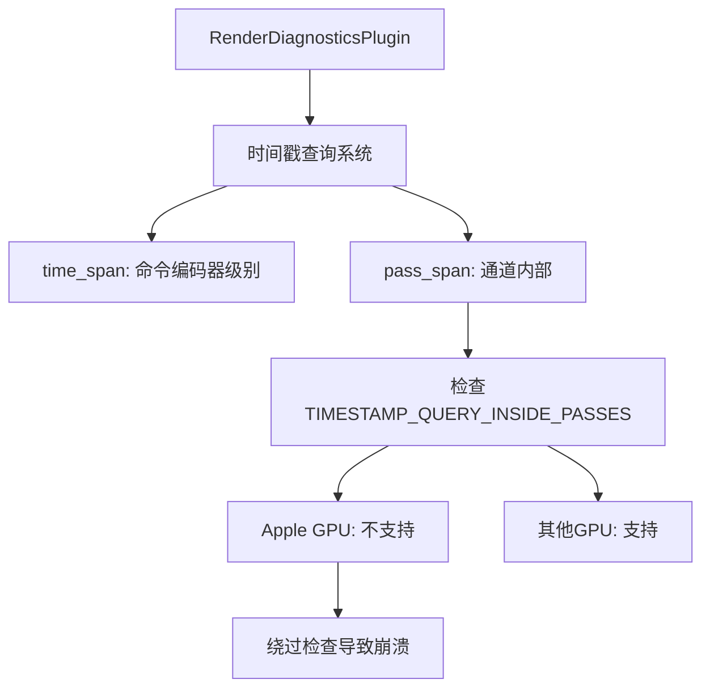

+++
title = "#21238 Fix crash with RenderDiagnosticsPlugin on mac"
date = "2025-09-28T00:00:00"
draft = false
template = "pull_request_page.html"
in_search_index = false

[extra]
current_language = "zh-cn"
available_languages = {"en" = { name = "English", url = "/pull_request/bevy/2025-09/pr-21238-en-20250928" }, "zh-cn" = { name = "中文", url = "/pull_request/bevy/2025-09/pr-21238-zh-cn-20250928" }}
+++

# Title
Fix crash with RenderDiagnosticsPlugin on mac

## Basic Information
- **Title**: Fix crash with RenderDiagnosticsPlugin on mac
- **PR Link**: https://github.com/bevyengine/bevy/pull/21238
- **作者**: akimakinai
- **状态**: 已合并
- **标签**: C-Bug, D-Trivial, A-Rendering, S-Ready-For-Final-Review, A-Diagnostics
- **创建时间**: 2025-09-27T04:32:27Z
- **合并时间**: 2025-09-28T18:38:07Z
- **合并者**: alice-i-cecile

## 描述翻译

### 目标
- 修复 #21167
  (在使用 `trace_tracy` 功能时也会发生，因为它会自动添加插件)
- 在渲染通道(pass)内部有一些使用 `time_span` 的地方，这些地方绕过了对 [TIMESTAMP_QUERY_INSIDE_PASSES](https://docs.rs/wgpu-types/latest/wgpu_types/struct.FeaturesWGPU.html#associatedconstant.TIMESTAMP_QUERY_INSIDE_PASSES) 功能的[检查](https://github.com/bevyengine/bevy/blob/10325593d5bae88e1089bdf1fa1395f232d5248b/crates/bevy_render/src/diagnostic/internal.rs#L289)（在 Apple GPU 上不支持）。在 #19191 中引入。

### 解决方案
- 这些看起来像是拼写错误（都是 `let pass_span = time_span` 的形式），所以用 `pass_span` 替换。

在 `meshlet/visibility_buffer_raster_node.rs` 中有这种模式的一个出现，但在这个情况下似乎是变量名不正确。我改用了重命名变量。

### 测试
- 在 Mac 上运行 `log_diagnostics` 示例不再崩溃。

## 这个 Pull Request 的故事

这个 PR 解决了一个在 macOS 平台上使用 RenderDiagnosticsPlugin 时发生的崩溃问题。问题的根源在于渲染诊断系统中对时间戳查询功能的使用方式不正确。

**问题背景**
在 Bevy 的渲染系统中，RenderDiagnosticsPlugin 用于收集和报告渲染性能指标。其中使用了 wgpu 的时间戳查询功能来测量不同渲染阶段的执行时间。然而，Apple 的 GPU 不支持在渲染通道(pass)内部使用时间戳查询（即缺少 TIMESTAMP_QUERY_INSIDE_PASSES 功能）。

在 PR #19191 中引入了一个安全检查机制，专门检测是否在支持的平台上使用通道内时间戳查询。但是，某些代码错误地使用了 `time_span` 方法而不是 `pass_span` 方法，绕过了这个安全检查。

**技术细节**
`time_span` 方法用于在命令编码器(command encoder)级别创建时间跨度，而 `pass_span` 方法专门用于在渲染或计算通道内部创建时间跨度。关键区别在于：

- `pass_span` 会检查 TIMESTAMP_QUERY_INSIDE_PASSES 功能支持
- `time_span` 不进行这个检查，因为它假设是在通道外部使用

在 Apple GPU 上，当代码在通道内部错误地使用 `time_span` 时，由于缺少安全检查，会尝试执行不支持的操作，导致崩溃。

**解决方案实现**
修复方案相当直接：将所有在渲染/计算通道内部错误使用的 `time_span` 调用替换为正确的 `pass_span` 调用。

在大多数情况下，这确实是简单的拼写错误，模式都是：
```rust
// 错误的代码
let pass_span = diagnostics.time_span(&mut render_pass, "some_pass");

// 修复后的代码  
let pass_span = diagnostics.pass_span(&mut render_pass, "some_pass");
```

但在 `meshlet/visibility_buffer_raster_node.rs` 中情况稍有不同。这里的问题是变量命名不一致：

```rust
// 修复前
let pass_span = diagnostics.time_span(
    render_context.command_encoder(),
    shadow_view.pass_name.clone(),
);

// 修复后
let time_span_shadow = diagnostics.time_span(
    render_context.command_encoder(), 
    shadow_view.pass_name.clone(),
);
```

在这个特定情况下，代码确实应该在通道外部使用 `time_span`（因为它操作的是命令编码器），但变量名 `pass_span` 造成了混淆。修复方案是重命名变量以反映其实际用途。

**影响和测试**
这个修复确保了在 macOS 上使用 RenderDiagnosticsPlugin 或启用 `trace_tracy` 功能时不会崩溃。测试确认 `log_diagnostics` 示例在 Mac 上能够正常运行。

从技术角度看，这个修复体现了平台兼容性处理的重要性，特别是在处理不同 GPU 厂商的功能支持差异时。正确的 API 使用和适当的特性检测是跨平台图形编程的关键。

## 可视化表示



## 关键文件变更

### `crates/bevy_pbr/src/render/gpu_preprocess.rs` (+3/-3)
这个文件处理 GPU 预处理节点，修复了三个计算通道中的时间跨度创建：

```rust
// 修复前:
let pass_span = diagnostics.time_span(&mut compute_pass, "early_mesh_preprocessing");

// 修复后:
let pass_span = diagnostics.pass_span(&mut compute_pass, "early_mesh_preprocessing");
```

### `crates/bevy_pbr/src/meshlet/visibility_buffer_raster_node.rs` (+2/-2)
修复了网格着色器可见性缓冲光栅化通道中的变量命名问题：

```rust
// 修复前:
let pass_span = diagnostics.time_span(
    render_context.command_encoder(),
    shadow_view.pass_name.clone(),
);

// 修复后:
let time_span_shadow = diagnostics.time_span(
    render_context.command_encoder(),
    shadow_view.pass_name.clone(),
);
```

### `crates/bevy_anti_alias/src/contrast_adaptive_sharpening/node.rs` (+1/-1)
修复了对比度自适应锐化节点中的时间跨度创建：

```rust
// 修复前:
let pass_span = diagnostics.time_span(&mut render_pass, "contrast_adaptive_sharpening");

// 修复后:
let pass_span = diagnostics.pass_span(&mut render_pass, "contrast_adaptive_sharpening");
```

### `crates/bevy_pbr/src/atmosphere/node.rs` (+1/-1)
修复了大气渲染节点中的时间跨度创建：

```rust
// 修复前:
let pass_span = diagnostics.time_span(&mut luts_pass, "atmosphere_luts");

// 修复后:
let pass_span = diagnostics.pass_span(&mut luts_pass, "atmosphere_luts");
```

### `crates/bevy_post_process/src/auto_exposure/node.rs` (+1/-1)
修复了自动曝光节点中的时间跨度创建：

```rust
// 修复前:
let pass_span = diagnostics.time_span(&mut compute_pass, "auto_exposure");

// 修复后:
let pass_span = diagnostics.pass_span(&mut compute_pass, "auto_exposure");
```

## 进一步阅读

- [wgpu 时间戳查询文档](https://docs.rs/wgpu-types/latest/wgpu_types/struct.FeaturesWGPU.html#associatedconstant.TIMESTAMP_QUERY_INSIDE_PASSES)
- [Bevy 渲染诊断系统](https://github.com/bevyengine/bevy/blob/main/crates/bevy_render/src/diagnostic/internal.rs)
- [跨平台图形编程最佳实践](https://github.com/gfx-rs/wgpu#platform-support)

# Full Code Diff
diff --git a/crates/bevy_anti_alias/src/contrast_adaptive_sharpening/node.rs b/crates/bevy_anti_alias/src/contrast_adaptive_sharpening/node.rs
index c1e6ccdda02c3..d3308fbeb5784 100644
--- a/crates/bevy_anti_alias/src/contrast_adaptive_sharpening/node.rs
+++ b/crates/bevy_anti_alias/src/contrast_adaptive_sharpening/node.rs
@@ -113,7 +113,7 @@ impl Node for CasNode {
         let mut render_pass = render_context
             .command_encoder()
             .begin_render_pass(&pass_descriptor);
-        let pass_span = diagnostics.time_span(&mut render_pass, "contrast_adaptive_sharpening");
+        let pass_span = diagnostics.pass_span(&mut render_pass, "contrast_adaptive_sharpening");
 
         render_pass.set_pipeline(pipeline);
         render_pass.set_bind_group(0, bind_group, &[uniform_index.index()]);
diff --git a/crates/bevy_pbr/src/atmosphere/node.rs b/crates/bevy_pbr/src/atmosphere/node.rs
index 13734ab07a980..17b47f7d01e8b 100644
--- a/crates/bevy_pbr/src/atmosphere/node.rs
+++ b/crates/bevy_pbr/src/atmosphere/node.rs
@@ -80,7 +80,7 @@ impl ViewNode for AtmosphereLutsNode {
             label: Some("atmosphere_luts"),
             timestamp_writes: None,
         });
-        let pass_span = diagnostics.time_span(&mut luts_pass, "atmosphere_luts");
+        let pass_span = diagnostics.pass_span(&mut luts_pass, "atmosphere_luts");
 
         fn dispatch_2d(compute_pass: &mut ComputePass, size: UVec2) {
             const WORKGROUP_SIZE: u32 = 16;
diff --git a/crates/bevy_pbr/src/meshlet/visibility_buffer_raster_node.rs b/crates/bevy_pbr/src/meshlet/visibility_buffer_raster_node.rs
index e056853be39b5..fee4741308b85 100644
--- a/crates/bevy_pbr/src/meshlet/visibility_buffer_raster_node.rs
+++ b/crates/bevy_pbr/src/meshlet/visibility_buffer_raster_node.rs
@@ -246,7 +246,7 @@ impl Node for MeshletVisibilityBufferRasterPassNode {
                 "meshlet_visibility_buffer_raster: {}",
                 shadow_view.pass_name
             ));
-            let pass_span = diagnostics.time_span(
+            let time_span_shadow = diagnostics.time_span(
                 render_context.command_encoder(),
                 shadow_view.pass_name.clone(),
             );
@@ -342,7 +342,7 @@ impl Node for MeshletVisibilityBufferRasterPassNode {
                 downsample_depth_second_shadow_view_pipeline,
             );
             render_context.command_encoder().pop_debug_group();
-            pass_span.end(render_context.command_encoder());
+            time_span_shadow.end(render_context.command_encoder());
         }
 
         time_span.end(render_context.command_encoder());
diff --git a/crates/bevy_pbr/src/render/gpu_preprocess.rs b/crates/bevy_pbr/src/render/gpu_preprocess.rs
index 54ac96242e41e..85bd2d8f6c902 100644
--- a/crates/bevy_pbr/src/render/gpu_preprocess.rs
+++ b/crates/bevy_pbr/src/render/gpu_preprocess.rs
@@ -598,7 +598,7 @@ impl Node for EarlyGpuPreprocessNode {
                     label: Some("early_mesh_preprocessing"),
                     timestamp_writes: None,
                 });
-        let pass_span = diagnostics.time_span(&mut compute_pass, "early_mesh_preprocessing");
+        let pass_span = diagnostics.pass_span(&mut compute_pass, "early_mesh_preprocessing");
 
         let mut all_views: SmallVec<[_; 8]> = SmallVec::new();
         all_views.push(graph.view_entity());
@@ -839,7 +839,7 @@ impl Node for LateGpuPreprocessNode {
                     label: Some("late_mesh_preprocessing"),
                     timestamp_writes: None,
                 });
-        let pass_span = diagnostics.time_span(&mut compute_pass, "late_mesh_preprocessing");
+        let pass_span = diagnostics.pass_span(&mut compute_pass, "late_mesh_preprocessing");
 
         // Run the compute passes.
         for (view, bind_groups, view_uniform_offset) in self.view_query.iter_manual(world) {
@@ -1056,7 +1056,7 @@ fn run_build_indirect_parameters_node(
                 label: Some(label),
                 timestamp_writes: None,
             });
-    let pass_span = diagnostics.time_span(&mut compute_pass, label);
+    let pass_span = diagnostics.pass_span(&mut compute_pass, label);
 
     // Fetch the pipeline.
     let (
diff --git a/crates/bevy_post_process/src/auto_exposure/node.rs b/crates/bevy_post_process/src/auto_exposure/node.rs
index c7f88dfb28d6f..d16c114774fdd 100644
--- a/crates/bevy_post_process/src/auto_exposure/node.rs
+++ b/crates/bevy_post_process/src/auto_exposure/node.rs
@@ -128,7 +128,7 @@ impl Node for AutoExposureNode {
                     label: Some("auto_exposure"),
                     timestamp_writes: None,
                 });
-        let pass_span = diagnostics.time_span(&mut compute_pass, "auto_exposure");
+        let pass_span = diagnostics.pass_span(&mut compute_pass, "auto_exposure");
 
         compute_pass.set_bind_group(0, &compute_bind_group, &[view_uniform_offset.offset]);
         compute_pass.set_pipeline(histogram_pipeline);