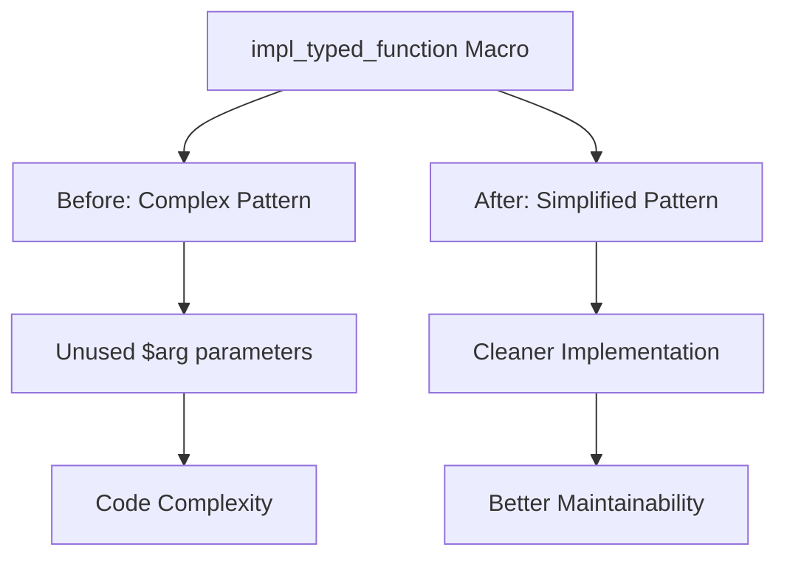

+++
title = "#21241 Remove redundant `$arg: ident` of the `impl_typed_function` macro"
date = "2025-09-28T00:00:00"
draft = false
template = "pull_request_page.html"
in_search_index = true

[taxonomies]
list_display = ["show"]

[extra]
current_language = "en"
available_languages = {"en" = { name = "English", url = "/pull_request/bevy/2025-09/pr-21241-en-20250928" }, "zh-cn" = { name = "中文", url = "/pull_request/bevy/2025-09/pr-21241-zh-cn-20250928" }}
labels = ["D-Trivial", "C-Code-Quality", "A-Reflection"]
+++

# Title

## Basic Information
- **Title**: Remove redundant `$arg: ident` of the `impl_typed_function` macro
- **PR Link**: https://github.com/bevyengine/bevy/pull/21241
- **Author**: Mysvac
- **Status**: MERGED
- **Labels**: D-Trivial, C-Code-Quality, S-Ready-For-Final-Review, A-Reflection
- **Created**: 2025-09-27T11:49:11Z
- **Merged**: 2025-09-28T18:02:18Z
- **Merged By**: alice-i-cecile

## Description Translation

# Objective

bevy_reflect: function reflection

The `$arg: ident` in macro `impl_typed_function` is redundant. It is not used internally at all. So I removed it.

## Testing

- `cargo run --features="reflect_functions" --example function_reflection`
- `cargo test -p bevy_reflect --features="functions"`

---

## Showcase

```rust
macro_rules! impl_typed_function {
    // ($(($Arg:ident, $arg:ident)),*) => {
    ($($Arg:ident),*) => {
        // ......
    }
}

// all_tuples!(impl_typed_function, 0, 15, Arg, arg);
all_tuples!(impl_typed_function, 0, 15, Arg);
```

## The Story of This Pull Request

This PR addresses a straightforward code quality issue in Bevy's reflection system. The problem was in the `impl_typed_function` macro, which had an unused parameter that served no functional purpose but added unnecessary complexity to the code.

The `impl_typed_function` macro is responsible for generating implementations of the `TypedFunction` trait for Rust functions with different numbers of arguments. The macro was designed to accept pairs of identifiers - one for the argument type and one for the argument name. However, during the macro expansion, only the type identifiers (`$Arg`) were actually used in the generated code, while the argument name identifiers (`$arg`) were completely unused.

The developer identified this redundancy through code inspection and realized that the `$arg` parameters were essentially dead code. They weren't referenced in any of the macro's expansion patterns, making them unnecessary complexity. This is a common type of technical debt that accumulates in complex macro systems - parameters that were perhaps intended for future use but never actually utilized.

The solution was simple and direct: remove the unused `$arg` parameters from both the macro pattern definition and the call to `all_tuples!`. This change reduced the macro's complexity without affecting any functionality, since the removed parameters weren't contributing to the actual code generation.

The implementation involved two key changes. First, the macro pattern was simplified from `$(($Arg:ident, $arg:ident)),*` to `$($Arg:ident),*`. Second, the invocation of the `all_tuples!` helper macro was updated to pass only the type identifiers instead of both type and name identifiers.

This change demonstrates good code hygiene practices. By removing unused parameters, the code becomes more maintainable and easier to understand. Future developers working with this macro won't need to wonder about the purpose of the `$arg` parameters or whether they're missing some functionality that depends on them.

The testing approach was appropriate for this type of change - running the existing function reflection example and executing the relevant test suite to ensure no regressions were introduced. Since this was purely a code cleanup change that didn't affect runtime behavior, comprehensive testing of the reflection system's functionality was sufficient to validate the change.

## Visual Representation



## Key Files Changed

### `crates/bevy_reflect/src/func/info.rs` (+7/-7)

This file contains the core implementation of function reflection in Bevy. The changes focus on simplifying the macro that generates typed function implementations.

**Key modifications:**

1. **Macro pattern simplification:**
```rust
// Before:
macro_rules! impl_typed_function {
    ($(($Arg:ident, $arg:ident)),*) => {
        // Macro implementation using only $Arg parameters
    };
}

// After:
macro_rules! impl_typed_function {
    ($($Arg:ident),*) => {
        // Same macro implementation, but cleaner signature
    };
}
```

2. **Macro invocation update:**
```rust
// Before:
all_tuples!(impl_typed_function, 0, 15, Arg, arg);

// After:
all_tuples!(impl_typed_function, 0, 15, Arg);
```

3. **Documentation alignment:**
```rust
// Before comment:
// This currently implements it for the following signatures (where `argX` may be any of `T`, `&T`, or `&mut T`):

// After comment:  
// This currently implements it for the following signatures (where `ArgX` may be any of `T`, `&T`, or `&mut T`):
```

The changes ensure that the macro's external interface matches its internal implementation, eliminating the cognitive overhead of understanding why certain parameters are present but unused.

## Further Reading

- [The Rust Programming Language - Macros](https://doc.rust-lang.org/book/ch19-06-macros.html)
- [Bevy Engine Reflection System](https://bevyengine.org/learn/quick-start/reflection/)
- [Rust Macro Patterns and Best Practices](https://danielkeep.github.io/tlborm/book/README.html)