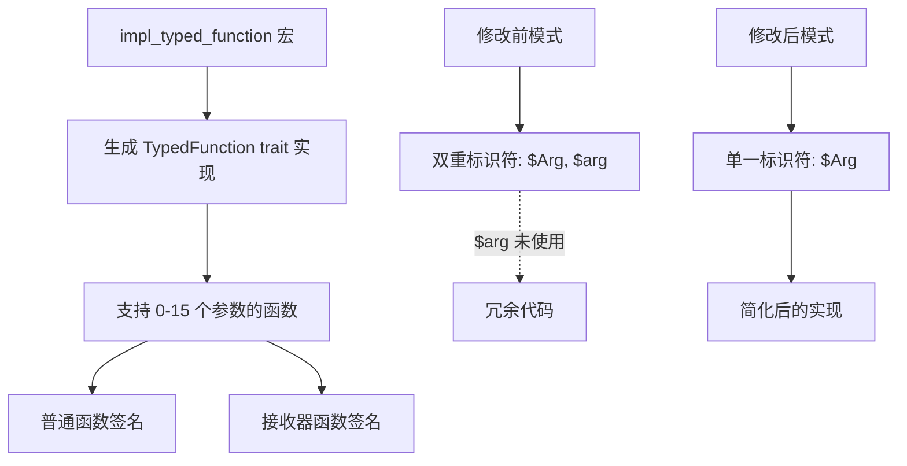

+++
title = "#21241 Remove redundant `$arg: ident` of the `impl_typed_function` macro"
date = "2025-09-28T00:00:00"
draft = false
template = "pull_request_page.html"
in_search_index = false

[extra]
current_language = "zh-cn"
available_languages = {"en" = { name = "English", url = "/pull_request/bevy/2025-09/pr-21241-en-20250928" }, "zh-cn" = { name = "中文", url = "/pull_request/bevy/2025-09/pr-21241-zh-cn-20250928" }}
labels = ["D-Trivial", "C-Code-Quality", "A-Reflection"]
+++

# Title

## Basic Information
- **Title**: Remove redundant `$arg: ident` of the `impl_typed_function` macro
- **PR Link**: https://github.com/bevyengine/bevy/pull/21241
- **Author**: Mysvac
- **Status**: MERGED
- **Labels**: D-Trivial, C-Code-Quality, S-Ready-For-Final-Review, A-Reflection
- **Created**: 2025-09-27T11:49:11Z
- **Merged**: 2025-09-28T18:02:18Z
- **Merged By**: alice-i-cecile

## Description Translation
# 目标

bevy_reflect: 函数反射

宏 `impl_typed_function` 中的 `$arg: ident` 是冗余的。它在内部完全没有被使用。因此我移除了它。

## 测试

- `cargo run --features="reflect_functions" --example function_reflection`
- `cargo test -p bevy_reflect --features="functions"`

---

## 展示

```rust
macro_rules! impl_typed_function {
    // ($(($Arg:ident, $arg:ident)),*) => {
    ($($Arg:ident),*) => {
        // ......
    }
}

// all_tuples!(impl_typed_function, 0, 15, Arg, arg);
all_tuples!(impl_typed_function, 0, 15, Arg);
```

## The Story of This Pull Request

这个PR源于对Bevy引擎反射系统中一个宏实现的代码质量改进。在分析`bevy_reflect`模块的`impl_typed_function`宏时，开发者发现了一个冗余的模式匹配参数。

**问题识别**

`impl_typed_function`宏用于为Rust函数自动实现`TypedFunction` trait，支持从0到15个参数的函数签名。原始的宏定义使用了双重标识符模式：

```rust
// 修改前
$(($Arg:ident, $arg:ident)),*
```

这里`$Arg`表示参数类型标识符，`$arg`表示参数变量标识符。然而，在仔细审查宏实现后，开发者发现`$arg`标识符在整个宏展开过程中从未被实际使用。宏体内部只使用了`$Arg`类型标识符来生成泛型参数和函数签名。

**解决方案实现**

解决方案是直接的代码清理：移除未使用的`$arg`标识符。修改后的宏模式变为：

```rust
// 修改后  
$($Arg:ident),*
```

相应的，调用这个宏的`all_tuples!`宏也需要调整，从传递两个参数标识符减少为只传递一个：

```rust
// 修改前
all_tuples!(impl_typed_function, 0, 15, Arg, arg);

// 修改后
all_tuples!(impl_typed_function, 0, 15, Arg);
```

**技术细节分析**

这个修改影响的宏用于生成函数反射相关的trait实现。宏生成的代码包括四种主要的函数签名模式：

1. 普通函数：`FnMut(Arg0, Arg1, ..., ArgN) -> R`
2. 不可变接收器：`FnMut(&Receiver, Arg0, Arg1, ..., ArgN) -> &R`  
3. 可变接收器返回可变引用：`FnMut(&mut Receiver, Arg0, Arg1, ..., ArgN) -> &mut R`
4. 可变接收器返回不可变引用：`FnMut(&mut Receiver, Arg0, Arg1, ..., ArgN) -> &R`

在所有这些情况下，宏只需要参数的类型信息（`$Arg`）来构造泛型约束和函数签名，而不需要参数变量名（`$arg`）。

**验证与影响**

为确保修改的正确性，开发者执行了相关的测试命令：
- `cargo run --features="reflect_functions" --example function_reflection`
- `cargo test -p bevy_reflect --features="functions"`

这些测试验证了函数反射功能在修改后仍然正常工作。由于只是移除了未使用的代码，这个修改不会影响任何运行时行为或功能，纯粹是代码质量的改进。

这个修改体现了良好的代码维护实践：定期清理未使用的代码可以简化代码库，提高可读性，并减少潜在的混淆。

## Visual Representation



## Key Files Changed

### `crates/bevy_reflect/src/func/info.rs`

这个文件包含了函数反射相关的类型信息和trait实现。

**关键修改：**

```rust
// 修改前：
macro_rules! impl_typed_function {
    ($(($Arg:ident, $arg:ident)),*) => {
        // 宏实现体
    };
}

all_tuples!(impl_typed_function, 0, 15, Arg, arg);

// 修改后：
macro_rules! impl_typed_function {
    ($($Arg:ident),*) => {
        // 宏实现体（内容不变）
    };
}

all_tuples!(impl_typed_function, 0, 15, Arg);
```

**注释更新：**
同时更新了文档注释，将参数描述从`argX`统一改为`ArgX`以保持一致性：

```rust
// 修改前注释：
// where `argX` may be any of `T`, `&T`, or `&mut T`

// 修改后注释：  
// where `ArgX` may be any of `T`, `&T`, or `&mut T`
```

这个修改简化了宏定义，移除了未使用的模式变量，使代码更加清晰和简洁。

## Further Reading

- [Rust宏编程指南](https://doc.rust-lang.org/book/ch19-06-macros.html)
- [Bevy反射系统文档](https://bevyengine.org/learn/quick-start/reflection/)
- [Rust代码质量最佳实践](https://rust-lang.github.io/api-guidelines/)

# Full Code Diff
diff --git a/crates/bevy_reflect/src/func/info.rs b/crates/bevy_reflect/src/func/info.rs
index f3675ca185f7a..ff1d7f0ed4b17 100644
--- a/crates/bevy_reflect/src/func/info.rs
+++ b/crates/bevy_reflect/src/func/info.rs
@@ -600,13 +600,13 @@ pub trait TypedFunction<Marker> {
 
 /// Helper macro for implementing [`TypedFunction`] on Rust functions.
 ///
-/// This currently implements it for the following signatures (where `argX` may be any of `T`, `&T`, or `&mut T`):
-/// - `FnMut(arg0, arg1, ..., argN) -> R`
-/// - `FnMut(&Receiver, arg0, arg1, ..., argN) -> &R`
-/// - `FnMut(&mut Receiver, arg0, arg1, ..., argN) -> &mut R`
-/// - `FnMut(&mut Receiver, arg0, arg1, ..., argN) -> &R`
+/// This currently implements it for the following signatures (where `ArgX` may be any of `T`, `&T`, or `&mut T`):
+/// - `FnMut(Arg0, Arg1, ..., ArgN) -> R`
+/// - `FnMut(&Receiver, Arg0, Arg1, ..., ArgN) -> &R`
+/// - `FnMut(&mut Receiver, Arg0, Arg1, ..., ArgN) -> &mut R`
+/// - `FnMut(&mut Receiver, Arg0, Arg1, ..., ArgN) -> &R`
 macro_rules! impl_typed_function {
-    ($(($Arg:ident, $arg:ident)),*) => {
+    ($($Arg:ident),*) => {
         // === (...) -> ReturnType === //
         impl<$($Arg,)* ReturnType, Function> TypedFunction<fn($($Arg),*) -> [ReturnType]> for Function
         where
@@ -711,7 +711,7 @@ macro_rules! impl_typed_function {
     };
 }
 
-all_tuples!(impl_typed_function, 0, 15, Arg, arg);
+all_tuples!(impl_typed_function, 0, 15, Arg);
 
 /// Helper function for creating [`FunctionInfo`] with the proper name value.
 ///