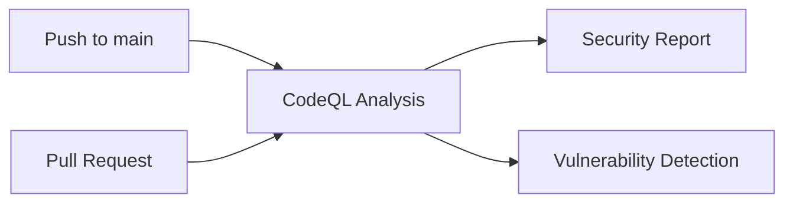

+++
title = "#21245 run codeql on PRs to automatically detect security vulnerabilities"
date = "2025-09-28T00:00:00"
draft = false
template = "pull_request_page.html"
in_search_index = true

[taxonomies]
list_display = ["show"]

[extra]
current_language = "en"
available_languages = {"en" = { name = "English", url = "/pull_request/bevy/2025-09/pr-21245-en-20250928" }, "zh-cn" = { name = "中文", url = "/pull_request/bevy/2025-09/pr-21245-zh-cn-20250928" }}
labels = ["C-Feature", "A-Build-System"]
+++

# Title
run codeql on PRs to automatically detect security vulnerabilities

## Basic Information
- **Title**: run codeql on PRs to automatically detect security vulnerabilities
- **PR Link**: https://github.com/bevyengine/bevy/pull/21245
- **Author**: mockersf
- **Status**: MERGED
- **Labels**: C-Feature, A-Build-System, S-Ready-For-Final-Review
- **Created**: 2025-09-27T16:29:39Z
- **Merged**: 2025-09-28T18:01:08Z
- **Merged By**: alice-i-cecile

## Description Translation
# Objective

- CodeQL for Rust is now stable and fast
- Run it on PRs

> Discover vulnerabilities across a codebase with CodeQL, our industry-leading semantic code analysis engine. CodeQL lets you query code as though it were data. Write a query to find all variants of a vulnerability, eradicating it forever. Then share your query to help others do the same.

## The Story of This Pull Request

This PR addresses a gap in the Bevy engine's continuous integration pipeline by enabling CodeQL security scanning on pull requests. Previously, the CodeQL workflow was configured to run only on pushes to the main branch, which meant potential security vulnerabilities could be introduced via PRs without being caught by automated security scanning.

The core issue was timing - CodeQL for Rust had previously been in a beta state where it was slower and less reliable. With the tool now reaching stable status and improved performance, the team could confidently enable it for PR workflows without significantly impacting development velocity.

The solution involved modifying the GitHub Actions workflow trigger configuration to include pull requests targeting the main branch. This change ensures that every PR undergoes the same security scanning that occurs on main branch commits, providing early detection of potential vulnerabilities before they're merged.

From an engineering perspective, this change represents a shift-left security approach - moving security checks earlier in the development lifecycle rather than relying solely on post-merge scanning. This aligns with modern DevOps practices where security is integrated into the development workflow rather than being a separate, later-stage activity.

The implementation required minimal changes because the underlying CodeQL analysis configuration remained the same. The workflow already contained the necessary steps for Rust code analysis; it just needed to be triggered at the appropriate time in the development process. This demonstrates good CI/CD design where the same security checks are applied consistently across different trigger events.

The removal of the scheduled cron job suggests the team determined that PR-based scanning provides sufficient coverage without needing periodic full-codebase scans. This decision likely balances security coverage with resource efficiency, as PR-triggered scans are more targeted and timely than scheduled scans.

## Visual Representation



## Key Files Changed

### `.github/workflows/codeql.yml` (+2/-5)

This file configures GitHub's CodeQL security scanning workflow. The changes enable the workflow to run on pull requests targeting the main branch, providing earlier security vulnerability detection.

```yaml
# File: .github/workflows/codeql.yml
# Before:
on:
  push:
    branches: ["main"]
# Commented for now to test
#  pull_request:
#    branches: [ "main" ]
#  schedule:
#    - cron: '22 14 * * 4'

# After:
on:
  push:
    branches: ["main"]
  pull_request:
    branches: ["main"]
```

The key changes:
1. **Enabled PR triggers**: Uncommented the `pull_request` section to activate security scanning on all PRs targeting main
2. **Removed scheduled runs**: Eliminated the weekly cron job, likely because PR-based scanning provides more timely coverage
3. **Simplified configuration**: Removed commented-out code that was no longer needed

These changes ensure that security scanning occurs during code review rather than after merge, allowing developers to address vulnerabilities before they enter the codebase.

## Further Reading

- [GitHub CodeQL Documentation](https://docs.github.com/en/code-security/codeql-cli/getting-started-with-the-codeql-cli/about-codeql-cli)
- [CodeQL for Rust](https://docs.github.com/en/code-security/code-scanning/automatically-scanning-your-code-for-vulnerabilities-and-errors/configuring-code-scanning-for-a-repository#configuring-code-scanning-for-a-repository)
- [GitHub Actions Workflow Syntax](https://docs.github.com/en/actions/using-workflows/workflow-syntax-for-github-actions)
- [Shift-Left Security Principles](https://www.synopsys.com/glossary/what-is-shift-left-testing.html)

# Full Code Diff
```
diff --git a/.github/workflows/codeql.yml b/.github/workflows/codeql.yml
index f82dedc81d4f0..167d35565d426 100644
--- a/.github/workflows/codeql.yml
+++ b/.github/workflows/codeql.yml
@@ -3,11 +3,8 @@ name: "CodeQL"
 on:
   push:
     branches: ["main"]
-# Commented for now to test
-#  pull_request:
-#    branches: [ "main" ]
-#  schedule:
-#    - cron: '22 14 * * 4'
+  pull_request:
+    branches: ["main"]
 
 jobs:
   analyze:
```