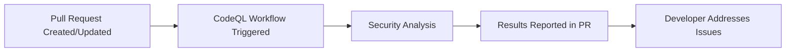

+++
title = "#21245 run codeql on PRs to automatically detect security vulnerabilities"
date = "2025-09-28T00:00:00"
draft = false
template = "pull_request_page.html"
in_search_index = false

[extra]
current_language = "zh-cn"
available_languages = {"en" = { name = "English", url = "/pull_request/bevy/2025-09/pr-21245-en-20250928" }, "zh-cn" = { name = "中文", url = "/pull_request/bevy/2025-09/pr-21245-zh-cn-20250928" }}
labels = ["C-Feature", "A-Build-System"]
+++

# Title
run codeql on PRs to automatically detect security vulnerabilities

## Basic Information
- **Title**: run codeql on PRs to automatically detect security vulnerabilities
- **PR Link**: https://github.com/bevyengine/bevy/pull/21245
- **Author**: mockersf
- **Status**: MERGED
- **Labels**: C-Feature, A-Build-System, S-Ready-For-Final-Review
- **Created**: 2025-09-27T16:29:39Z
- **Merged**: 2025-09-28T18:01:08Z
- **Merged By**: alice-i-cecile

## Description Translation
**目标**

- CodeQL for Rust 现已稳定且快速
- 在 PR 上运行它

> 使用我们行业领先的语义代码分析引擎 CodeQL 发现代码库中的漏洞。CodeQL 让您能够像查询数据一样查询代码。编写查询以查找漏洞的所有变体，永久消除它。然后分享您的查询以帮助其他人做同样的事情。

## The Story of This Pull Request

这个 PR 解决了一个直接的问题：在 Rust 生态系统中自动检测安全漏洞。随着 CodeQL for Rust 达到稳定状态并具备良好的性能，现在是将其集成到持续集成流程中的合适时机。

**问题背景**

在软件开发中，安全漏洞可能在任何代码更改中引入。传统的代码审查虽然有效，但可能会遗漏复杂的安全问题。CodeQL 提供了静态分析能力，能够系统性地检测代码中的潜在漏洞模式。

之前，Bevy 项目只在推送到主分支时运行 CodeQL 分析，这意味着：
- 安全问题只能在代码合并后被发现
- 修复成本更高，需要额外的修复提交
- 无法在代码审查阶段提供即时反馈

**解决方案**

开发者采取了最直接的解决方案：启用 CodeQL 在拉取请求上的自动运行。这个改动很小但影响很大，只需要修改 GitHub Actions 工作流的触发器配置。

技术实现上，这个 PR 修改了 `.github/workflows/codeql.yml` 文件，取消了对 `pull_request` 触发器的注释。这样，每当有新的 PR 创建或现有 PR 更新时，CodeQL 分析都会自动运行。

**技术细节**

关键的修改是将工作流的触发条件从仅限推送扩展到包括拉取请求。原来的配置只监控对主分支的推送事件，现在增加了对目标为主分支的拉取请求的监控。

这个配置更改利用了 GitHub Actions 的内置功能，不需要额外的脚本或工具。CodeQL 工作流会自动：
1. 设置分析环境
2. 初始化 CodeQL
3. 构建代码库
4. 执行安全分析
5. 在 PR 中报告发现的问题

**影响与优势**

这个改动带来了几个重要的好处：
1. **早期检测**：安全问题在代码合并前就能被发现
2. **开发效率**：开发者可以在代码审查阶段获得即时反馈
3. **质量提升**：自动化的安全扫描补充了人工代码审查
4. **零成本集成**：利用现有的 CodeQL 基础设施，无需额外配置

由于 CodeQL for Rust 现在已经稳定且性能良好，这个改动不会显著影响 CI 流水线的执行时间，为项目提供了可靠的安全保障。

## Visual Representation



## Key Files Changed

### `.github/workflows/codeql.yml` (+2/-5)

这个文件是 GitHub Actions 的工作流配置，定义了 CodeQL 安全分析的执行条件和步骤。

**主要修改：**
- 取消了对 `pull_request` 触发器的注释
- 现在工作流会在 PR 创建和更新时自动运行

```yaml
# File: .github/workflows/codeql.yml
# Before:
on:
  push:
    branches: ["main"]
# Commented for now to test
#  pull_request:
#    branches: [ "main" ]
#  schedule:
#    - cron: '22 14 * * 4'

# After:
on:
  push:
    branches: ["main"]
  pull_request:
    branches: ["main"]
```

**修改说明：**
- 移除了测试注释，启用了对拉取请求的监控
- 保持了原有的推送触发器和计划任务配置
- 现在 CodeQL 分析会在 PR 目标为主分支时自动执行

这个改动使得安全分析从仅限事后检查变为主动预防，在代码合并前就能发现潜在的安全问题。

## Further Reading

- [GitHub CodeQL Documentation](https://docs.github.com/en/code-security/codeql-cli/getting-started-with-the-codeql-cli/about-codeql)
- [CodeQL for Rust](https://docs.github.com/en/code-security/code-scanning/automatically-scanning-your-code-for-vulnerabilities-and-errors/configuring-code-scanning-for-a-repository#about-codeql-for-compiled-languages)
- [GitHub Actions Workflow Syntax](https://docs.github.com/en/actions/using-workflows/workflow-syntax-for-github-actions)
- [Rust Security Best Practices](https://cheats.rs/#safety-security)

# Full Code Diff
```
diff --git a/.github/workflows/codeql.yml b/.github/workflows/codeql.yml
index f82dedc81d4f0..167d35565d426 100644
--- a/.github/workflows/codeql.yml
+++ b/.github/workflows/codeql.yml
@@ -3,11 +3,8 @@ name: "CodeQL"
 on:
   push:
     branches: ["main"]
-# Commented for now to test
-#  pull_request:
-#    branches: [ "main" ]
-#  schedule:
-#    - cron: '22 14 * * 4'
+  pull_request:
+    branches: ["main"]
 
 jobs:
   analyze:
```