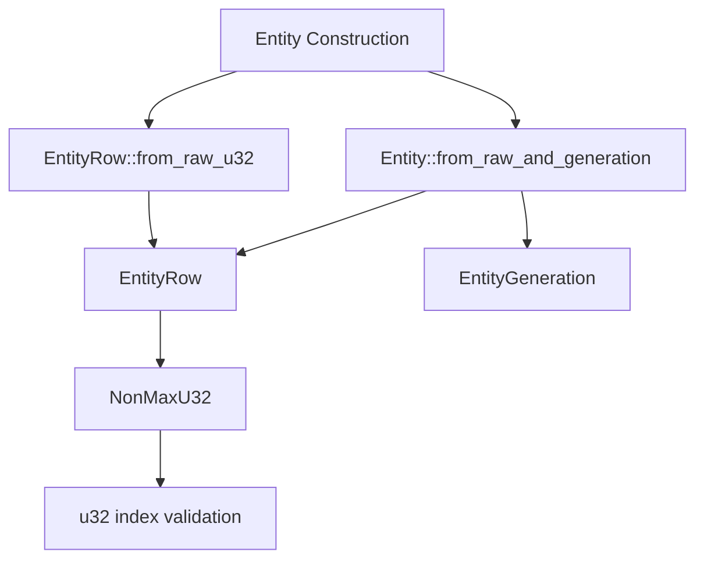

+++
title = "#21246 Make Entity construction more ergonomic"
date = "2025-09-28T00:00:00"
draft = false
template = "pull_request_page.html"
in_search_index = true

[taxonomies]
list_display = ["show"]

[extra]
current_language = "en"
available_languages = {"en" = { name = "English", url = "/pull_request/bevy/2025-09/pr-21246-en-20250928" }, "zh-cn" = { name = "中文", url = "/pull_request/bevy/2025-09/pr-21246-zh-cn-20250928" }}
labels = ["A-ECS", "C-Code-Quality", "D-Straightforward"]
+++

# Title

## Basic Information
- **Title**: Make Entity construction more ergonomic
- **PR Link**: https://github.com/bevyengine/bevy/pull/21246
- **Author**: Shatur
- **Status**: MERGED
- **Labels**: A-ECS, C-Code-Quality, S-Ready-For-Final-Review, D-Straightforward
- **Created**: 2025-09-27T19:01:46Z
- **Merged**: 2025-09-28T20:20:45Z
- **Merged By**: alice-i-cecile

## Description Translation

# Objective

Entity serialization is necessary for networking. Entities can exist inside components and events. After deserialization, we simply map remote entities to local entities.

To serialize entities efficiently, we split them into index and generation, which benefits from varint serialization. #19121 and #18704 changed the entity layout, and I like the new layout a lot. We can now use the extra bit from the index to store whether the generation is zero or not, avoiding the need to serialize the generation entirely.

However, constructing new entities requires relying on the internal layout, which is not very ergonomic. For example, here is how an entity with index = 1 and generation = 1 can be created:

```rust
let expected_entity = Entity::from_bits((1 ^ u32::MAX) as u64 | (1 << 32));
```

## Solution

- Make `Entity::from_raw_and_generation` public. While at it, I also removed outdated comment.
- Add `EntityRow::from_raw_u32` to make the initialization nicer.

## Testing

- It's a trivial change, but I re-used `EntityRow::from_raw_u32` in unit tests to simplify them.

## Notes

I'd probably rename `Entity::from_raw_and_generation` into `Entity::from_row_and_generation` or `Entity::from_index_and_generation`.

## The Story of This Pull Request

This PR addresses a practical ergonomics issue in Bevy's Entity Component System (ECS) that emerged after recent entity layout optimizations. The core problem was that while the new entity layout provided significant serialization benefits, it made manual entity construction unnecessarily complex and error-prone.

The issue became apparent when developers needed to construct entities with specific index and generation values for testing, networking, or other advanced use cases. Previously, constructing an entity with index=1 and generation=1 required understanding the internal bit layout and writing complex bitwise operations:

```rust
let expected_entity = Entity::from_bits((1 ^ u32::MAX) as u64 | (1 << 32));
```

This approach was problematic because it exposed internal implementation details, was difficult to read and maintain, and could easily lead to bugs if the entity layout changed in the future.

The solution took a two-pronged approach. First, the PR made the existing `Entity::from_raw_and_generation` method public, allowing developers to construct entities directly from an `EntityRow` and `EntityGeneration` without dealing with bit manipulation. Second, it introduced `EntityRow::from_raw_u32` as a more ergonomic way to create `EntityRow` instances from raw u32 values.

The implementation was straightforward but impactful. By changing the visibility of `Entity::from_raw_and_generation` from `pub(crate)` to `pub`, the method became available to all Bevy users. The method signature remained clean and self-documenting:

```rust
pub const fn from_raw_and_generation(row: EntityRow, generation: EntityGeneration) -> Entity
```

The new `EntityRow::from_raw_u32` method provided a convenient way to create `EntityRow` instances while handling the edge case of `u32::MAX` (which is reserved and cannot be used as a valid entity index):

```rust
pub const fn from_raw_u32(index: u32) -> Option<Self> {
    match NonMaxU32::new(index) {
        Some(index) => Some(Self(index)),
        None => None,
    }
}
```

A key insight in this implementation was recognizing that many test cases and usage patterns could benefit from this ergonomic improvement. The PR systematically updated numerous test cases throughout the codebase to use the new `EntityRow::from_raw_u32` method, demonstrating its practical utility and improving test readability.

The changes maintained full backward compatibility while significantly improving the developer experience. The author also noted potential future improvements, suggesting that `Entity::from_raw_and_generation` could be renamed to `Entity::from_row_and_generation` or `Entity::from_index_and_generation` for even clearer semantics.

## Visual Representation



## Key Files Changed

### `crates/bevy_ecs/src/entity/mod.rs` (+52/-53)

This file contains the core entity functionality and received the main changes:

1. **Added `EntityRow::from_raw_u32` method** - Provides ergonomic entity row creation from raw u32 values:

```rust
/// Equivalent to [`new`](Self::new) except that it takes a `u32` instead of a `NonMaxU32`.
///
/// Returns `None` if the index is `u32::MAX`.
pub const fn from_raw_u32(index: u32) -> Option<Self> {
    match NonMaxU32::new(index) {
        Some(index) => Some(Self(index)),
        None => None,
    }
}
```

2. **Made `Entity::from_raw_and_generation` public** - Changed from internal to public API:

```rust
// Before:
pub(crate) const fn from_raw_and_generation(
    row: EntityRow,
    generation: EntityGeneration,
) -> Entity

// After:
pub const fn from_raw_and_generation(row: EntityRow, generation: EntityGeneration) -> Entity
```

3. **Updated tests** - Refactored numerous test cases to use the new ergonomic methods:

```rust
// Before:
let r = EntityRow::new(NonMaxU32::new(0xDEADBEEF).unwrap());

// After:
let r = EntityRow::from_raw_u32(0xDEADBEEF).unwrap();
```

### `crates/bevy_ecs/src/storage/sparse_set.rs` (+5/-6)

Updated test cases to use the new ergonomic entity construction:

```rust
// Before:
let e0 = Entity::from_raw(EntityRow::new(NonMaxU32::new(0).unwrap()));

// After:
let e0 = Entity::from_raw(EntityRow::from_raw_u32(0).unwrap());
```

### `crates/bevy_ecs/src/storage/table/mod.rs` (+1/-2)

Similarly updated test entity construction:

```rust
// Before:
.map(|index| Entity::from_raw(EntityRow::new(NonMaxU32::new(index).unwrap())))

// After:
.map(|index| Entity::from_raw(EntityRow::from_raw_u32(index).unwrap()))
```

## Further Reading

- [Bevy ECS Documentation](https://bevyengine.org/learn/book/ecs/) - Comprehensive guide to Bevy's Entity Component System
- [PR #19121](https://github.com/bevyengine/bevy/pull/19121) - Previous entity layout optimization that motivated these ergonomic improvements
- [Rust API Guidelines](https://rust-lang.github.io/api-guidelines/) - Best practices for designing ergonomic Rust APIs
- [NonMaxU32 Documentation](https://docs.rs/nonmax/latest/nonmax/struct.NonMaxU32.html) - The type used for efficient entity index storage