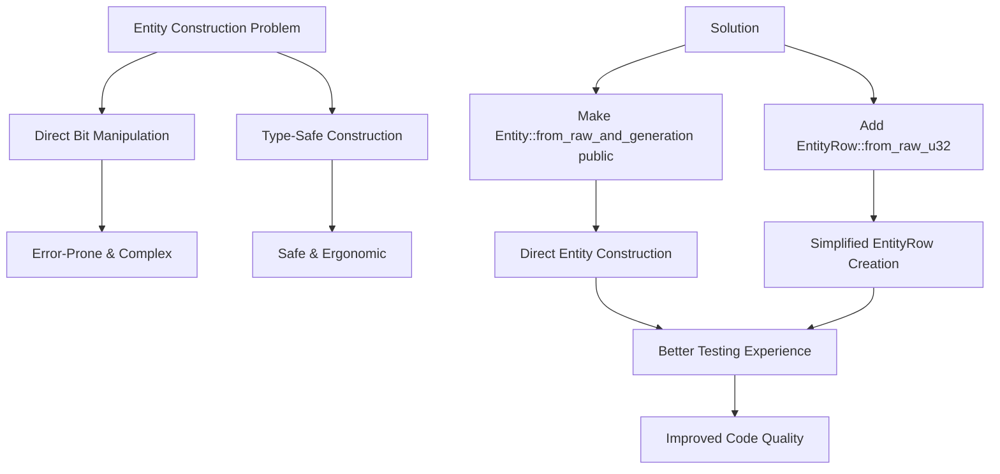

+++
title = "#21246 Make Entity construction more ergonomic"
date = "2025-09-28T00:00:00"
draft = false
template = "pull_request_page.html"
in_search_index = false

[extra]
current_language = "zh-cn"
available_languages = {"en" = { name = "English", url = "/pull_request/bevy/2025-09/pr-21246-en-20250928" }, "zh-cn" = { name = "中文", url = "/pull_request/bevy/2025-09/pr-21246-zh-cn-20250928" }}
labels = ["A-ECS", "C-Code-Quality", "D-Straightforward"]
+++

# Make Entity construction more ergonomic

## Basic Information
- **Title**: Make Entity construction more ergonomic
- **PR Link**: https://github.com/bevyengine/bevy/pull/21246
- **Author**: Shatur
- **Status**: MERGED
- **Labels**: A-ECS, C-Code-Quality, S-Ready-For-Final-Review, D-Straightforward
- **Created**: 2025-09-27T19:01:46Z
- **Merged**: 2025-09-28T20:20:45Z
- **Merged By**: alice-i-cecile

## Description Translation
# Objective

Entity 序列化对于网络传输是必要的。实体可以存在于组件和事件中。在反序列化之后，我们只需将远程实体映射到本地实体。

为了高效地序列化实体，我们将其拆分为索引(index)和代(generation)，这得益于 varint 序列化。#19121 和 #18704 改变了实体布局，我很喜欢这个新布局。我们现在可以使用索引中的额外位来存储代是否为0，从而避免完全序列化代。

然而，构建新实体需要依赖内部布局，这不够 ergonomic。例如，以下是如何创建一个索引=1且代=1的实体：

```rust
let expected_entity = Entity::from_bits((1 ^ u32::MAX) as u64 | (1 << 32));
```

## Solution

- 将 `Entity::from_raw_and_generation` 设为公开。同时，我还移除了过时的注释。
- 添加 `EntityRow::from_raw_u32` 使初始化更简洁。

## Testing

- 这是一个简单的更改，但我在单元测试中重新使用了 `EntityRow::from_raw_u32` 来简化它们。

## Notes

我可能会将 `Entity::from_raw_and_generation` 重命名为 `Entity::from_row_and_generation` 或 `Entity::from_index_and_generation`。

## The Story of This Pull Request

这个PR的核心问题是Entity构造API不够友好。在Bevy ECS中，Entity是实体组件系统架构的基础构建块，每个Entity由索引(index)和代(generation)组成。代的作用是防止重用已删除实体的索引时出现悬空引用。

问题出现在需要手动构造Entity实例的场景中，比如测试代码、序列化/反序列化逻辑，或者需要创建特定Entity的场景。在PR描述中，作者展示了一个令人困惑的例子：

```rust
let expected_entity = Entity::from_bits((1 ^ u32::MAX) as u64 | (1 << 32));
```

这种构造方式需要开发者理解Entity的内部位布局，包括索引和代在64位中的具体排布方式。这不仅是反直觉的，而且容易出错，特别是考虑到Entity布局在之前的PR (#19121 和 #18704) 中已经发生了变化。

开发者面临的挑战是：他们需要一个简单、直观的方式来构造Entity，而不需要深入了解内部的位操作。现有的API设计迫使开发者绕过类型系统直接操作位，这违背了Rust类型安全的设计哲学。

解决方案采用了两个互补的方法：

首先，将`Entity::from_raw_and_generation`从`pub(crate)`改为`pub`，使其对外公开。这个函数接受类型安全的参数：`EntityRow`和`EntityGeneration`，而不是原始的位操作。同时，作者移除了过时的注释，因为新的Entity布局已经稳定。

其次，添加了`EntityRow::from_raw_u32`构造函数，这解决了创建`EntityRow`时的繁琐问题。原来的`EntityRow::new`方法需要`NonMaxU32`类型，而创建`NonMaxU32`本身就需要额外的步骤：

```rust
// 之前的方式
let row = EntityRow::new(NonMaxU32::new(42).unwrap());

// 新的方式  
let row = EntityRow::from_raw_u32(42).unwrap();
```

新的`from_raw_u32`方法内部处理了`NonMaxU32`的创建和错误检查，提供了更简洁的API。

在实现细节方面，这个PR展示了良好的API设计原则。`from_raw_u32`方法返回`Option<EntityRow>`，正确处理了边界情况（当传入`u32::MAX`时返回`None`）。这保持了类型安全，同时提供了方便的构造方式。

测试代码的改进特别能说明问题。PR中大量修改了测试代码，用新的API替换了旧的繁琐构造方式。例如：

```rust
// 之前
let r = EntityRow::new(NonMaxU32::new(0xDEADBEEF).unwrap());

// 之后
let r = EntityRow::from_raw_u32(0xDEADBEEF).unwrap();
```

这种改变不仅使测试代码更简洁，也使其意图更清晰。测试现在更关注于测试的逻辑，而不是Entity构造的细节。

从工程角度看，这个PR体现了渐进式改进的理念。它没有重新设计整个Entity系统，而是在现有架构基础上提供更好的开发者体验。作者在notes部分提到可能的重命名建议，这表明他对API设计的持续关注，但将更大的改动留给未来的PR。

这个改变的影响是直接的：它简化了Entity构造，减少了潜在的错误，使代码更易于理解和维护。特别是在测试和序列化相关代码中，这种改进尤为明显。

## Visual Representation



## Key Files Changed

### `crates/bevy_ecs/src/entity/mod.rs` (+52/-53)

这个文件包含了Entity和EntityRow的核心定义，是改动最多的文件。

**主要改动：**

1. **新增`EntityRow::from_raw_u32`方法**：
```rust
/// Equivalent to [`new`](Self::new) except that it takes a `u32` instead of a `NonMaxU32`.
///
/// Returns `None` if the index is `u32::MAX`.
pub const fn from_raw_u32(index: u32) -> Option<Self> {
    match NonMaxU32::new(index) {
        Some(index) => Some(Self(index)),
        None => None,
    }
}
```

2. **公开`Entity::from_raw_and_generation`方法**：
```rust
// 之前：
pub(crate) const fn from_raw_and_generation(
    row: EntityRow,
    generation: EntityGeneration,
) -> Entity {

// 之后：
pub const fn from_raw_and_generation(row: EntityRow, generation: EntityGeneration) -> Entity {
```

3. **测试代码简化**：大量测试用例从使用`EntityRow::new(NonMaxU32::new(...).unwrap())`改为使用`EntityRow::from_raw_u32(...).unwrap()`。

### `crates/bevy_ecs/src/storage/sparse_set.rs` (+5/-6)

这个文件中的测试代码也被更新以使用新的API。

**改动示例：**
```rust
// 之前：
let e0 = Entity::from_raw(EntityRow::new(NonMaxU32::new(0).unwrap()));

// 之后：
let e0 = Entity::from_raw(EntityRow::from_raw_u32(0).unwrap());
```

### `crates/bevy_ecs/src/storage/table/mod.rs` (+1/-2)

同样更新了测试代码中的Entity构造方式。

**改动示例：**
```rust
// 之前：
.map(|index| Entity::from_raw(EntityRow::new(NonMaxU32::new(index).unwrap())))

// 之后：
.map(|index| Entity::from_raw(EntityRow::from_raw_u32(index).unwrap()))
```

## Further Reading

- [Bevy ECS Documentation](https://bevyengine.org/learn/book/ecs/) - Bevy实体组件系统的官方文档
- [PR #19121](https://github.com/bevyengine/bevy/pull/19121) - Entity布局改进的相关PR
- [PR #18704](https://github.com/bevyengine/bevy/pull/18704) - 另一个Entity布局相关的PR
- [Rust API Guidelines](https://rust-lang.github.io/api-guidelines/) - Rust API设计的最佳实践