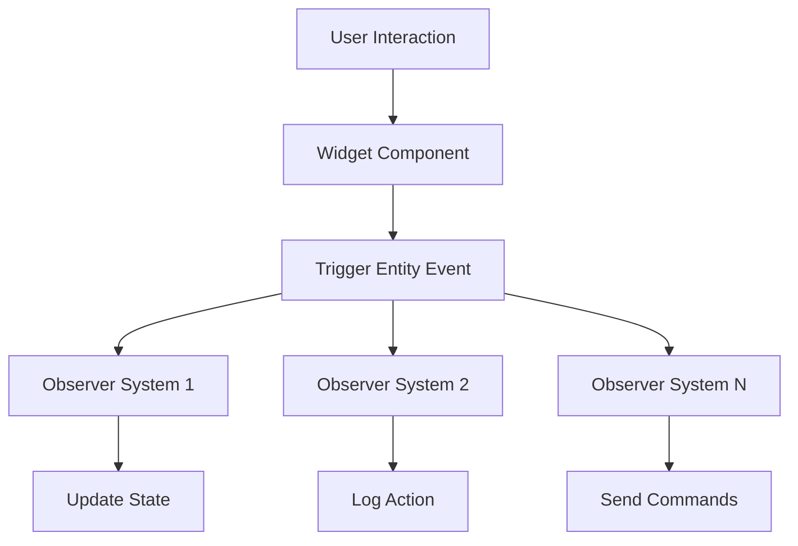

+++
title = "#21247 Delete `Callback` and use observers to control widgets for 0.17"
date = "2025-09-30T00:00:00"
draft = false
template = "pull_request_page.html"
in_search_index = true

[taxonomies]
list_display = ["show"]

[extra]
current_language = "en"
available_languages = {"en" = { name = "English", url = "/pull_request/bevy/2025-09/pr-21247-en-20250930" }, "zh-cn" = { name = "中文", url = "/pull_request/bevy/2025-09/pr-21247-zh-cn-20250930" }}
labels = ["C-Feature", "A-UI", "X-Blessed", "S-Needs-SME"]
+++

# Title
Delete `Callback` and use observers to control widgets for 0.17

## Basic Information
- **Title**: Delete `Callback` and use observers to control widgets for 0.17
- **PR Link**: https://github.com/bevyengine/bevy/pull/21247
- **Author**: viridia
- **Status**: MERGED
- **Labels**: C-Feature, A-UI, X-Blessed, S-Needs-SME
- **Created**: 2025-09-28T00:20:58Z
- **Merged**: 2025-09-30T02:57:05Z
- **Merged By**: cart

## Description Translation
Removed the `Callback` type.
Updated all widgets and examples.
Added an `observe` helper which adds an observer via a bundle effect.

Note: I would have updated the release notes, but they are gone already.

## The Story of This Pull Request

This PR represents a fundamental architectural shift in how Bevy handles UI widget interactions, moving from a callback-based system to an observer-based event system. The change affects the entire UI widget ecosystem and reflects Bevy's evolution toward more idiomatic ECS patterns.

### The Problem and Context

The previous system used a `Callback` type that allowed widgets to invoke one-shot systems when user interactions occurred. While functional, this approach had several limitations:

1. **Tight coupling**: Widgets needed to store system IDs and manage callback execution
2. **Limited flexibility**: Each widget could only have one callback per event type
3. **Complex state management**: Callbacks often needed to work around the ECS rather than with it
4. **Inconsistent patterns**: The callback system felt like an architectural outlier compared to Bevy's event-driven design

The `Callback` system was becoming increasingly difficult to maintain and extend, particularly as Bevy's observer system matured and offered a more natural way to handle entity interactions.

### The Solution Approach

The developer chose to completely remove the `Callback` system and replace it with observers that trigger entity events. This approach leverages Bevy's existing observer infrastructure and provides several key benefits:

1. **True event-driven architecture**: Widgets now emit standard Bevy events that can be observed by any system
2. **Multiple observers**: Multiple systems can react to the same widget event
3. **Better ECS integration**: Events flow naturally through Bevy's observer system
4. **Simplified widget components**: Widgets no longer need to store callback configuration

The implementation strategy was comprehensive - remove the callback system entirely and update every widget and example to use the new observer pattern.

### The Implementation

The core change was removing the `Callback` enum and `Notify` trait from `bevy_ui_widgets`. Here's how the widget architecture transformed:

**Before: Callback-based widgets**
```rust
pub struct Button {
    pub on_activate: Callback<In<Activate>>,
}

pub struct Checkbox {
    pub on_change: Callback<In<ValueChange<bool>>>,
}

pub struct Slider {
    pub on_change: Callback<In<ValueChange<f32>>>,
    pub track_click: TrackClick,
}
```

**After: Event-emitting widgets**
```rust
pub struct Button;

pub struct Checkbox;

pub struct Slider {
    pub track_click: TrackClick,
}
```

Widgets now trigger events directly through commands:

```rust
// Instead of calling callbacks:
// commands.notify_with(&bstate.on_activate, Activate(event.focused_entity));

// They now trigger events:
commands.trigger(Activate {
    entity: event.focused_entity,
});
```

The PR introduced a key utility function `observe` that simplifies attaching observers to entities:

```rust
pub fn observe<E: EntityEvent, B: Bundle, M, I: IntoObserverSystem<E, B, M>>(
    observer: I,
) -> AddObserver<E, B, M, I> {
    AddObserver {
        observer,
        marker: PhantomData,
    }
}
```

This allows developers to attach observers directly as bundle components:

```rust
commands.spawn((
    button(ButtonProps::default(), (), Spawn(Text::new("Click me"))),
    observe(|activate: On<Activate>| {
        info!("Button clicked!");
    }),
));
```

### Technical Insights

The migration revealed several important patterns:

1. **Self-updating observers**: Common patterns like checkbox state toggling and slider value updates were extracted into reusable observer functions:

```rust
pub fn checkbox_self_update(value_change: On<ValueChange<bool>>, mut commands: Commands) {
    if value_change.value {
        commands.entity(value_change.source).insert(Checked);
    } else {
        commands.entity(value_change.source).remove::<Checked>();
    }
}

pub fn slider_self_update(value_change: On<ValueChange<f32>>, mut commands: Commands) {
    commands
        .entity(value_change.source)
        .insert(SliderValue(value_change.value));
}
```

2. **Virtual keyboard redesign**: The virtual keyboard example was completely reworked to use the new observer pattern with a custom event:

```rust
#[derive(EntityEvent)]
pub struct VirtualKeyPressed<T> {
    pub entity: Entity,
    pub key: T,
}

// Usage with observe:
observe(
    move |activate: On<Activate>,
          mut commands: Commands,
          query: Query<&ChildOf>|
          -> Result {
        let virtual_keyboard =
            query.get(query.get(activate.entity)?.parent())?.parent();
        commands.trigger(VirtualKeyPressed {
            entity: virtual_keyboard,
            key: key.clone(),
        });
        Ok(())
    },
)
```

3. **Radio group simplification**: Radio groups now emit `ValueChange<Entity>` events containing the selected entity, making exclusion logic much cleaner:

```rust
observe(
    |value_change: On<ValueChange<Entity>>,
     q_radio: Query<Entity, With<RadioButton>>,
     mut commands: Commands| {
        for radio in q_radio.iter() {
            if radio == value_change.value {
                commands.entity(radio).insert(Checked);
            } else {
                commands.entity(radio).remove::<Checked>();
            }
        }
    }
)
```

### The Impact

This architectural change has several significant benefits:

1. **Performance**: Observer systems are more efficient than one-shot system execution
2. **Maintainability**: Widget code is simpler and more consistent
3. **Extensibility**: Multiple systems can react to widget events without modification
4. **Debugging**: Event flows are easier to trace through Bevy's existing observer tools
5. **Learning curve**: New developers encounter consistent ECS patterns throughout the codebase

The migration affected 18 files across the codebase, demonstrating the pervasiveness of the callback system and the comprehensive nature of this update.

## Visual Representation



## Key Files Changed

### `crates/bevy_ui_widgets/src/callback.rs` (+0/-115)
**Complete removal of callback system**
This file contained the entire callback infrastructure that was replaced by observers.

```rust
// Before: Entire callback system
pub enum Callback<I: SystemInput = ()> {
    System(SystemId<I>),
    Ignore,
}

pub trait Notify {
    fn notify(&mut self, callback: &Callback<()>);
    fn notify_with<I>(&mut self, callback: &Callback<I>, input: I::Inner<'static>);
}
```

### `crates/bevy_ui_widgets/src/observe.rs` (+77/-0)
**New observer helper utility**
This new file provides the `observe` function for easily attaching observers to entities.

```rust
pub fn observe<E: EntityEvent, B: Bundle, M, I: IntoObserverSystem<E, B, M>>(
    observer: I,
) -> AddObserver<E, B, M, I> {
    AddObserver {
        observer,
        marker: PhantomData,
    }
}
```

### `crates/bevy_ui_widgets/src/button.rs` (+51/-77)
**Button widget migration**
Removed callback storage and updated to trigger events directly.

```rust
// Before:
pub struct Button {
    pub on_activate: Callback<In<Activate>>,
}

// After: 
pub struct Button;

// Event triggering:
commands.trigger(Activate {
    entity: event.focused_entity,
});
```

### `crates/bevy_ui_widgets/src/checkbox.rs` (+43/-46)
**Checkbox widget migration with self-update helper**
Added reusable observer for automatic state management.

```rust
// New helper function:
pub fn checkbox_self_update(value_change: On<ValueChange<bool>>, mut commands: Commands) {
    if value_change.value {
        commands.entity(value_change.source).insert(Checked);
    } else {
        commands.entity(value_change.source).remove::<Checked>();
    }
}
```

### `examples/ui/feathers.rs` (+239/-251)
**Comprehensive example migration**
Demonstrates the new observer pattern across all widget types.

```rust
// Before: Callback registration
button(
    ButtonProps {
        on_click: Callback::System(commands.register_system(|_: In<Activate>| {
            info!("Normal button clicked!");
        })),
        ..default()
    },
    (),
    Spawn((Text::new("Normal"), ThemedText))
)

// After: Observer attachment
(
    button(ButtonProps::default(), (), Spawn((Text::new("Normal"), ThemedText))),
    observe(|_activate: On<Activate>| {
        info!("Normal button clicked!");
    })
)
```

## Further Reading

- [Bevy Observers Documentation](https://bevyengine.org/learn/quick-start/ecs-advanced/observers/) - Official guide to Bevy's observer system
- [Entity Events in Bevy](https://bevyengine.org/learn/quick-start/ecs/events/) - Understanding entity events
- [Bevy UI Widgets](https://github.com/bevyengine/bevy/tree/main/crates/bevy_ui_widgets) - Current widget implementation
- [ECS Patterns in Bevy](https://bevyengine.org/learn/quick-start/ecs/) - Core ECS concepts used in this migration

# Full Code Diff
*(The full code diff is provided in the original request, showing all the detailed changes across the 18 modified files)*