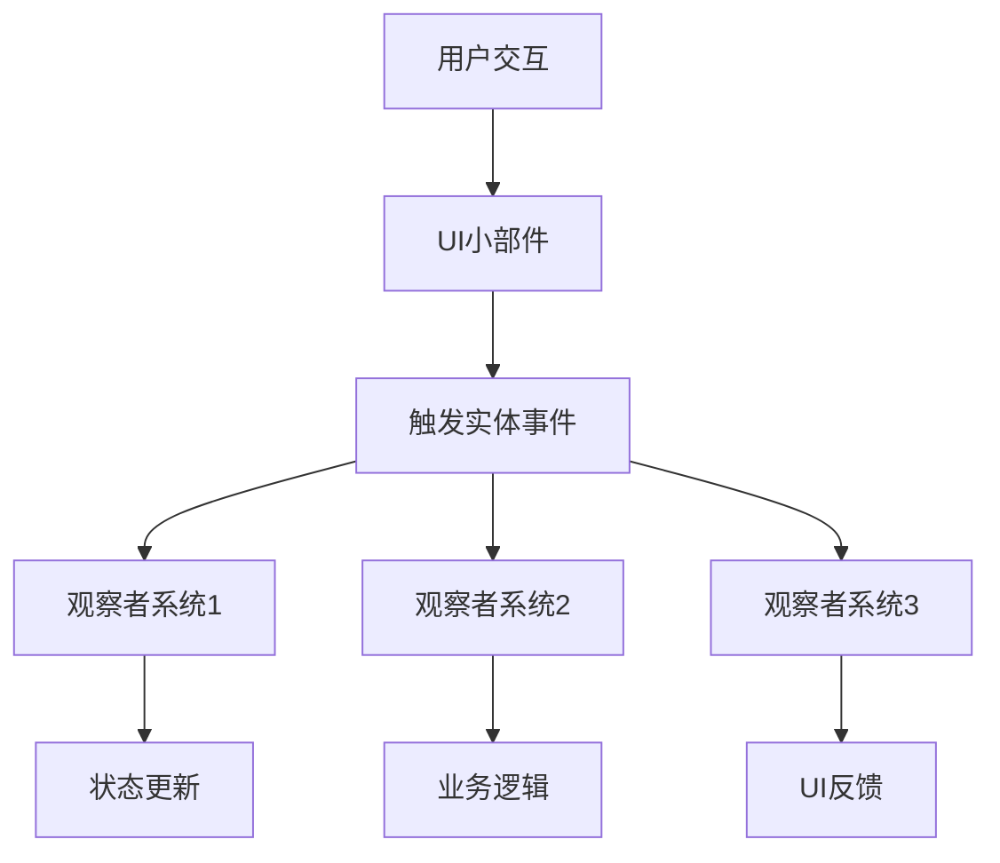

+++
title = "#21247 Delete `Callback` and use observers to control widgets for 0.17"
date = "2025-09-30T00:00:00"
draft = false
template = "pull_request_page.html"
in_search_index = false

[extra]
current_language = "zh-cn"
available_languages = {"en" = { name = "English", url = "/pull_request/bevy/2025-09/pr-21247-en-20250930" }, "zh-cn" = { name = "中文", url = "/pull_request/bevy/2025-09/pr-21247-zh-cn-20250930" }}
+++

# Delete `Callback` and use observers to control widgets for 0.17

## 基本信息
- **标题**: Delete `Callback` and use observers to control widgets for 0.17
- **PR链接**: https://github.com/bevyengine/bevy/pull/21247
- **作者**: viridia
- **状态**: MERGED
- **标签**: C-Feature, A-UI, X-Blessed, S-Needs-SME
- **创建时间**: 2025-09-28T00:20:58Z
- **合并时间**: 2025-09-30T02:57:05Z
- **合并者**: cart

## 描述翻译
删除了 `Callback` 类型。
更新了所有小部件和示例。
添加了一个 `observe` 助手，它通过 bundle effect 添加观察者。

注意：我本想更新发布说明，但它们已经不见了。

## 这个Pull Request的故事

这个PR代表了Bevy UI系统架构的一次重要演进。核心问题是如何在小部件和应用程序逻辑之间建立响应式通信机制。

### 问题背景：Callback模式的局限性

在之前的实现中，UI小部件使用`Callback`类型来处理用户交互。这种模式有几个技术限制：

1. **类型复杂性**：`Callback`是一个枚举，可以包装系统ID或忽略通知，这增加了类型系统的复杂性
2. **紧耦合**：小部件需要预先知道要调用的具体系统
3. **单一响应**：每个小部件只能有一个回调，限制了响应式设计的灵活性

```rust
// 之前的实现
pub struct Button {
    pub on_activate: Callback<In<Activate>>,
}
```

### 解决方案：转向观察者模式

开发者选择了观察者模式作为替代方案，这种模式更符合ECS架构的理念。核心改变包括：

1. **移除Callback类型**：完全删除`callback.rs`模块
2. **事件驱动设计**：小部件现在触发实体事件，而不是调用预定义的回调
3. **灵活的观察者注册**：引入`observe`助手，允许动态添加多个观察者

### 实现细节：架构重构

这次重构影响了整个UI小部件系统。以按钮组件为例：

```rust
// 修改前
pub struct Button {
    pub on_activate: Callback<In<Activate>>,
}

// 修改后  
pub struct Button;
```

按钮不再直接持有回调引用，而是通过触发`Activate`事件来通知观察者。事件定义也进行了改进：

```rust
// 新的事件定义
#[derive(Copy, Clone, Debug, PartialEq, EntityEvent)]
pub struct Activate {
    pub entity: Entity,
}
```

### 技术洞察：observe助手的创新

新引入的`observe`助手是一个关键技术创新：

```rust
pub fn observe<E: EntityEvent, B: Bundle, M, I: IntoObserverSystem<E, B, M>>(
    observer: I,
) -> AddObserver<E, B, M, I> {
    AddObserver {
        observer,
        marker: PhantomData,
    }
}
```

这个助手允许通过bundle effect的方式添加观察者，提供了更好的组合性和灵活性。它本质上是一个动态bundle，在实体应用时注册观察者系统。

### 示例迁移：从回调到观察者

迁移过程在示例代码中体现得很明显。以feathers示例中的按钮为例：

```rust
// 迁移前
button(
    ButtonProps {
        on_click: Callback::System(commands.register_system(|_: In<Activate>| {
            info!("Normal button clicked!");
        })),
        ..default()
    },
    (),
    Spawn((Text::new("Normal"), ThemedText))
)

// 迁移后
(
    button(
        ButtonProps::default(),
        (),
        Spawn((Text::new("Normal"), ThemedText))
    ),
    observe(|_activate: On<Activate>| {
        info!("Normal button clicked!");
    })
)
```

这种改变使得UI逻辑更加声明式和组合化。

### 自更新模式

对于需要管理自身状态的小部件，PR引入了自更新观察者：

```rust
// 复选框自更新
pub fn checkbox_self_update(value_change: On<ValueChange<bool>>, mut commands: Commands) {
    if value_change.value {
        commands.entity(value_change.source).insert(Checked);
    } else {
        commands.entity(value_change.source).remove::<Checked>();
    }
}
```

这种模式允许小部件在外部状态管理不可用时回退到内部状态管理。

### 虚拟键盘的重构

虚拟键盘的实现展示了新模式的强大之处：

```rust
// 新的虚拟键盘实现使用observe和自定义事件
pub fn virtual_keyboard<T>(
    keys: impl Iterator<Item = Vec<T>> + Send + Sync + 'static,
) -> impl Bundle
where
    T: AsRef<str> + Clone + Send + Sync + 'static,
{
    // 使用observe处理按键事件
    observe(
        move |activate: On<Activate>,
              mut commands: Commands,
              query: Query<&ChildOf>|
              -> Result {
            let virtual_keyboard =
                query.get(query.get(activate.entity)?.parent())?.parent();
            commands.trigger(VirtualKeyPressed {
                entity: virtual_keyboard,
                key: key.clone(),
            });
            Ok(())
        },
    )
}
```

### 性能与架构影响

这种改变带来了几个架构优势：

1. **更好的解耦**：小部件不再依赖具体的系统实现
2. **多重观察者**：支持多个系统监听同一事件
3. **运行时灵活性**：观察者可以在运行时动态添加和移除
4. **类型安全**：强类型的事件系统减少了运行时错误

### 向后兼容性考虑

由于这是一个破坏性变更，所有使用旧Callback模式的代码都需要更新。PR提供了详细的迁移示例，展示了如何将现有的回调逻辑转换为观察者模式。

## 视觉表示



## 关键文件更改

### `crates/bevy_ui_widgets/src/callback.rs` (+0/-115)
完全删除了Callback类型和相关的基础设施。

**删除的代码：**
```rust
pub enum Callback<I: SystemInput = ()> {
    System(SystemId<I>),
    #[default]
    Ignore,
}

pub trait Notify {
    fn notify(&mut self, callback: &Callback<()>);
    fn notify_with<I>(&mut self, callback: &Callback<I>, input: I::Inner<'static>)
    where
        I: SystemInput<Inner<'static>: Send> + 'static;
}
```

### `crates/bevy_ui_widgets/src/observe.rs` (新增文件)
新增了observe助手，用于通过bundle effect添加观察者。

**关键代码：**
```rust
pub struct AddObserver<E: EntityEvent, B: Bundle, M, I: IntoObserverSystem<E, B, M>> {
    observer: I,
    marker: PhantomData<(E, B, M)>,
}

pub fn observe<E: EntityEvent, B: Bundle, M, I: IntoObserverSystem<E, B, M>>(
    observer: I,
) -> AddObserver<E, B, M, I> {
    AddObserver {
        observer,
        marker: PhantomData,
    }
}
```

### `crates/bevy_ui_widgets/src/button.rs` (+51/-77)
重构了按钮组件，移除了Callback依赖。

**修改前：**
```rust
pub struct Button {
    pub on_activate: Callback<In<Activate>>,
}

fn button_on_pointer_click(
    mut click: On<Pointer<Click>>,
    mut q_state: Query<(&Button, Has<Pressed>, Has<InteractionDisabled>)>,
    mut commands: Commands,
) {
    if let Ok((bstate, pressed, disabled)) = q_state.get_mut(click.entity) {
        // ... 调用回调
        commands.notify_with(&bstate.on_activate, Activate(click.entity));
    }
}
```

**修改后：**
```rust
pub struct Button;

fn button_on_pointer_click(
    mut click: On<Pointer<Click>>,
    mut q_state: Query<(Has<Pressed>, Has<InteractionDisabled>), With<Button>>,
    mut commands: Commands,
) {
    if let Ok((pressed, disabled)) = q_state.get_mut(click.entity) {
        // ... 触发事件
        commands.trigger(Activate {
            entity: click.entity,
        });
    }
}
```

### `crates/bevy_ui_widgets/src/checkbox.rs` (+43/-46)
重构了复选框组件，添加了自更新功能。

**新增的自更新观察者：**
```rust
pub fn checkbox_self_update(value_change: On<ValueChange<bool>>, mut commands: Commands) {
    if value_change.value {
        commands.entity(value_change.source).insert(Checked);
    } else {
        commands.entity(value_change.source).remove::<Checked>();
    }
}
```

### `examples/ui/feathers.rs` (+239/-251)
更新了feathers示例，展示了新的观察者模式。

**迁移示例：**
```rust
// 旧的回调方式
checkbox(
    CheckboxProps {
        on_change: Callback::System(commands.register_system(
            |change: In<ValueChange<bool>>,
             query: Query<Entity, With<DemoDisabledButton>>,
             mut commands: Commands| {
                // 处理逻辑
            }
        )),
    },
    Checked,
    Spawn((Text::new("Checkbox"), ThemedText))
)

// 新的观察者方式
(
    checkbox(Checked, Spawn((Text::new("Checkbox"), ThemedText))),
    observe(
        |change: On<ValueChange<bool>>,
         query: Query<Entity, With<DemoDisabledButton>>,
         mut commands: Commands| {
            // 处理逻辑
        }
    )
)
```

## 进一步阅读

- [Bevy观察者系统文档](https://docs.rs/bevy/latest/bevy/ecs/observer/index.html)
- [实体事件系统](https://docs.rs/bevy/latest/bevy/ecs/event/trait.EntityEvent.html)
- [ECS模式在UI系统中的应用](https://bevy-cheatbook.github.io/programming/ecs-intro.html)