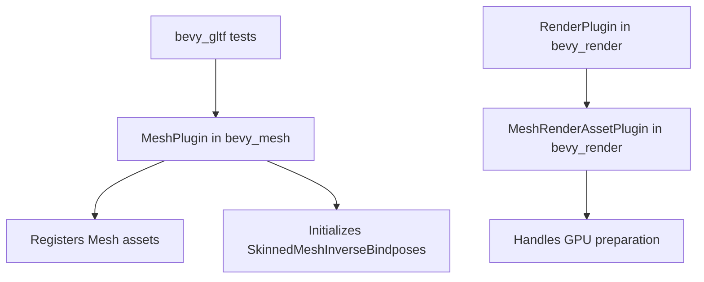

+++
title = "#21254 Fix footgunny `MeshPlugin` export"
date = "2025-09-28T00:00:00"
draft = false
template = "pull_request_page.html"
in_search_index = true

[taxonomies]
list_display = ["show"]

[extra]
current_language = "en"
available_languages = {"en" = { name = "English", url = "/pull_request/bevy/2025-09/pr-21254-en-20250928" }, "zh-cn" = { name = "中文", url = "/pull_request/bevy/2025-09/pr-21254-zh-cn-20250928" }}
labels = ["C-Bug", "A-Rendering", "A-Assets", "D-Straightforward"]
+++

# Fix footgunny `MeshPlugin` export

## Basic Information
- **Title**: Fix footgunny `MeshPlugin` export
- **PR Link**: https://github.com/bevyengine/bevy/pull/21254
- **Author**: janhohenheim
- **Status**: MERGED
- **Labels**: C-Bug, A-Rendering, A-Assets, S-Ready-For-Final-Review, D-Straightforward
- **Created**: 2025-09-28T15:03:50Z
- **Merged**: 2025-09-28T18:13:36Z
- **Merged By**: alice-i-cecile

## Description Translation
# Objective

- Fixes https://github.com/bevyengine/bevy/issues/21253, see that issue for details
- The `MeshPlugin` that was *wrongly* used per that issue is now `MeshRenderAssetPlugin`, given that it deals with `RenderAsset`s.
  - Note that we cannot name it `MeshRenderPlugin`, as [that name is also already taken](https://dev-docs.bevy.org/bevy/pbr/struct.MeshRenderPlugin.html)
  - We now have `MeshPlugin`, `MeshRenderPlugin`, `MeshRenderAssetPlugin`, and `Mesh2dRenderPlugin`, ALL of which are in different crates :bavy: :bavy: :bavy:
  - Since this is an implementation detail, I think we could also make it `pub(crate)`. I verified that that compiles fine. But I'll leave that decision for someone who knows the rendering architecture better.
- Also fixed a subtle mistake in asset initialization I spotted while on it, as the proper `MeshPlugin` forgets to initialize skinned mesh bind poses.
  - Funnily enough, the CI caught this, as before this change our own glTF tests accidentally used the *wrong* `MeshPlugin` lol
- Fixes wrong documentation on the rendering plugin
- No need for a migration guide, this is already documented in https://github.com/bevyengine/bevy/blob/release-0.17.0/release-content/migration-guides/bevy_render_reorganization.md

## The Story of This Pull Request

This PR addresses a confusing naming conflict in Bevy's mesh plugin architecture that was causing developers to accidentally use the wrong plugin. The core issue was that there were multiple plugins with similar names but different responsibilities spread across different crates, creating a "footgun" situation where it was easy to make mistakes.

The problem surfaced when developers were trying to use `MeshPlugin` from `bevy_render` instead of `bevy_mesh`. The `bevy_render` version was designed for internal rendering asset management, not for general mesh asset registration. This became apparent when the CI tests failed after the author started fixing the issue - the glTF tests were accidentally using the wrong plugin, demonstrating how easily this mistake could occur.

The solution involved three key changes. First, the problematic `MeshPlugin` in `bevy_render` was renamed to `MeshRenderAssetPlugin` to better reflect its actual purpose - handling render asset preparation for meshes. This name was chosen because `MeshRenderPlugin` was already taken in the PBR module.

Second, while investigating the plugin confusion, the author discovered that the correct `MeshPlugin` in `bevy_mesh` was missing initialization for `SkinnedMeshInverseBindposes` assets. This was a subtle bug that would have affected skinned mesh functionality, so it was fixed by adding the missing asset initialization.

Third, the documentation was updated to clearly state that `MeshRenderAssetPlugin` only handles mesh extraction and preparation for the GPU, while `MeshPlugin` is responsible for adding `Mesh` as an asset. This distinction helps prevent future confusion about which plugin to use for different purposes.

The implementation maintains backward compatibility through careful plugin renaming rather than removing functionality. The changes are localized to plugin registration and asset initialization, making them relatively low-risk while addressing the core naming confusion.

## Visual Representation



## Key Files Changed

### `crates/bevy_render/src/mesh/mod.rs` (+6/-5)
This file contained the problematic `MeshPlugin` that was causing confusion. The plugin was renamed and its documentation was clarified.

```rust
// Before:
/// Adds the [`Mesh`] as an asset and makes sure that they are extracted and prepared for the GPU.
pub struct MeshPlugin;

// After:
/// Makes sure that [`Mesh`]es are extracted and prepared for the GPU.
/// Does *not* add the [`Mesh`] as an asset. Use [`MeshPlugin`] for that.
pub struct MeshRenderAssetPlugin;
```

### `crates/bevy_render/src/lib.rs` (+2/-2)
Updated the main render plugin to use the renamed `MeshRenderAssetPlugin` instead of the old `MeshPlugin`.

```rust
// Before:
use crate::mesh::{MeshPlugin, MorphPlugin, RenderMesh};
// ...
MeshPlugin,

// After:
use crate::mesh::{MeshRenderAssetPlugin, MorphPlugin, RenderMesh};
// ...
MeshRenderAssetPlugin,
```

### `crates/bevy_mesh/src/lib.rs` (+2/-0)
Fixed the missing asset initialization in the proper `MeshPlugin` by adding `SkinnedMeshInverseBindposes` asset registration.

```rust
// Added to MeshPlugin build method:
app.init_asset::<Mesh>()
    .init_asset::<skinning::SkinnedMeshInverseBindposes>()  // This line was added
    .register_asset_reflect::<Mesh>()
```

### `crates/bevy_gltf/src/loader/mod.rs` (+1/-1)
Fixed the test that was accidentally using the wrong plugin by updating the import.

```rust
// Before:
use bevy_render::mesh::MeshPlugin;

// After:
use bevy_mesh::MeshPlugin;
```

## Further Reading

- [Bevy Render Reorganization Migration Guide](https://github.com/bevyengine/bevy/blob/release-0.17.0/release-content/migration-guides/bevy_render_reorganization.md)
- [Original Issue #21253](https://github.com/bevyengine/bevy/issues/21253)
- [Bevy Plugin System Documentation](https://bevyengine.org/learn/quick-start/plugins/)