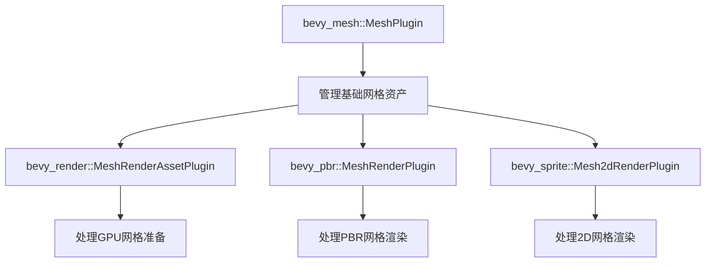

+++
title = "#21254 Fix footgunny `MeshPlugin` export"
date = "2025-09-28T00:00:00"
draft = false
template = "pull_request_page.html"
in_search_index = false

[extra]
current_language = "zh-cn"
available_languages = {"en" = { name = "English", url = "/pull_request/bevy/2025-09/pr-21254-en-20250928" }, "zh-cn" = { name = "中文", url = "/pull_request/bevy/2025-09/pr-21254-zh-cn-20250928" }}
labels = ["C-Bug", "A-Rendering", "A-Assets", "D-Straightforward"]
+++

# Fix footgunny `MeshPlugin` export

## Basic Information
- **Title**: Fix footgunny `MeshPlugin` export
- **PR Link**: https://github.com/bevyengine/bevy/pull/21254
- **Author**: janhohenheim
- **Status**: MERGED
- **Labels**: C-Bug, A-Rendering, A-Assets, S-Ready-For-Final-Review, D-Straightforward
- **Created**: 2025-09-28T15:03:50Z
- **Merged**: 2025-09-28T18:13:36Z
- **Merged By**: alice-i-cecile

## Description Translation
**目标**

- 修复 https://github.com/bevyengine/bevy/issues/21253，详情请参阅该 issue
- 根据该 issue 中*错误*使用的 `MeshPlugin` 现在已重命名为 `MeshRenderAssetPlugin`，因为它处理的是 `RenderAsset`。
  - 注意我们不能将其命名为 `MeshRenderPlugin`，因为[该名称已被占用](https://dev-docs.bevy.org/bevy/pbr/struct.MeshRenderPlugin.html)
  - 我们现在有 `MeshPlugin`、`MeshRenderPlugin`、`MeshRenderAssetPlugin` 和 `Mesh2dRenderPlugin`，它们都位于不同的 crate 中 :bavy: :bavy: :bavy:
  - 由于这是一个实现细节，我认为我们也可以将其设为 `pub(crate)`。我验证过这样可以正常编译。但我会让更了解渲染架构的人来做这个决定。
- 同时还修复了在处理过程中发现的资产初始化的一个细微错误，因为正确的 `MeshPlugin` 忘记初始化蒙皮网格绑定姿势。
  - 有趣的是，CI 捕获到了这个问题，因为在此更改之前，我们自己的 glTF 测试意外使用了*错误的* `MeshPlugin` lol
- 修复了渲染插件上的错误文档
- 不需要迁移指南，这已经在 https://github.com/bevyengine/bevy/blob/release-0.17.0/release-content/migration-guides/bevy_render_reorganization.md 中记录了

## The Story of This Pull Request

这个 PR 源于一个典型的软件工程问题：命名冲突和职责混淆。Bevy 引擎中有多个与网格相关的插件，但它们的命名和职责不够清晰，导致开发者容易错误使用。

**问题根源**

问题的核心在于 `bevy_render` crate 中的 `MeshPlugin` 实际上处理的是渲染资产（RenderAsset），而不是基础网格资产。这造成了两个主要问题：

1. **命名误导**：`MeshPlugin` 这个名字暗示它负责网格资产的基础功能，但实际上它专门处理渲染相关的网格准备
2. **初始化遗漏**：正确的网格插件（在 `bevy_mesh` 中）忘记初始化蒙皮网格的绑定姿势资产

这种混淆在实际开发中导致了严重问题 - 开发者可能会错误地导入 `bevy_render` 中的 `MeshPlugin` 而不是 `bevy_mesh` 中的，从而缺失关键功能。

**解决方案设计**

作者采取了清晰的解决方案：

1. **重命名澄清**：将 `bevy_render::mesh::MeshPlugin` 重命名为 `MeshRenderAssetPlugin`，明确其处理渲染资产的职责
2. **修复初始化**：在正确的 `bevy_mesh::MeshPlugin` 中添加缺失的蒙皮网格绑定姿势初始化
3. **更新导入**：修复测试代码中错误的导入路径

**技术实现细节**

在 `bevy_render/src/mesh/mod.rs` 中，插件定义和文档都被更新：

```rust
// Before:
/// Adds the [`Mesh`] as an asset and makes sure that they are extracted and prepared for the GPU.
pub struct MeshPlugin;

// After:
/// Makes sure that [`Mesh`]es are extracted and prepared for the GPU.
/// Does *not* add the [`Mesh`] as an asset. Use [`MeshPlugin`] for that.
pub struct MeshRenderAssetPlugin;
```

这个文档更新特别重要，因为它明确指出了职责边界 - 这个插件不负责添加网格资产，只负责GPU准备。

在 `bevy_mesh/src/lib.rs` 中，修复了关键的初始化遗漏：

```rust
impl Plugin for MeshPlugin {
    fn build(&self, app: &mut App) {
        app.init_asset::<Mesh>()
            .init_asset::<skinning::SkinnedMeshInverseBindposes>()  // 新增的初始化
            .register_asset_reflect::<Mesh>()
            // ... 其他系统
    }
}
```

这个修复确保了蒙皮网格所需的 `SkinnedMeshInverseBindposes` 资产被正确注册。

**架构意义**

这个变更体现了清晰的关注点分离原则：

- `bevy_mesh::MeshPlugin`：负责网格资产的通用管理和序列化
- `bevy_render::MeshRenderAssetPlugin`：专门处理网格的渲染相关准备和GPU上传

这种分离使得代码更加模块化，减少了意外的副作用。有趣的是，CI系统在PR测试过程中暴露了现有测试代码中错误使用插件的问题，这恰好证明了修复的必要性。

**工程启示**

这个PR展示了几个重要的软件工程实践：

1. **命名的重要性**：清晰的命名可以预防一整类错误
2. **测试的价值**：现有测试意外地暴露了问题，强调了全面测试覆盖的重要性
3. **渐进式改进**：通过小的、目标明确的变更来修复架构问题，而不是大规模重构

## Visual Representation



## Key Files Changed

### `crates/bevy_render/src/mesh/mod.rs` (+6/-5)
**变更目的**：重命名插件并更新文档以明确职责

```rust
// Before:
/// Adds the [`Mesh`] as an asset and makes sure that they are extracted and prepared for the GPU.
pub struct MeshPlugin;

impl Plugin for MeshPlugin {
    fn build(&self, app: &mut App) {
        app.init_asset::<skinning::SkinnedMeshInverseBindposes>()
            .add_plugins(RenderAssetPlugin::<RenderMesh, GpuImage>::default())
            .add_plugins(MeshAllocatorPlugin);
    }
}

// After:
/// Makes sure that [`Mesh`]es are extracted and prepared for the GPU.
/// Does *not* add the [`Mesh`] as an asset. Use [`MeshPlugin`] for that.
pub struct MeshRenderAssetPlugin;

impl Plugin for MeshRenderAssetPlugin {
    fn build(&self, app: &mut App) {
        app
            .add_plugins(RenderAssetPlugin::<RenderMesh, GpuImage>::default())
            .add_plugins(MeshAllocatorPlugin);
    }
}
```

### `crates/bevy_mesh/src/lib.rs` (+2/-0)
**变更目的**：修复缺失的蒙皮网格绑定姿势初始化

```rust
impl Plugin for MeshPlugin {
    fn build(&self, app: &mut App) {
        app.init_asset::<Mesh>()
            .init_asset::<skinning::SkinnedMeshInverseBindposes>()  // 新增行
            .register_asset_reflect::<Mesh>()
            .add_systems(/* ... */);
    }
}
```

### `crates/bevy_render/src/lib.rs` (+2/-2)
**变更目的**：更新插件注册以使用新名称

```rust
// Before:
use crate::mesh::{MeshPlugin, MorphPlugin, RenderMesh};
// ...
MeshPlugin,

// After:
use crate::mesh::{MeshRenderAssetPlugin, MorphPlugin, RenderMesh};
// ...
MeshRenderAssetPlugin,
```

### `crates/bevy_gltf/src/loader/mod.rs` (+1/-1)
**变更目的**：修复测试中的错误导入

```rust
// Before:
use bevy_render::mesh::MeshPlugin;

// After:
use bevy_mesh::MeshPlugin;
```

## Further Reading

- [Bevy Render Reorganization Migration Guide](https://github.com/bevyengine/bevy/blob/release-0.17.0/release-content/migration-guides/bevy_render_reorganization.md) - 了解渲染系统的架构演变
- [Bevy Plugin System Documentation](https://bevyengine.org/learn/quick-start/plugins/) - 理解Bevy插件系统的工作原理
- [Render Assets in Bevy](https://bevyengine.org/learn/quick-start/resource-assets/) - 学习渲染资产的概念和使用