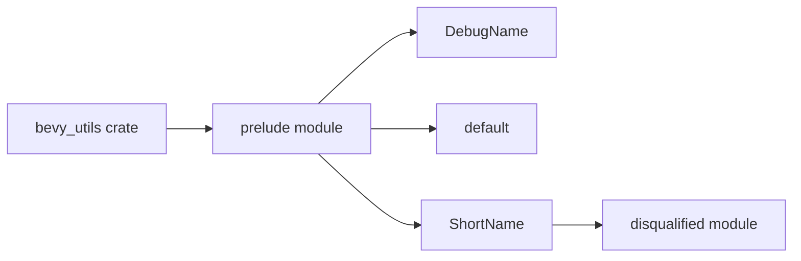

+++
title = "#21255 Re-export disqualified::ShortName from bevy_utils"
date = "2025-09-28T00:00:00"
draft = false
template = "pull_request_page.html"
in_search_index = true

[taxonomies]
list_display = ["show"]

[extra]
current_language = "en"
available_languages = {"en" = { name = "English", url = "/pull_request/bevy/2025-09/pr-21255-en-20250928" }, "zh-cn" = { name = "中文", url = "/pull_request/bevy/2025-09/pr-21255-zh-cn-20250928" }}
labels = ["D-Trivial", "A-Utils"]
+++

# Title

Re-export disqualified::ShortName from bevy_utils

## Basic Information
- **Title**: Re-export disqualified::ShortName from bevy_utils
- **PR Link**: https://github.com/bevyengine/bevy/pull/21255
- **Author**: cBournhonesque
- **Status**: MERGED
- **Labels**: D-Trivial, A-Utils, S-Needs-Review
- **Created**: 2025-09-28T15:16:54Z
- **Merged**: 2025-09-28T17:37:33Z
- **Merged By**: mockersf

## Description Translation

To migrate to 0.17, I tried switching to using `DebugName::type_name::<C>()` from bevy_utils.

In some cases I wanted to use the `ShortName` type that I saw in bevy_utils, but to my surprise it was not exported.

Is it possible to include this in 0.17?

## The Story of This Pull Request

During the migration to Bevy 0.17, the developer encountered a practical issue while updating code to use the new `DebugName::type_name::<C>()` API from bevy_utils. While working with this API, they needed to use the `ShortName` type that they had discovered existed within bevy_utils, but found it wasn't publicly exported from the crate.

The core problem was straightforward: bevy_utils contained a useful type (`ShortName`) that was accessible internally but not exposed through the public API. This created a situation where developers could see the type existed (likely through IDE exploration or code inspection) but couldn't actually use it in their own code without resorting to workarounds or internal module paths.

The solution implemented was minimal and direct - add a single line to the bevy_utils prelude module to publicly re-export the `ShortName` type from the `disqualified` module. This approach follows Rust's common pattern of re-exporting internal types through public modules to make them accessible to external users.

The technical implementation is clean and follows established patterns in the codebase. By adding `pub use disqualified::ShortName;` to the prelude module, the type becomes available through the standard import path `bevy_utils::prelude::ShortName`, making it discoverable and usable while maintaining the internal module structure.

This change demonstrates an important principle in API design: if a type is useful enough to exist and be used internally, it should generally be available to external users who have legitimate use cases for it. The fact that the developer discovered this need during a migration suggests that `ShortName` has practical utility beyond internal implementations.

The impact of this change is immediate and practical. Developers migrating to Bevy 0.17 who need to work with short type names can now do so using the official public API rather than relying on internal module paths that could break in future versions. This improves the stability and maintainability of codebases using bevy_utils.

## Visual Representation



## Key Files Changed

### `crates/bevy_utils/src/lib.rs`

This file defines the public API surface of the bevy_utils crate. The change adds a single re-export to make the `ShortName` type publicly available through the prelude module.

**Before:**
```rust
pub mod prelude {
    pub use crate::debug_info::DebugName;
    pub use crate::default;
}
```

**After:**
```rust
pub mod prelude {
    pub use crate::debug_info::DebugName;
    pub use crate::default;
    pub use disqualified::ShortName;
}
```

The addition of `pub use disqualified::ShortName;` makes the type available to external users of the bevy_utils crate through the standard import path.

## Further Reading

- [Rust Module System and Privacy](https://doc.rust-lang.org/book/ch07-02-defining-modules-to-control-scope-and-privacy.html)
- [Bevy Engine Documentation](https://docs.rs/bevy)
- [Rust Re-export Patterns](https://doc.rust-lang.org/reference/items/use-declarations.html)